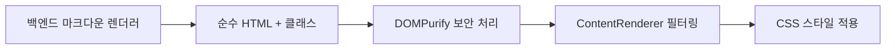

# CSS 아키텍처 - 마크다운 스타일 통합 시스템

## 🏗️ 아키텍처 개요

### 설계 원칙
1. **관심사 분리**: 각 CSS 파일이 명확한 책임을 가짐
2. **성능 최적화**: Tailwind CSS `@layer`를 활용한 최적화된 번들링
3. **확장성**: 다크모드, 새로운 컴포넌트 추가 용이
4. **일관성**: BEM 기반 네이밍으로 예측 가능한 스타일

### 파일 구조
```
frontend/src/
├── app/
│   └── globals.css          # 메인 CSS + 스타일 임포트
├── styles/
│   ├── markdown.css         # 마크다운 콘텐츠 전용 스타일
│   └── syntax-highlighting.css # 코드 하이라이팅 전용 스타일
```

## 📋 CSS 모듈 세부사항

### 1. `globals.css` - 메인 통합 파일
**역할**: 
- Tailwind CSS 기본 레이어 임포트
- 전역 폰트 설정 (Pretendard, GeistMono)
- 마크다운/신택스 하이라이팅 CSS 임포트
- 기존 블로그 콘텐츠와의 호환성 유지

**핵심 개선사항**:
```css
/* 마크다운 및 신택스 하이라이팅 스타일 임포트 */
@import '../styles/markdown.css';
@import '../styles/syntax-highlighting.css';

/* 마크다운 클래스를 상속받지 않는 요소들만 기본 스타일 적용 */
.blog-content :not([class*="markdown-"]) {
  font-family: var(--font-pretendard) !important;
  max-width: 100%;
  word-break: break-word;
}
```

### 2. `markdown.css` - 마크다운 콘텐츠 스타일
**역할**: 백엔드에서 생성된 마크다운 HTML 요소 스타일링

#### BEM 네이밍 컨벤션
```css
/* Block */
.markdown-{element}

/* Examples */
.markdown-h1, .markdown-h2, .markdown-h3
.markdown-p
.markdown-link, .markdown-external-link
.markdown-image
.markdown-table, .markdown-table-header, .markdown-table-cell
.markdown-ul, .markdown-ol, .markdown-li
.markdown-blockquote
.markdown-hr
.markdown-inline-code
```

#### Tailwind CSS 레이어 구조
```css
@layer components {
  .markdown-p {
    @apply mb-4 text-sm leading-relaxed text-gray-900;
    @apply break-words max-w-full;
  }
  
  @screen sm {
    .markdown-p {
      @apply text-base leading-7;
    }
  }
}

@layer utilities {
  .markdown-break-words {
    word-break: break-word;
    overflow-wrap: break-word;
    hyphens: auto;
  }
}
```

### 3. `syntax-highlighting.css` - 코드 하이라이팅
**역할**: VSCode Dark+ 테마 기반 신택스 하이라이팅

#### 언어별 특화 스타일
- **웹 개발**: TypeScript, JavaScript, React/JSX, HTML, CSS
- **모바일**: Swift (iOS), Kotlin (Android), Dart (Flutter)
- **백엔드**: Python, Go, Ruby, Java, C#, PHP, Rust
- **DevOps**: Bash, SQL, Docker, YAML, GraphQL

#### 성능 최적화
```css
@layer components {
  .hljs {
    @apply block overflow-x-auto p-4 my-6 rounded-lg;
    @apply markdown-scroll-smooth;
    will-change: transform, opacity;
    transform: translateZ(0);
  }
}
```

## 🎨 스타일 적용 플로우

### 백엔드 → 프론트엔드 플로우


1. **백엔드**: 마크다운 → HTML 변환 시 클래스만 추가
   ```typescript
   // Before (인라인 스타일)
   `<h1 style="font-size: 2rem; color: #333;">제목</h1>`
   
   // After (클래스 기반)
   `<h1 class="markdown-h1">제목</h1>`
   ```

2. **프론트엔드**: CSS 클래스로 모든 스타일 제어
   ```css
   .markdown-h1 {
     @apply text-2xl font-bold text-gray-900 mt-8 mb-4;
     @apply border-b border-gray-200 pb-2 break-words;
   }
   ```

## 📱 반응형 설계

### 모바일 최적화 전략
```css
/* Desktop First → Mobile First 접근 */
.markdown-h1 {
  @apply text-2xl; /* 기본 크기 */
}

@screen max-sm {
  .markdown-h1 {
    @apply text-xl; /* 모바일에서 축소 */
  }
}

/* 모바일 터치 최적화 */
.markdown-image {
  @apply cursor-pointer transition-transform duration-200;
  @apply hover:scale-105 hover:shadow-lg;
}

@screen max-sm {
  .markdown-image {
    @apply max-h-60vh; /* 모바일 뷰포트 고려 */
  }
}
```

### 뷰포트 단위 활용
```css
@layer utilities {
  .max-h-60vh {
    max-height: 60vh;
  }
}
```

## 🌙 다크모드 준비

### Future-Proof 다크모드 지원
```css
/* 라이트 모드 (기본) */
.markdown-code-block {
  @apply bg-gray-900 text-gray-100;
}

/* 다크모드 (시스템 설정 기반) */
@media (prefers-color-scheme: dark) {
  .markdown-code-block {
    @apply bg-gray-800 text-gray-100;
  }
  
  .markdown-inline-code {
    @apply bg-gray-800 text-gray-100;
  }
}
```

## ⚡ 성능 최적화

### CSS 번들 최적화
1. **레이어 기반 구조**: Tailwind CSS의 `@layer`를 활용한 최적 번들링
2. **Tree Shaking**: 사용되지 않는 CSS 자동 제거
3. **GPU 가속**: `will-change`, `transform: translateZ(0)` 활용
4. **Lazy Loading**: 이미지 및 코드 블록 지연 로딩

### 메모리 최적화
```css
/* 모바일에서 성능 최적화 */
@screen max-sm {
  .hljs {
    contain: layout style paint;
  }
}
```

### 프린트 최적화
```css
@media print {
  .hljs {
    background: white !important;
    color: black !important;
    box-shadow: none !important;
  }
}
```

## 🔧 개발자 가이드

### 새로운 마크다운 요소 추가
1. 백엔드에서 클래스 추가
   ```typescript
   // markdown-renderer.service.ts
   text = text.replace(/pattern/, '<element class="markdown-new-element">$1</element>');
   ```

2. CSS 스타일 정의
   ```css
   /* markdown.css */
   @layer components {
     .markdown-new-element {
       @apply /* Tailwind classes */;
     }
   }
   ```

3. ContentRenderer 필터링 추가
   ```typescript
   // ContentRenderer.tsx
   const filterSafeClasses = (classNames: string): string => {
     return classNames
       .split(/\s+/)
       .filter(className => 
         className.startsWith('markdown-') || // 기존 필터 유지
         // 추가 필터 규칙
       )
       .join(' ');
   };
   ```

### 새로운 프로그래밍 언어 지원
1. 언어 모듈 임포트
   ```typescript
   // ContentRenderer.tsx
   import newLanguage from 'highlight.js/lib/languages/new-language';
   lowlight.register({ newLanguage });
   ```

2. 언어별 특화 스타일 추가
   ```css
   /* syntax-highlighting.css */
   .language-new-language .hljs-keyword {
     color: #custom-color !important;
   }
   ```

## 📊 성능 메트릭 목표

### 로딩 성능
- **CSS 번들 크기**: < 50KB (gzipped)
- **First Paint**: < 100ms (스타일 적용)
- **Layout Shift**: < 0.1 (CLS)

### 런타임 성능
- **신택스 하이라이팅**: < 10ms/코드블록
- **이미지 렌더링**: 지연 로딩 + 최적화
- **스크롤 성능**: 60fps 유지

## 🧪 테스트 전략

### CSS 회귀 테스트
1. **Visual Regression**: 마크다운 요소별 스크린샷 비교
2. **Cross-Browser**: Chrome, Safari, Firefox 호환성
3. **Responsive**: 다양한 화면 크기 테스트
4. **Performance**: Lighthouse CSS 성능 점수 90+ 유지

### 접근성 테스트
- **색상 대비**: WCAG AA 기준 충족
- **키보드 내비게이션**: 모든 인터랙티브 요소 접근 가능
- **스크린 리더**: ARIA 레이블 및 의미론적 HTML 구조

## 🔄 마이그레이션 가이드

### 기존 코드에서 새 구조로 변경
1. **globals.css**: 기존 마크다운 스타일 제거 → 모듈 임포트
2. **백엔드**: 인라인 스타일 → 클래스 기반 스타일
3. **ContentRenderer**: 필터링 로직 업데이트

### 점진적 마이그레이션
- 기존 `.blog-content` 스타일은 호환성을 위해 유지
- 새로운 `.markdown-*` 클래스가 우선순위를 가짐
- 충돌 시 명시도(specificity) 규칙 활용

## 🎯 향후 로드맵

### Phase 1 (완료)
- ✅ 인라인 스타일 제거
- ✅ CSS 모듈화
- ✅ VSCode Dark+ 테마 적용

### Phase 2 (계획 중)
- 🔄 다크모드 토글 기능
- 🔄 코드 블록 라인 넘버
- 🔄 복사 버튼 추가

### Phase 3 (향후)
- 🔮 테마 커스터마이제이션
- 🔮 A11y 개선
- 🔮 성능 최적화 고도화

---

이 아키텍처는 확장성, 성능, 유지보수성을 모두 고려한 현대적인 CSS 구조를 제공합니다.