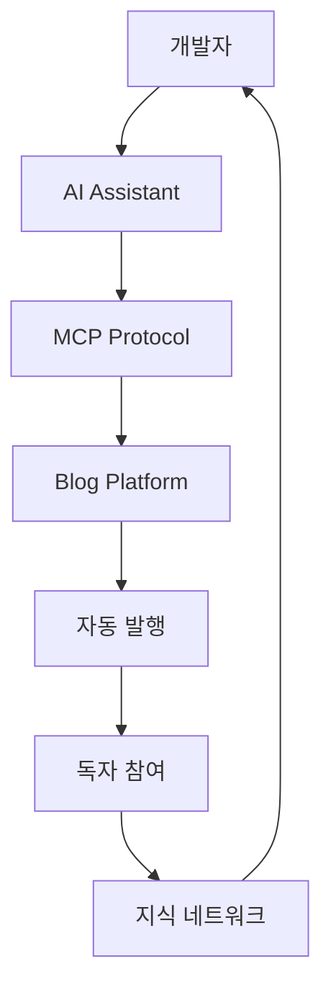
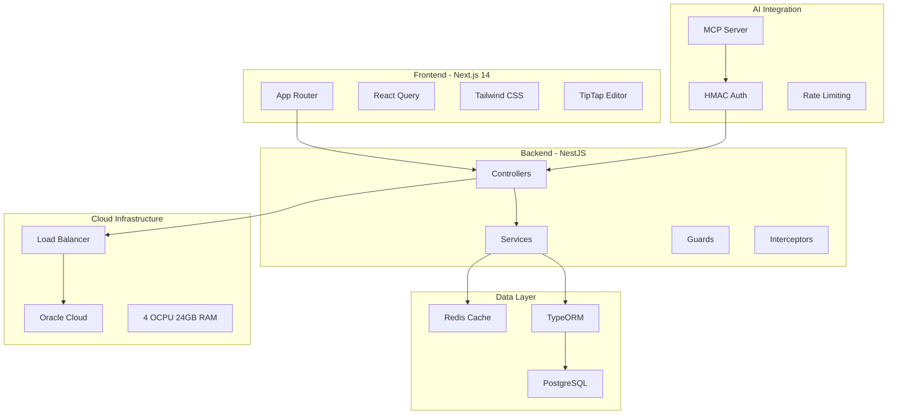
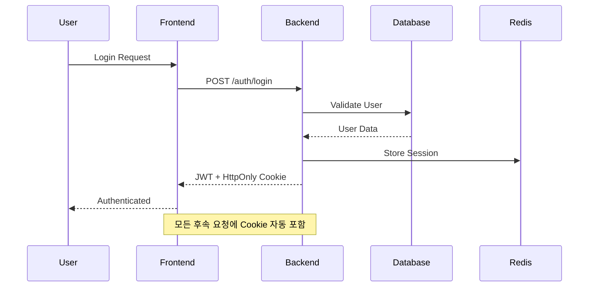
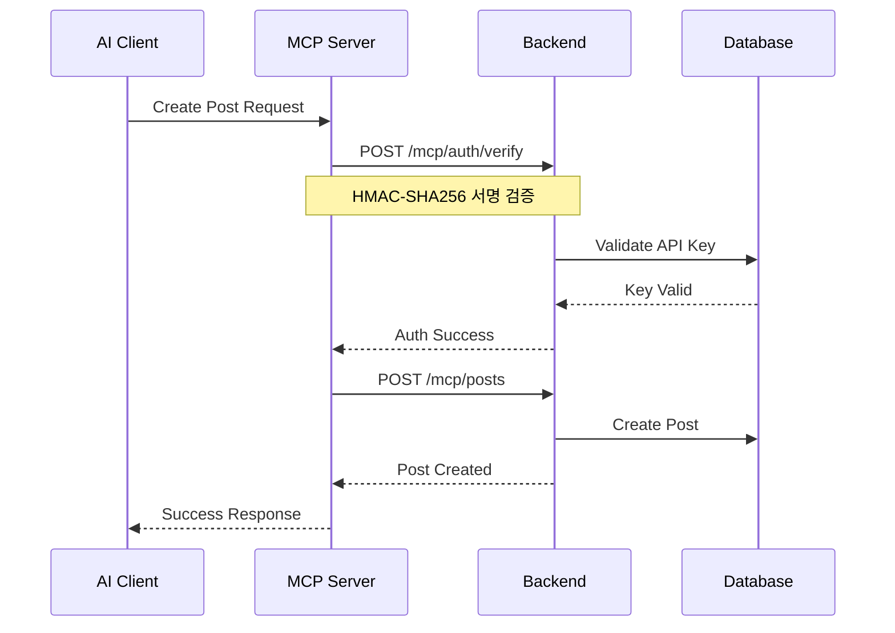

# 🚀 Multi-User Blog System 개발자 온보딩 가이드

*"혁신은 기존의 것을 다르게 보는 것에서 시작됩니다. 우리는 단순한 블로그 플랫폼을 만든 것이 아닙니다. 우리는 인공지능과 인간이 협력하여 지식을 공유하는 새로운 방식을 창조했습니다."*

---

## 🎯 The Vision - 우리가 해결하는 문제

### 문제: 지식 공유의 장벽

매일 수백만 명의 개발자들이 Stack Overflow에서 답을 찾고, GitHub에서 코드를 훑어보며, 블로그를 전전합니다. 하지만 **정작 자신의 지식을 공유하는 것은 어려워합니다**. 왜일까요?

- **기술적 복잡성**: 블로그 설정, 호스팅, 도메인...
- **시간 부족**: 글쓰기는 시간이 많이 걸립니다
- **완벽주의**: "아직 부족해서..." 하며 발행을 미룹니다

### 해결책: AI가 함께하는 지식 공유 생태계

우리는 **Model Context Protocol(MCP)**를 통해 Claude, ChatGPT 같은 AI와 직접 연결된 블로그 플랫폼을 만들었습니다. 이제 개발자는 AI와 대화하듯 자연스럽게 콘텐츠를 생성하고, 즉시 공유할 수 있습니다.



---

## 🏗️ The Architecture - 올바른 설계

### 전체 시스템 아키텍처



### 핵심 설계 원칙

**1. 단방향 데이터 흐름**
- Next.js: UI → React Query → API
- NestJS: Controller → Service → Repository → Database

**2. 관심사의 분리**
- Frontend: 함수형 컴포넌트 + Hooks 패턴
- Backend: 클래스 기반 + 의존성 주입

**3. 확장 가능한 구조**
- 멀티 테넌시: 사용자별 독립된 블로그
- 모듈형 아키텍처: 기능별 완전 분리

---

## ⚙️ The Technology - 전략적 기술 선택

### Frontend Stack: Next.js 14 생태계

| 기술 | 선택 이유 | 대안 |
|------|----------|------|
| **Next.js 14** | App Router, Server Components | Remix, Nuxt |
| **React Query** | 서버 상태 관리의 표준 | SWR, Apollo |
| **Tailwind CSS** | 개발 속도 + 일관성 | Styled Components |
| **TipTap Editor** | 확장성 + YouTube 통합 | CKEditor, Quill |

**핵심 구현 패턴:**
```typescript
// Container/Presentational 분리
function PostListContainer() {
  const { data, isLoading } = useQuery(['posts']);
  return <PostList posts={data} loading={isLoading} />;
}

// 함수형 컴포넌트 필수
export default function PostCard({ title, content }: PostProps) {
  const [isLiked, setIsLiked] = useState(false);
  return <article className="p-4 rounded-lg">{title}</article>;
}
```

### Backend Stack: NestJS 엔터프라이즈 패턴

| 기술 | 선택 이유 | 대안 |
|------|----------|------|
| **NestJS** | TypeScript 네이티브, 확장성 | Express, Fastify |
| **TypeORM** | 타입 안정성 + Migration | Prisma, Sequelize |
| **PostgreSQL** | 관계형 데이터 + JSONB | MongoDB, MySQL |
| **Redis** | 고성능 캐싱 + 세션 관리 | Memcached, DragonflyDB |

**핵심 구현 패턴:**
```typescript
@Controller('posts')
export class PostsController {
  constructor(private readonly postsService: PostsService) {}

  @Get()
  @UseGuards(JwtAuthGuard)
  async findAll(@Query() query: FindAllPostsDto) {
    return this.postsService.findAll(query);
  }
}

@Injectable()
export class PostsService {
  constructor(
    @InjectRepository(Post) private postsRepository: Repository<Post>,
    private cacheService: CacheService,
  ) {}
}
```

---

## 📊 The Data Flow - 정보의 흐름

### 데이터베이스 스키마

| Entity | 관계 | 핵심 필드 |
|--------|------|----------|
| **User** | 1:1 Blog, 1:N Post | email, username, authProvider |
| **Blog** | N:1 User, 1:N Post | slug, name, isPublic |
| **Post** | N:1 Blog, N:1 User | title, content, slug, isPublished |
| **Comment** | N:1 Post, N:1 User | content, parentId |
| **File** | N:N Post | url, mimeType, size |

### 인증 흐름



### MCP 인증 흐름



---

## ☁️ The Scale - 클라우드 인프라 전략

### Oracle Cloud 무료 티어 최적화

**리소스 할당:**
- **4 OCPU, 24GB RAM**: 4개 인스턴스로 분산
- **200GB 블록 스토리지**: 데이터베이스 + 파일 저장
- **10TB 아웃바운드**: 월 10TB 무료 트래픽

**인스턴스 분배 전략:**
```yaml
Instance 1 (1 OCPU, 6GB):
  - Frontend (Next.js)
  - Nginx Reverse Proxy

Instance 2 (2 OCPU, 12GB):
  - Backend (NestJS)
  - API 서버

Instance 3 (1 OCPU, 6GB):
  - PostgreSQL Database
  - 데이터 지속성

Instance 4 (Ampere, 무료):
  - Redis Cache
  - 세션 스토어
```

### 성능 최적화 전략

**캐싱 레이어:**
```typescript
// 통합 Redis 서비스로 중앙화된 캐시 관리
class UnifiedRedisService {
  // TTL 필수 (무한루프 방지)
  async setCache(namespace: string, key: string, value: any, ttl: number = 300) {
    const fullKey = this.buildKey(namespace, key);
    await this.redis.setex(fullKey, ttl, JSON.stringify(value));
  }

  // 패턴 기반 무효화
  async invalidatePattern(pattern: string) {
    const stream = this.redis.scanStream({ match: pattern });
    // SCAN 사용으로 블로킹 방지
  }
}
```

---

## 🤖 The Intelligence - AI 통합과 MCP

### Model Context Protocol (MCP) 통합

**MCP가 특별한 이유:**
- **직접 연결**: AI 클라이언트가 API를 직접 호출
- **보안 강화**: HMAC-SHA256 서명 기반 인증
- **제한된 권한**: 오직 포스트 생성만 가능

**AI 포스팅 프로세스:**
```typescript
// 1. AI 클라이언트 인증
@Post('mcp/auth/verify')
async verifyMcpAuth(@Body() body, @Headers() headers) {
  const signature = this.verifyHmacSignature(
    method, uri, timestamp, nonce, body, signature, apiSecret
  );
  if (!signature) throw new UnauthorizedException();
  return { valid: true, userId, blogId };
}

// 2. 보안 포스트 생성
@Post('mcp/posts')
@UseGuards(McpAuthGuard, McpRateLimitGuard)
async createPost(@Body() createPostDto, @Request() req) {
  const post = await this.postsService.create(createPostDto, req.user);
  await this.cacheService.invalidatePattern('feed:*'); // 캐시 무효화
  return post;
}
```

**보안 특징:**
- **Rate Limiting**: 분당 5회 요청 제한
- **Nonce 중복 방지**: 동일 요청 재사용 차단
- **시간 윈도우**: 5분 내 요청만 유효
- **감사 로그**: 모든 MCP 활동 추적

---

## 💰 The Business - 수익화와 성장

### 학습 생태계 비즈니스 모델

**1단계: 기반 구축 (현재)**
- 무료 블로그 플랫폼으로 사용자 확보
- AI 통합 편의성으로 차별화
- 개발자 커뮤니티 중심 성장

**2단계: 프리미엄 기능 (6개월 후)**
- **Advanced MCP**: 멀티 AI 통합, 고급 자동화
- **Analytics Pro**: 상세한 독자 분석, 성과 지표
- **Custom Domains**: 개인/기업 도메인 연결
- **Team Blogs**: 팀 단위 협업 기능

**3단계: 기업 솔루션 (1년 후)**
- **Enterprise MCP**: 기업용 AI 지식 관리
- **White Label**: 기업 맞춤형 플랫폼
- **API Marketplace**: 서드파티 통합 생태계

### 예상 수익 구조
```
개인 사용자 (월 $9):     70% of revenue
팀 계정 (월 $29):        25% of revenue
기업 솔루션 (월 $99+):   5% of revenue
```

---

## 🔮 The Future - 나아갈 방향

### 기술 로드맵

**Q1 2025: AI 고도화**
- **멀티 AI 지원**: Claude, GPT, Gemini 동시 연결
- **Smart Editing**: AI 기반 실시간 글쓰기 도우미
- **Auto Translation**: 다국어 자동 번역

**Q2 2025: 커뮤니티 강화**
- **AI Code Reviews**: MCP를 통한 코드 리뷰 자동화
- **Knowledge Graph**: 포스트 간 지식 연결 시각화
- **Collaborative AI**: 여러 AI가 함께 작성하는 포스트

**Q3 2025: 플랫폼 확장**
- **Video Integration**: AI 생성 영상 콘텐츠
- **Interactive Tutorials**: 실행 가능한 코드 예제
- **Learning Paths**: AI 큐레이션 학습 경로

### 개발 팀 확장 계획

**현재 팀: 1명** (Full-Stack)
```
Backend: NestJS + PostgreSQL + Redis
Frontend: Next.js + React Query
AI Integration: MCP Protocol
```

**6개월 후: 3명**
```
+ AI/ML Engineer: MCP 고도화, 자연어 처리
+ Frontend Specialist: UX/UI, 성능 최적화
```

**1년 후: 7명**
```
+ DevOps Engineer: 스케일링, 모니터링
+ Product Manager: 사용자 경험, 비즈니스 로직
+ Backend Engineer: 마이크로서비스, API 확장
+ QA Engineer: 자동화 테스트, 품질 보증
```

---

## 🛠️ Development Quick Start

### 로컬 개발 환경 설정

```bash
# 1. 저장소 클론
git clone <repository-url>
cd my-blog-app

# 2. 의존성 설치
cd backend && pnpm install
cd ../frontend && pnpm install

# 3. 환경 변수 설정
cp backend/.env.example backend/.env
cp frontend/.env.local.example frontend/.env.local

# 4. 데이터베이스 설정
docker compose up postgres redis -d
cd backend && pnpm migration:run

# 5. 개발 서버 실행
cd backend && pnpm start:dev    # Port 3000
cd frontend && pnpm dev         # Port 3001
```

### 필수 개발 규칙

**Frontend (Next.js):**
- ✅ 함수형 컴포넌트만 사용
- ✅ Container/Presentational 패턴
- ❌ DOM 직접 조작 금지
- ❌ 클래스 컴포넌트 금지

**Backend (NestJS):**
- ✅ 클래스 + 데코레이터 패턴
- ✅ 의존성 주입 활용
- ❌ SQL 직접 작성 금지
- ❌ 하드코딩된 설정 금지

### API 경로 주의사항

```javascript
// ❌ 잘못된 예시 - /api/v1 중복
const API_URL = process.env.NEXT_PUBLIC_API_URL; // 이미 "/api/v1" 포함
fetch(`${API_URL}/api/v1/posts`); // 결과: /api/v1/api/v1/posts

// ✅ 올바른 예시
const API_URL = process.env.NEXT_PUBLIC_API_URL || 'http://localhost:3000/api/v1';
fetch(`${API_URL}/posts`); // 결과: /api/v1/posts
```

---

## 📈 Success Metrics

### 개발 성공 지표

**기술적 지표:**
- API 응답 시간: <200ms (95th percentile)
- 캐시 히트율: >80%
- 시스템 가용성: >99.9%
- 코드 커버리지: >85%

**사용자 지표:**
- AI 포스팅 성공률: >95%
- 첫 페이지 로딩: <3초
- 사용자 재방문율: >60%
- 포스트 생성률: 주당 평균 2개

**비즈니스 지표:**
- 월간 활성 사용자: 1,000명 (6개월 목표)
- 프리미엄 전환율: 5% (1년 목표)
- AI 통합 사용률: >70%

---

*"Technology alone is not enough. It's technology married with the humanities that yields the results that make our hearts sing."* - Steve Jobs

**환영합니다, 새로운 팀원님.** 당신은 단순히 코드를 작성하는 것이 아닙니다. 당신은 지식을 공유하고, 학습을 혁신하며, AI와 인간이 협력하는 미래를 만들어가는 것입니다.

함께 만들어갈 세상이 기대됩니다. 🚀