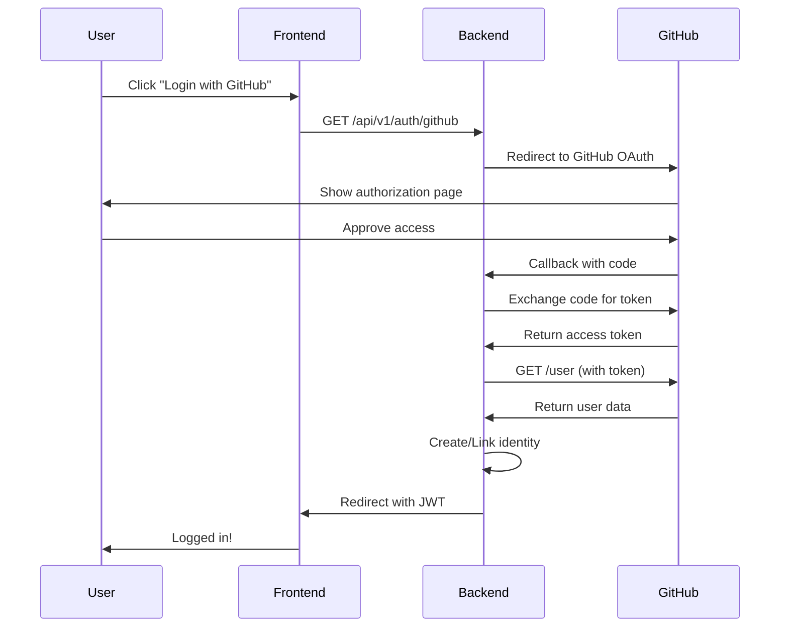

# GitHub OAuth App 설정 가이드

## 📋 GitHub OAuth App 생성 단계

### 1. GitHub Developer Settings 접속
1. GitHub에 로그인
2. 프로필 클릭 → **Settings**
3. 왼쪽 메뉴 하단 → **Developer settings**
4. **OAuth Apps** → **New OAuth App** 클릭

### 2. OAuth App 정보 입력

#### Development 환경 설정
```
Application name: My Blog App (Dev)
Homepage URL: http://localhost:3001
Authorization callback URL: http://localhost:3000/api/v1/auth/github/callback
```

#### Production 환경 설정
```
Application name: My Blog App
Homepage URL: https://yourdomain.com
Authorization callback URL: https://api.yourdomain.com/api/v1/auth/github/callback
```

### 3. Client ID & Secret 받기
1. App 생성 후 **Client ID** 복사
2. **Generate a new client secret** 클릭
3. 생성된 **Client Secret** 즉시 복사 (다시 볼 수 없음!)

### 4. 환경 변수 설정

#### backend/.env 파일에 추가
```bash
# GitHub OAuth
GITHUB_CLIENT_ID=Ov23li... # 실제 Client ID
GITHUB_CLIENT_SECRET=7c8a... # 실제 Client Secret
GITHUB_CALLBACK_URL=http://localhost:3000/api/v1/auth/github/callback
```

## 🔒 보안 주의사항

### ⚠️ 절대 하지 말아야 할 것
- Client Secret을 Git에 커밋 ❌
- Client Secret을 프론트엔드 코드에 포함 ❌
- .env 파일을 공개 저장소에 업로드 ❌

### ✅ 반드시 해야 할 것
- .env 파일이 .gitignore에 포함되어 있는지 확인
- Client Secret은 백엔드 서버에서만 사용
- Production 환경에서는 환경 변수 암호화 사용

## 🔍 필요한 GitHub 권한 (Scopes)

기본적으로 GitHub OAuth는 공개 정보만 접근합니다:
- 사용자 이메일 (public email)
- 사용자 프로필 정보
- 사용자 아바타

추가 권한이 필요한 경우 scope를 명시해야 합니다.

## 📝 테스트 방법

### 1. 서버 시작
```bash
cd backend
pnpm start:dev
```

### 2. 환경 변수 확인
```bash
# .env 파일에 GitHub 관련 변수가 있는지 확인
cat .env | grep GITHUB
```

### 3. GitHub 로그인 테스트
1. 브라우저에서 `http://localhost:3000/api/v1/auth/github` 접속
2. GitHub 인증 페이지로 리다이렉트 확인
3. 승인 후 콜백 처리 확인

## 🚨 트러블슈팅

### "redirect_uri_mismatch" 에러
- GitHub App 설정의 callback URL과 환경 변수의 URL이 정확히 일치하는지 확인
- 프로토콜(http/https), 포트 번호, 경로 모두 확인

### "bad_verification_code" 에러
- Client Secret이 올바른지 확인
- 환경 변수가 제대로 로드되는지 확인

### "Application suspended" 에러
- GitHub App이 활성화되어 있는지 확인
- GitHub Developer Settings에서 App 상태 확인

## 📊 GitHub OAuth Flow



## 🔗 참고 링크

- [GitHub OAuth Apps Documentation](https://docs.github.com/en/apps/oauth-apps)
- [GitHub OAuth Scopes](https://docs.github.com/en/apps/oauth-apps/building-oauth-apps/scopes-for-oauth-apps)
- [GitHub REST API - Users](https://docs.github.com/en/rest/users/users)

---

**작성일**: 2025-09-02  
**다음 단계**: GitHub Strategy 구현 → AuthService 업데이트 → Frontend 통합