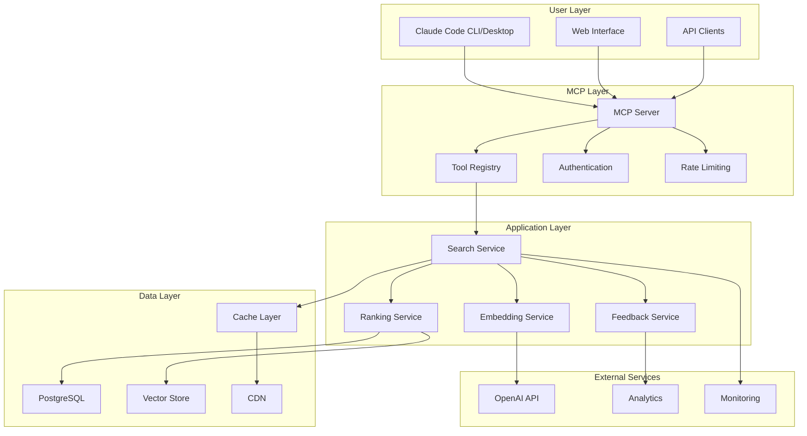
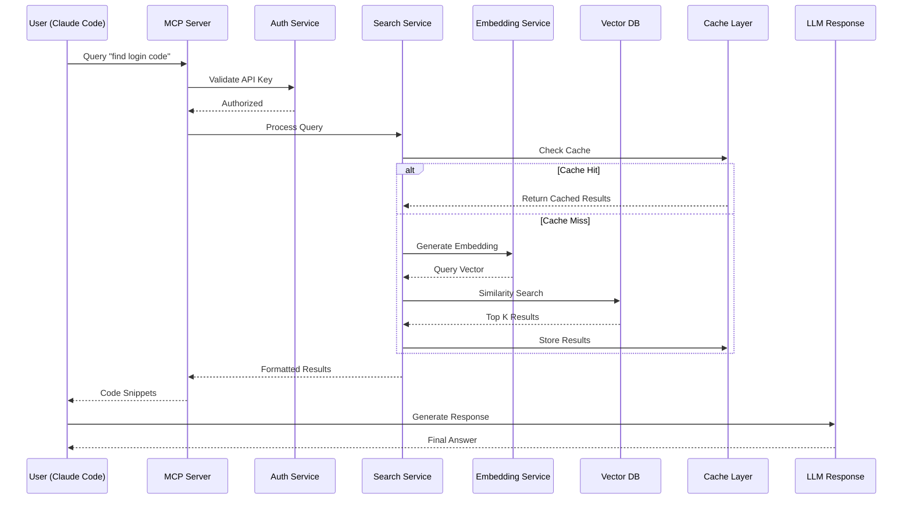
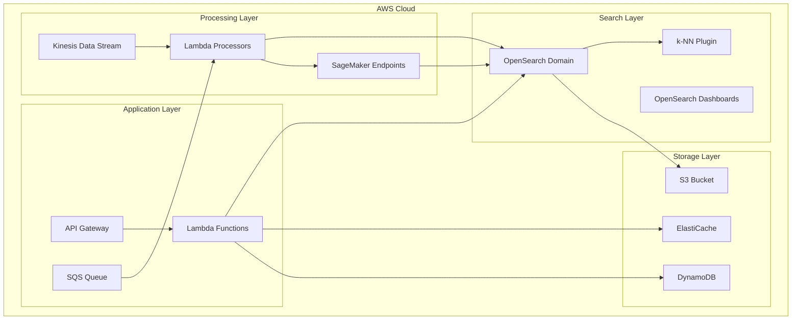
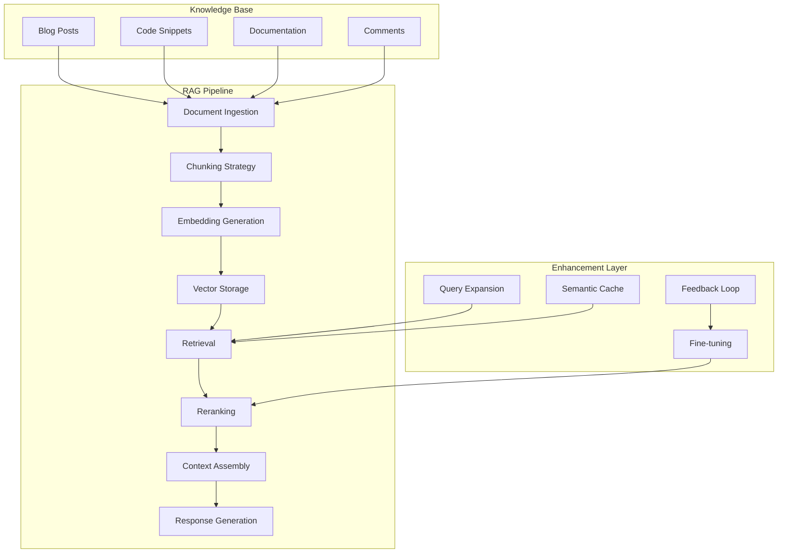
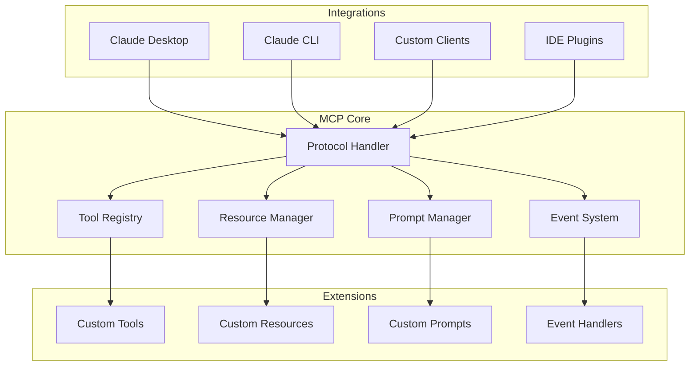
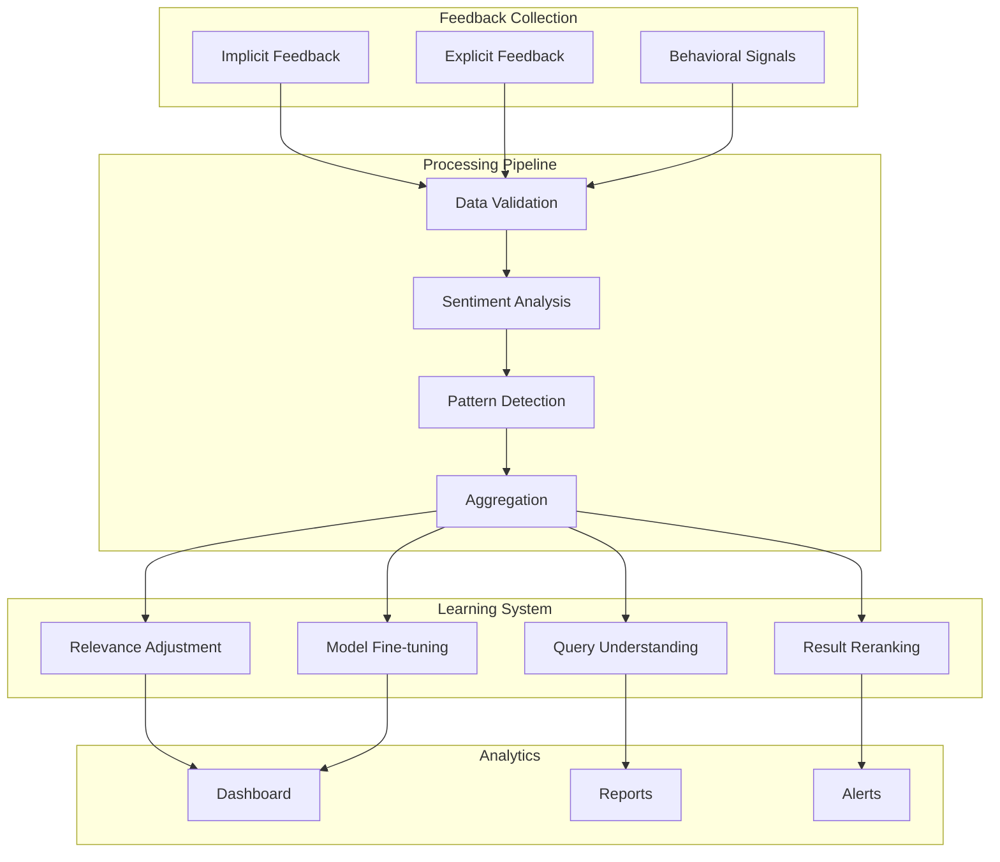

# Codebase.blog Intelligent MCP System - Comprehensive Design Document

## Table of Contents
1. [Executive Summary](#executive-summary)
2. [System Architecture Overview](#system-architecture-overview)
3. [Implementation Approaches](#implementation-approaches)
   - [Approach 1: PostgreSQL + pgvector](#approach-1-postgresql--pgvector)
   - [Approach 2: AWS Elasticsearch](#approach-2-aws-elasticsearch)
   - [Approach 3: RAG System](#approach-3-rag-system)
4. [MCP Technology Deep Dive](#mcp-technology-deep-dive)
5. [User Feedback System](#user-feedback-system)
6. [Detailed Implementation Guide](#detailed-implementation-guide)
7. [Cost Analysis](#cost-analysis)
8. [Performance Optimization](#performance-optimization)
9. [Security Considerations](#security-considerations)
10. [Future Roadmap](#future-roadmap)

---

## Executive Summary

### Vision Statement
Transform codebase.blog from a simple technical blogging platform into an intelligent knowledge base that serves as a living documentation system for developers. The system will enable seamless code discovery through natural language queries via MCP (Model Context Protocol), making technical knowledge instantly accessible to AI assistants.

### Core Capabilities
- **Semantic Code Search**: Find relevant code snippets using natural language
- **Context-Aware Responses**: Provide code examples with full context
- **Real-time Learning**: Continuously improve based on user interactions
- **Multi-modal Support**: Handle code, documentation, and diagrams
- **Feedback Loop**: Learn from user interactions to improve relevance

### Business Value
- **Developer Productivity**: 10x faster code discovery
- **Knowledge Retention**: Preserve institutional knowledge
- **AI-First Documentation**: Native integration with AI tools
- **Community Building**: Share and discover best practices

---

## System Architecture Overview

### High-Level Architecture



### Data Flow Architecture



---

## Implementation Approaches

## Approach 1: PostgreSQL + pgvector

### Detailed Architecture

pgvector is a PostgreSQL extension that adds vector similarity search capabilities. This approach leverages your existing PostgreSQL infrastructure.

#### Database Schema

```sql
-- Enable pgvector extension
CREATE EXTENSION IF NOT EXISTS vector;

-- Main content table with vector embeddings
CREATE TABLE blog_embeddings (
    id UUID PRIMARY KEY DEFAULT gen_random_uuid(),
    post_id UUID REFERENCES posts(id) ON DELETE CASCADE,
    content_type VARCHAR(50) NOT NULL, -- 'full_post', 'code_block', 'section'
    content TEXT NOT NULL,
    metadata JSONB NOT NULL DEFAULT '{}',
    embedding vector(1536), -- OpenAI ada-002 dimensions
    created_at TIMESTAMP DEFAULT CURRENT_TIMESTAMP,
    updated_at TIMESTAMP DEFAULT CURRENT_TIMESTAMP,
    
    -- Indexes for performance
    INDEX idx_post_id (post_id),
    INDEX idx_content_type (content_type),
    INDEX idx_metadata_gin (metadata),
    INDEX idx_created_at (created_at)
);

-- Create HNSW index for vector similarity search
CREATE INDEX embedding_hnsw_idx ON blog_embeddings 
USING hnsw (embedding vector_cosine_ops)
WITH (m = 16, ef_construction = 64);

-- Query performance tracking
CREATE TABLE search_queries (
    id UUID PRIMARY KEY DEFAULT gen_random_uuid(),
    query_text TEXT NOT NULL,
    query_embedding vector(1536),
    results_count INTEGER,
    response_time_ms INTEGER,
    user_id UUID REFERENCES users(id),
    session_id VARCHAR(255),
    created_at TIMESTAMP DEFAULT CURRENT_TIMESTAMP
);

-- User feedback table
CREATE TABLE search_feedback (
    id UUID PRIMARY KEY DEFAULT gen_random_uuid(),
    query_id UUID REFERENCES search_queries(id),
    result_id UUID REFERENCES blog_embeddings(id),
    feedback_type VARCHAR(50), -- 'helpful', 'not_helpful', 'wrong'
    feedback_text TEXT,
    created_at TIMESTAMP DEFAULT CURRENT_TIMESTAMP
);
```

#### Embedding Generation Pipeline

```typescript
// Embedding Service Implementation
import { OpenAI } from 'openai';
import { Pool } from 'pg';
import { z } from 'zod';

interface EmbeddingConfig {
  model: 'text-embedding-3-small' | 'text-embedding-3-large';
  dimensions: number;
  batchSize: number;
  retryAttempts: number;
}

class EmbeddingService {
  private openai: OpenAI;
  private db: Pool;
  private config: EmbeddingConfig;
  
  constructor(config: EmbeddingConfig) {
    this.openai = new OpenAI({ apiKey: process.env.OPENAI_API_KEY });
    this.db = new Pool({ connectionString: process.env.DATABASE_URL });
    this.config = config;
  }
  
  /**
   * Generate embeddings for a blog post
   * Implements intelligent chunking strategy
   */
  async generatePostEmbeddings(postId: string): Promise<void> {
    const post = await this.fetchPost(postId);
    const chunks = this.chunkContent(post);
    
    // Batch process chunks for efficiency
    for (let i = 0; i < chunks.length; i += this.config.batchSize) {
      const batch = chunks.slice(i, i + this.config.batchSize);
      const embeddings = await this.generateBatchEmbeddings(batch);
      await this.storeEmbeddings(postId, batch, embeddings);
    }
  }
  
  /**
   * Intelligent content chunking strategy
   */
  private chunkContent(post: BlogPost): ContentChunk[] {
    const chunks: ContentChunk[] = [];
    
    // Strategy 1: Extract code blocks as separate chunks
    const codeBlocks = this.extractCodeBlocks(post.content);
    codeBlocks.forEach(block => {
      chunks.push({
        type: 'code_block',
        content: block.code,
        metadata: {
          language: block.language,
          title: block.title,
          tags: post.tags,
          postTitle: post.title
        }
      });
    });
    
    // Strategy 2: Chunk remaining content by sections
    const sections = this.extractSections(post.content);
    sections.forEach(section => {
      if (section.content.length > 1000) {
        // Further chunk large sections
        const subChunks = this.chunkBySentence(section.content, 500);
        subChunks.forEach(subChunk => {
          chunks.push({
            type: 'section',
            content: subChunk,
            metadata: {
              sectionTitle: section.title,
              postTitle: post.title,
              tags: post.tags
            }
          });
        });
      } else {
        chunks.push({
          type: 'section',
          content: section.content,
          metadata: {
            sectionTitle: section.title,
            postTitle: post.title,
            tags: post.tags
          }
        });
      }
    });
    
    // Strategy 3: Add full post for context
    chunks.push({
      type: 'full_post',
      content: post.content.substring(0, 2000), // Limit size
      metadata: {
        title: post.title,
        tags: post.tags,
        author: post.author,
        createdAt: post.createdAt
      }
    });
    
    return chunks;
  }
  
  /**
   * Generate embeddings with retry logic
   */
  private async generateBatchEmbeddings(
    chunks: ContentChunk[]
  ): Promise<number[][]> {
    const texts = chunks.map(c => c.content);
    
    for (let attempt = 0; attempt < this.config.retryAttempts; attempt++) {
      try {
        const response = await this.openai.embeddings.create({
          model: this.config.model,
          input: texts,
          dimensions: this.config.dimensions
        });
        
        return response.data.map(d => d.embedding);
      } catch (error) {
        if (attempt === this.config.retryAttempts - 1) throw error;
        await this.sleep(Math.pow(2, attempt) * 1000); // Exponential backoff
      }
    }
    
    throw new Error('Failed to generate embeddings');
  }
}
```

#### Search Implementation

```typescript
// Advanced Search Service
class SearchService {
  private db: Pool;
  private embeddingService: EmbeddingService;
  private cache: Redis;
  
  /**
   * Hybrid search combining vector similarity and keyword matching
   */
  async search(query: string, options: SearchOptions): Promise<SearchResult[]> {
    // Check cache first
    const cacheKey = this.getCacheKey(query, options);
    const cached = await this.cache.get(cacheKey);
    if (cached) return JSON.parse(cached);
    
    // Generate query embedding
    const queryEmbedding = await this.embeddingService.generateEmbedding(query);
    
    // Parallel search strategies
    const [vectorResults, keywordResults, tagResults] = await Promise.all([
      this.vectorSearch(queryEmbedding, options),
      this.keywordSearch(query, options),
      this.tagSearch(query, options)
    ]);
    
    // Merge and rank results
    const mergedResults = this.mergeResults(
      vectorResults,
      keywordResults,
      tagResults,
      options
    );
    
    // Apply re-ranking based on user feedback
    const rerankedResults = await this.rerank(mergedResults, query);
    
    // Cache results
    await this.cache.setex(cacheKey, 3600, JSON.stringify(rerankedResults));
    
    // Track query for analytics
    await this.trackQuery(query, queryEmbedding, rerankedResults);
    
    return rerankedResults;
  }
  
  /**
   * Vector similarity search using pgvector
   */
  private async vectorSearch(
    embedding: number[],
    options: SearchOptions
  ): Promise<SearchResult[]> {
    const query = `
      SELECT 
        be.id,
        be.post_id,
        be.content,
        be.metadata,
        be.embedding <=> $1 as distance,
        p.title as post_title,
        p.slug as post_slug,
        p.author_id,
        u.username as author_name
      FROM blog_embeddings be
      JOIN posts p ON be.post_id = p.id
      JOIN users u ON p.author_id = u.id
      WHERE 
        be.embedding <=> $1 < $2  -- Distance threshold
        ${options.contentType ? 'AND be.content_type = $3' : ''}
        ${options.tags ? 'AND be.metadata->\'tags\' ?| $4' : ''}
      ORDER BY distance
      LIMIT $5
    `;
    
    const params = [
      `[${embedding.join(',')}]`,
      options.distanceThreshold || 0.5,
      options.contentType,
      options.tags,
      options.limit || 10
    ].filter(Boolean);
    
    const result = await this.db.query(query, params);
    
    return result.rows.map(row => ({
      id: row.id,
      postId: row.post_id,
      content: row.content,
      metadata: row.metadata,
      score: 1 - row.distance, // Convert distance to similarity score
      postTitle: row.post_title,
      postSlug: row.post_slug,
      authorName: row.author_name
    }));
  }
  
  /**
   * Intelligent result re-ranking based on multiple factors
   */
  private async rerank(
    results: SearchResult[],
    query: string
  ): Promise<SearchResult[]> {
    // Fetch historical feedback for these results
    const feedback = await this.fetchFeedback(results.map(r => r.id));
    
    // Calculate composite score
    return results.map(result => {
      let score = result.score;
      
      // Factor 1: User feedback history
      const resultFeedback = feedback[result.id];
      if (resultFeedback) {
        score *= (1 + resultFeedback.helpfulRatio * 0.2);
      }
      
      // Factor 2: Content freshness
      const ageInDays = this.calculateAge(result.metadata.createdAt);
      score *= Math.exp(-ageInDays / 365); // Decay over time
      
      // Factor 3: Author reputation
      score *= (1 + (result.metadata.authorReputation || 0) * 0.1);
      
      // Factor 4: Code block relevance for code queries
      if (this.isCodeQuery(query) && result.metadata.hasCode) {
        score *= 1.2;
      }
      
      return { ...result, score };
    }).sort((a, b) => b.score - a.score);
  }
}
```

### Performance Optimizations

#### 1. Index Optimization

```sql
-- Optimize HNSW parameters based on dataset size
ALTER INDEX embedding_hnsw_idx SET (m = 32, ef_construction = 128);

-- Add covering index for common queries
CREATE INDEX idx_embeddings_covering ON blog_embeddings 
  (post_id, content_type) 
  INCLUDE (content, metadata);

-- Partial index for active content only
CREATE INDEX idx_active_embeddings ON blog_embeddings (embedding)
  WHERE created_at > NOW() - INTERVAL '1 year';
```

#### 2. Query Optimization

```typescript
// Implement query result caching with intelligent invalidation
class QueryCache {
  private redis: Redis;
  private bloomFilter: BloomFilter;
  
  async get(query: string): Promise<SearchResult[] | null> {
    // Use Bloom filter for quick negative lookups
    if (!this.bloomFilter.has(query)) {
      return null;
    }
    
    const cached = await this.redis.get(this.hashQuery(query));
    if (cached) {
      // Extend TTL for popular queries
      await this.redis.expire(this.hashQuery(query), 7200);
      return JSON.parse(cached);
    }
    
    return null;
  }
  
  async set(query: string, results: SearchResult[]): Promise<void> {
    const hashedQuery = this.hashQuery(query);
    
    // Add to Bloom filter
    this.bloomFilter.add(query);
    
    // Adaptive TTL based on query popularity
    const ttl = await this.calculateTTL(query);
    
    await this.redis.setex(
      hashedQuery,
      ttl,
      JSON.stringify(results)
    );
  }
  
  private async calculateTTL(query: string): Promise<number> {
    const popularity = await this.getQueryPopularity(query);
    
    if (popularity > 100) return 86400; // 24 hours for very popular
    if (popularity > 10) return 7200;   // 2 hours for popular
    return 3600; // 1 hour default
  }
}
```

---

## Approach 2: AWS Elasticsearch

### Architecture Overview

AWS Elasticsearch (OpenSearch) provides a managed search service with built-in vector search capabilities through k-NN plugin.



### OpenSearch Index Configuration

```json
{
  "settings": {
    "index": {
      "number_of_shards": 3,
      "number_of_replicas": 2,
      "knn": true,
      "knn.space_type": "cosinesimil",
      "analysis": {
        "analyzer": {
          "code_analyzer": {
            "type": "custom",
            "tokenizer": "standard",
            "filter": ["lowercase", "stop", "code_synonyms"]
          }
        },
        "filter": {
          "code_synonyms": {
            "type": "synonym",
            "synonyms": [
              "auth,authentication,login",
              "db,database,sql",
              "api,endpoint,route"
            ]
          }
        }
      }
    }
  },
  "mappings": {
    "properties": {
      "post_id": { "type": "keyword" },
      "title": { 
        "type": "text",
        "analyzer": "standard",
        "fields": {
          "keyword": { "type": "keyword" }
        }
      },
      "content": { 
        "type": "text",
        "analyzer": "code_analyzer"
      },
      "code_blocks": {
        "type": "nested",
        "properties": {
          "language": { "type": "keyword" },
          "code": { "type": "text" },
          "description": { "type": "text" }
        }
      },
      "embedding": {
        "type": "knn_vector",
        "dimension": 1536,
        "method": {
          "name": "hnsw",
          "space_type": "cosinesimil",
          "engine": "nmslib",
          "parameters": {
            "ef_construction": 128,
            "m": 24
          }
        }
      },
      "tags": { "type": "keyword" },
      "author": { "type": "keyword" },
      "created_at": { "type": "date" },
      "updated_at": { "type": "date" },
      "view_count": { "type": "integer" },
      "helpful_count": { "type": "integer" },
      "metadata": { "type": "object" }
    }
  }
}
```

### Lambda Implementation

```typescript
// Lambda function for search API
import { Client } from '@opensearch-project/opensearch';
import { AwsSigv4Signer } from '@opensearch-project/opensearch/aws';
import { defaultProvider } from '@aws-sdk/credential-provider-node';

export const handler = async (event: APIGatewayProxyEvent) => {
  const { query, filters, options } = JSON.parse(event.body || '{}');
  
  // Initialize OpenSearch client
  const client = new Client({
    ...AwsSigv4Signer({
      region: process.env.AWS_REGION,
      service: 'es',
      getCredentials: () => defaultProvider()()
    }),
    node: process.env.OPENSEARCH_ENDPOINT
  });
  
  // Generate embedding for query
  const queryEmbedding = await generateEmbedding(query);
  
  // Build OpenSearch query
  const searchQuery = {
    index: 'blog-content',
    body: {
      size: options?.limit || 10,
      query: {
        bool: {
          should: [
            // Vector similarity search
            {
              knn: {
                embedding: {
                  vector: queryEmbedding,
                  k: 20
                }
              }
            },
            // Text search with boosting
            {
              multi_match: {
                query: query,
                fields: [
                  'title^3',
                  'content^2',
                  'code_blocks.code',
                  'tags^2'
                ],
                type: 'best_fields',
                fuzziness: 'AUTO'
              }
            }
          ],
          filter: buildFilters(filters),
          minimum_should_match: 1
        }
      },
      // Custom scoring
      rescore: {
        window_size: 50,
        query: {
          rescore_query: {
            function_score: {
              functions: [
                {
                  field_value_factor: {
                    field: 'helpful_count',
                    factor: 1.2,
                    modifier: 'log1p'
                  }
                },
                {
                  gauss: {
                    created_at: {
                      origin: 'now',
                      scale: '30d',
                      decay: 0.5
                    }
                  }
                }
              ],
              score_mode: 'sum',
              boost_mode: 'multiply'
            }
          },
          query_weight: 0.7,
          rescore_query_weight: 1.2
        }
      },
      // Aggregations for facets
      aggs: {
        tags: {
          terms: { field: 'tags', size: 20 }
        },
        languages: {
          terms: { field: 'code_blocks.language', size: 10 }
        },
        authors: {
          terms: { field: 'author', size: 10 }
        }
      },
      // Highlighting
      highlight: {
        fields: {
          content: {
            fragment_size: 150,
            number_of_fragments: 3
          },
          'code_blocks.code': {
            fragment_size: 200,
            number_of_fragments: 2
          }
        }
      }
    }
  };
  
  const response = await client.search(searchQuery);
  
  // Process and format results
  const results = response.body.hits.hits.map(hit => ({
    id: hit._id,
    score: hit._score,
    ...hit._source,
    highlights: hit.highlight
  }));
  
  // Log search metrics
  await logSearchMetrics({
    query,
    resultsCount: results.length,
    responseTime: response.body.took,
    maxScore: response.body.hits.max_score
  });
  
  return {
    statusCode: 200,
    body: JSON.stringify({
      results,
      facets: response.body.aggregations,
      total: response.body.hits.total.value
    })
  };
};
```

### Real-time Indexing Pipeline

```typescript
// Kinesis processor for real-time content indexing
export const kinesisProcessor = async (event: KinesisStreamEvent) => {
  const client = getOpenSearchClient();
  const sagemakerRuntime = new SageMakerRuntimeClient();
  
  const records = event.Records.map(record => {
    const payload = Buffer.from(record.kinesis.data, 'base64').toString();
    return JSON.parse(payload);
  });
  
  const bulkOperations = [];
  
  for (const record of records) {
    // Generate embedding using SageMaker endpoint
    const embeddingResponse = await sagemakerRuntime.send(
      new InvokeEndpointCommand({
        EndpointName: process.env.EMBEDDING_ENDPOINT,
        ContentType: 'application/json',
        Body: JSON.stringify({ text: record.content })
      })
    );
    
    const embedding = JSON.parse(
      new TextDecoder().decode(embeddingResponse.Body)
    ).embedding;
    
    // Prepare bulk index operation
    bulkOperations.push(
      { index: { _index: 'blog-content', _id: record.id } },
      {
        ...record,
        embedding,
        indexed_at: new Date().toISOString()
      }
    );
  }
  
  // Bulk index to OpenSearch
  if (bulkOperations.length > 0) {
    const bulkResponse = await client.bulk({
      body: bulkOperations
    });
    
    if (bulkResponse.body.errors) {
      console.error('Bulk indexing errors:', bulkResponse.body.items);
    }
  }
};
```

---

## Approach 3: RAG System

### RAG Architecture Overview



### Advanced RAG Implementation

```python
# Advanced RAG System Implementation
import numpy as np
from typing import List, Dict, Any, Optional
from dataclasses import dataclass
from langchain.text_splitter import RecursiveCharacterTextSplitter
from langchain.embeddings import OpenAIEmbeddings
from langchain.vectorstores import Chroma
from langchain.chains import RetrievalQA
from langchain.llms import OpenAI
import faiss
import torch
from transformers import AutoTokenizer, AutoModel
from sentence_transformers import CrossEncoder

@dataclass
class RAGConfig:
    chunk_size: int = 1000
    chunk_overlap: int = 200
    embedding_model: str = "text-embedding-3-small"
    rerank_model: str = "cross-encoder/ms-marco-MiniLM-L-6-v2"
    retrieval_k: int = 20
    rerank_k: int = 5
    temperature: float = 0.0
    max_tokens: int = 2000

class AdvancedRAGSystem:
    def __init__(self, config: RAGConfig):
        self.config = config
        self.embeddings = OpenAIEmbeddings(model=config.embedding_model)
        self.reranker = CrossEncoder(config.rerank_model)
        self.vector_store = None
        self.metadata_index = {}
        
    def ingest_documents(self, documents: List[Dict[str, Any]]):
        """
        Intelligent document ingestion with metadata preservation
        """
        processed_chunks = []
        
        for doc in documents:
            # Custom chunking based on document type
            chunks = self._intelligent_chunk(doc)
            
            # Add metadata to each chunk
            for chunk in chunks:
                chunk_id = self._generate_chunk_id(doc['id'], chunk)
                processed_chunk = {
                    'id': chunk_id,
                    'content': chunk['content'],
                    'metadata': {
                        **doc['metadata'],
                        'chunk_type': chunk['type'],
                        'chunk_index': chunk['index'],
                        'parent_id': doc['id'],
                        'timestamp': doc['created_at']
                    }
                }
                processed_chunks.append(processed_chunk)
                self.metadata_index[chunk_id] = processed_chunk['metadata']
        
        # Generate embeddings and store
        self._store_embeddings(processed_chunks)
        
    def _intelligent_chunk(self, document: Dict[str, Any]) -> List[Dict]:
        """
        Content-aware chunking strategy
        """
        chunks = []
        content = document['content']
        doc_type = document.get('type', 'general')
        
        if doc_type == 'code':
            # For code, chunk by functions/classes
            chunks.extend(self._chunk_code(content))
        elif doc_type == 'tutorial':
            # For tutorials, chunk by sections
            chunks.extend(self._chunk_by_sections(content))
        else:
            # Default recursive chunking
            text_splitter = RecursiveCharacterTextSplitter(
                chunk_size=self.config.chunk_size,
                chunk_overlap=self.config.chunk_overlap,
                separators=["\n\n", "\n", ". ", " ", ""]
            )
            text_chunks = text_splitter.split_text(content)
            chunks = [
                {'content': chunk, 'type': 'text', 'index': i}
                for i, chunk in enumerate(text_chunks)
            ]
        
        return chunks
    
    def _chunk_code(self, content: str) -> List[Dict]:
        """
        Intelligent code chunking by logical units
        """
        import ast
        chunks = []
        
        try:
            # Parse Python code
            tree = ast.parse(content)
            
            for node in ast.walk(tree):
                if isinstance(node, (ast.FunctionDef, ast.ClassDef)):
                    # Extract function or class as a chunk
                    start_line = node.lineno - 1
                    end_line = node.end_lineno
                    
                    chunk_content = '\n'.join(
                        content.split('\n')[start_line:end_line]
                    )
                    
                    chunks.append({
                        'content': chunk_content,
                        'type': 'code_function' if isinstance(node, ast.FunctionDef) else 'code_class',
                        'index': len(chunks),
                        'name': node.name
                    })
        except:
            # Fallback for non-Python or invalid code
            lines = content.split('\n')
            chunk_size = 50  # lines per chunk
            
            for i in range(0, len(lines), chunk_size - 10):
                chunk_content = '\n'.join(lines[i:i + chunk_size])
                chunks.append({
                    'content': chunk_content,
                    'type': 'code_block',
                    'index': len(chunks)
                })
        
        return chunks
    
    def retrieve(
        self,
        query: str,
        filters: Optional[Dict] = None
    ) -> List[Dict]:
        """
        Multi-stage retrieval with reranking
        """
        # Stage 1: Query expansion
        expanded_queries = self._expand_query(query)
        
        # Stage 2: Initial retrieval
        candidates = []
        for exp_query in expanded_queries:
            results = self.vector_store.similarity_search_with_score(
                exp_query,
                k=self.config.retrieval_k,
                filter=filters
            )
            candidates.extend(results)
        
        # Remove duplicates
        unique_candidates = self._deduplicate_results(candidates)
        
        # Stage 3: Reranking
        reranked = self._rerank_results(query, unique_candidates)
        
        # Stage 4: Context assembly
        final_context = self._assemble_context(reranked[:self.config.rerank_k])
        
        return final_context
    
    def _expand_query(self, query: str) -> List[str]:
        """
        Query expansion using multiple strategies
        """
        expanded = [query]
        
        # Strategy 1: Synonym expansion
        synonyms = self._get_synonyms(query)
        expanded.extend(synonyms)
        
        # Strategy 2: Acronym expansion
        acronyms = self._expand_acronyms(query)
        expanded.extend(acronyms)
        
        # Strategy 3: Related terms
        related = self._get_related_terms(query)
        expanded.extend(related)
        
        return list(set(expanded))[:5]  # Limit to 5 queries
    
    def _rerank_results(
        self,
        query: str,
        candidates: List[tuple]
    ) -> List[Dict]:
        """
        Cross-encoder reranking for better relevance
        """
        if not candidates:
            return []
        
        # Prepare pairs for reranking
        pairs = [[query, doc[0].page_content] for doc in candidates]
        
        # Get reranking scores
        scores = self.reranker.predict(pairs)
        
        # Combine with original scores
        reranked = []
        for i, (doc, original_score) in enumerate(candidates):
            combined_score = 0.7 * scores[i] + 0.3 * (1 - original_score)
            reranked.append({
                'content': doc.page_content,
                'metadata': doc.metadata,
                'score': combined_score,
                'original_score': original_score,
                'rerank_score': scores[i]
            })
        
        # Sort by combined score
        reranked.sort(key=lambda x: x['score'], reverse=True)
        
        return reranked
    
    def _assemble_context(self, documents: List[Dict]) -> List[Dict]:
        """
        Intelligent context assembly with deduplication
        """
        assembled = []
        seen_content = set()
        
        for doc in documents:
            # Check for near-duplicates
            content_hash = self._fuzzy_hash(doc['content'])
            if content_hash not in seen_content:
                seen_content.add(content_hash)
                
                # Add parent context if available
                if doc['metadata'].get('parent_id'):
                    parent_context = self._get_parent_context(
                        doc['metadata']['parent_id']
                    )
                    doc['parent_context'] = parent_context
                
                assembled.append(doc)
        
        return assembled
    
    def generate_response(
        self,
        query: str,
        context: List[Dict]
    ) -> str:
        """
        Generate response using retrieved context
        """
        # Format context for LLM
        formatted_context = self._format_context(context)
        
        # Create prompt
        prompt = f"""
        You are an AI assistant helping developers find relevant code and documentation.
        
        Query: {query}
        
        Context:
        {formatted_context}
        
        Based on the context above, provide a helpful response to the query.
        Include relevant code examples and explanations.
        """
        
        # Generate response
        llm = OpenAI(
            temperature=self.config.temperature,
            max_tokens=self.config.max_tokens
        )
        
        response = llm(prompt)
        
        # Post-process response
        processed_response = self._post_process_response(response, context)
        
        return processed_response
```

### RAG Optimization Strategies

```python
class RAGOptimizer:
    """
    Advanced optimization strategies for RAG systems
    """
    
    def __init__(self, rag_system: AdvancedRAGSystem):
        self.rag = rag_system
        self.cache = {}
        self.feedback_store = []
        
    def optimize_chunking(self, documents: List[Dict]) -> Dict[str, Any]:
        """
        Adaptive chunking based on content analysis
        """
        optimization_results = {
            'original_chunks': 0,
            'optimized_chunks': 0,
            'strategies_used': []
        }
        
        for doc in documents:
            content_length = len(doc['content'])
            content_type = self._detect_content_type(doc['content'])
            
            # Dynamic chunk size based on content
            if content_type == 'code':
                chunk_size = min(1500, content_length // 10)
                overlap = 100
                strategy = 'code_aware_chunking'
            elif content_type == 'tutorial':
                chunk_size = min(2000, content_length // 8)
                overlap = 200
                strategy = 'section_based_chunking'
            else:
                chunk_size = min(1000, content_length // 15)
                overlap = 150
                strategy = 'standard_chunking'
            
            optimization_results['strategies_used'].append(strategy)
            
        return optimization_results
    
    def implement_hybrid_search(
        self,
        query: str,
        alpha: float = 0.5
    ) -> List[Dict]:
        """
        Hybrid search combining dense and sparse retrieval
        """
        # Dense retrieval (vector similarity)
        dense_results = self.rag.vector_store.similarity_search(
            query,
            k=50
        )
        
        # Sparse retrieval (BM25)
        sparse_results = self._bm25_search(query, k=50)
        
        # Combine results using reciprocal rank fusion
        combined = self._reciprocal_rank_fusion(
            dense_results,
            sparse_results,
            alpha=alpha
        )
        
        return combined
    
    def _reciprocal_rank_fusion(
        self,
        dense_results: List,
        sparse_results: List,
        alpha: float = 0.5,
        k: int = 60
    ) -> List[Dict]:
        """
        Reciprocal Rank Fusion for combining search results
        """
        scores = {}
        
        # Score dense results
        for rank, doc in enumerate(dense_results):
            doc_id = doc.metadata.get('id', str(doc))
            scores[doc_id] = scores.get(doc_id, 0) + alpha / (k + rank + 1)
        
        # Score sparse results
        for rank, doc in enumerate(sparse_results):
            doc_id = doc.metadata.get('id', str(doc))
            scores[doc_id] = scores.get(doc_id, 0) + (1 - alpha) / (k + rank + 1)
        
        # Sort by combined score
        sorted_docs = sorted(
            scores.items(),
            key=lambda x: x[1],
            reverse=True
        )
        
        # Retrieve full documents
        results = []
        for doc_id, score in sorted_docs[:20]:
            doc = self._get_document_by_id(doc_id)
            if doc:
                doc['fusion_score'] = score
                results.append(doc)
        
        return results
    
    def implement_caching(self, ttl: int = 3600) -> None:
        """
        Multi-level caching strategy
        """
        # Level 1: Query result cache
        self.query_cache = LRUCache(maxsize=1000, ttl=ttl)
        
        # Level 2: Embedding cache
        self.embedding_cache = LRUCache(maxsize=5000, ttl=ttl * 2)
        
        # Level 3: Document cache
        self.document_cache = LRUCache(maxsize=10000, ttl=ttl * 4)
    
    def collect_feedback(
        self,
        query: str,
        results: List[Dict],
        feedback: Dict[str, Any]
    ) -> None:
        """
        Collect user feedback for continuous improvement
        """
        feedback_entry = {
            'timestamp': datetime.now().isoformat(),
            'query': query,
            'results': [r['id'] for r in results],
            'feedback': feedback,
            'context': {
                'user_id': feedback.get('user_id'),
                'session_id': feedback.get('session_id'),
                'device': feedback.get('device')
            }
        }
        
        self.feedback_store.append(feedback_entry)
        
        # Trigger retraining if enough feedback collected
        if len(self.feedback_store) >= 100:
            self._trigger_retraining()
    
    def _trigger_retraining(self) -> None:
        """
        Fine-tune embeddings based on user feedback
        """
        # Prepare training data from feedback
        positive_pairs = []
        negative_pairs = []
        
        for entry in self.feedback_store:
            query = entry['query']
            for i, result_id in enumerate(entry['results']):
                if entry['feedback'].get(f'result_{i}_helpful'):
                    positive_pairs.append((query, result_id))
                elif entry['feedback'].get(f'result_{i}_not_helpful'):
                    negative_pairs.append((query, result_id))
        
        # Fine-tune embedding model (pseudo-code)
        # This would typically involve:
        # 1. Creating contrastive learning dataset
        # 2. Fine-tuning the embedding model
        # 3. Re-indexing documents with new embeddings
        
        print(f"Collected {len(positive_pairs)} positive and {len(negative_pairs)} negative pairs for training")
```

---

## MCP Technology Deep Dive

### MCP Architecture and Capabilities



### Advanced MCP Server Implementation

```typescript
// Advanced MCP Server with all capabilities
import { 
  MCPServer, 
  Tool, 
  Resource, 
  Prompt,
  EventHandler,
  Feedback 
} from '@modelcontextprotocol/sdk';

class AdvancedBlogMCPServer extends MCPServer {
  private searchService: SearchService;
  private feedbackService: FeedbackService;
  private analyticsService: AnalyticsService;
  private ragSystem: RAGSystem;
  
  constructor() {
    super({
      name: 'codebase-blog-mcp',
      version: '2.0.0',
      description: 'Intelligent code search and knowledge retrieval'
    });
    
    this.initializeServices();
    this.registerTools();
    this.registerResources();
    this.registerPrompts();
    this.registerEventHandlers();
  }
  
  /**
   * Register advanced tools
   */
  private registerTools(): void {
    // Tool 1: Semantic search
    this.registerTool({
      name: 'search_code',
      description: 'Search for code examples and technical content',
      inputSchema: {
        type: 'object',
        properties: {
          query: {
            type: 'string',
            description: 'Natural language search query'
          },
          filters: {
            type: 'object',
            properties: {
              language: { type: 'string' },
              tags: { type: 'array', items: { type: 'string' } },
              author: { type: 'string' },
              dateRange: {
                type: 'object',
                properties: {
                  from: { type: 'string', format: 'date' },
                  to: { type: 'string', format: 'date' }
                }
              }
            }
          },
          options: {
            type: 'object',
            properties: {
              limit: { type: 'integer', minimum: 1, maximum: 100 },
              includeContext: { type: 'boolean' },
              explainRelevance: { type: 'boolean' }
            }
          }
        },
        required: ['query']
      },
      handler: async (params) => {
        const results = await this.searchService.search(
          params.query,
          params.filters,
          params.options
        );
        
        // Track usage for analytics
        await this.analyticsService.trackSearch({
          query: params.query,
          resultsCount: results.length,
          timestamp: new Date()
        });
        
        return {
          results,
          metadata: {
            totalResults: results.length,
            searchTime: results.searchTime,
            relevanceScores: results.map(r => r.score)
          }
        };
      }
    });
    
    // Tool 2: RAG-based code generation
    this.registerTool({
      name: 'generate_code',
      description: 'Generate code based on examples from the knowledge base',
      inputSchema: {
        type: 'object',
        properties: {
          prompt: {
            type: 'string',
            description: 'Description of the code to generate'
          },
          language: {
            type: 'string',
            description: 'Programming language'
          },
          context: {
            type: 'object',
            description: 'Additional context for generation'
          },
          examples: {
            type: 'integer',
            description: 'Number of examples to use',
            minimum: 1,
            maximum: 10
          }
        },
        required: ['prompt']
      },
      handler: async (params) => {
        // Retrieve relevant examples
        const examples = await this.ragSystem.retrieve(
          params.prompt,
          { language: params.language }
        );
        
        // Generate code using RAG
        const generatedCode = await this.ragSystem.generate({
          prompt: params.prompt,
          examples: examples.slice(0, params.examples || 3),
          context: params.context
        });
        
        return {
          code: generatedCode,
          examples: examples.map(e => ({
            id: e.id,
            snippet: e.content,
            source: e.metadata.source
          })),
          confidence: generatedCode.confidence
        };
      }
    });
    
    // Tool 3: Provide feedback
    this.registerTool({
      name: 'provide_feedback',
      description: 'Submit feedback on search results or generated code',
      inputSchema: {
        type: 'object',
        properties: {
          type: {
            type: 'string',
            enum: ['helpful', 'not_helpful', 'incorrect', 'outdated']
          },
          targetId: {
            type: 'string',
            description: 'ID of the result or generated code'
          },
          comment: {
            type: 'string',
            description: 'Additional feedback comment'
          },
          suggestion: {
            type: 'string',
            description: 'Suggested improvement'
          },
          metadata: {
            type: 'object',
            description: 'Additional metadata'
          }
        },
        required: ['type', 'targetId']
      },
      handler: async (params) => {
        // Store feedback
        const feedbackId = await this.feedbackService.store({
          ...params,
          timestamp: new Date(),
          sessionId: this.getSessionId(),
          userId: this.getUserId()
        });
        
        // Update relevance scores based on feedback
        if (params.type === 'helpful') {
          await this.searchService.boostRelevance(params.targetId);
        } else if (params.type === 'not_helpful') {
          await this.searchService.reduceRelevance(params.targetId);
        }
        
        // Send to analytics
        await this.analyticsService.trackFeedback(params);
        
        return {
          feedbackId,
          message: 'Thank you for your feedback!'
        };
      }
    });
    
    // Tool 4: Explain code
    this.registerTool({
      name: 'explain_code',
      description: 'Get detailed explanation of code from the knowledge base',
      inputSchema: {
        type: 'object',
        properties: {
          codeId: {
            type: 'string',
            description: 'ID of the code snippet'
          },
          level: {
            type: 'string',
            enum: ['beginner', 'intermediate', 'advanced'],
            default: 'intermediate'
          },
          focus: {
            type: 'array',
            items: { type: 'string' },
            description: 'Specific aspects to focus on'
          }
        },
        required: ['codeId']
      },
      handler: async (params) => {
        const code = await this.searchService.getById(params.codeId);
        const explanation = await this.ragSystem.explain({
          code: code.content,
          level: params.level,
          focus: params.focus,
          context: code.metadata
        });
        
        return {
          explanation,
          relatedConcepts: explanation.concepts,
          examples: explanation.examples,
          resources: explanation.resources
        };
      }
    });
  }
  
  /**
   * Register resources (browsable content)
   */
  private registerResources(): void {
    // Resource 1: Recent posts
    this.registerResource({
      uri: 'blog://recent',
      name: 'Recent Blog Posts',
      mimeType: 'application/json',
      handler: async () => {
        const posts = await this.searchService.getRecent(10);
        return {
          content: JSON.stringify(posts, null, 2)
        };
      }
    });
    
    // Resource 2: Popular code snippets
    this.registerResource({
      uri: 'blog://popular',
      name: 'Popular Code Snippets',
      mimeType: 'application/json',
      handler: async () => {
        const snippets = await this.searchService.getPopular(20);
        return {
          content: JSON.stringify(snippets, null, 2)
        };
      }
    });
    
    // Resource 3: Tags taxonomy
    this.registerResource({
      uri: 'blog://tags',
      name: 'Available Tags',
      mimeType: 'application/json',
      handler: async () => {
        const tags = await this.searchService.getTagTaxonomy();
        return {
          content: JSON.stringify(tags, null, 2)
        };
      }
    });
  }
  
  /**
   * Register prompt templates
   */
  private registerPrompts(): void {
    // Prompt 1: Code review
    this.registerPrompt({
      name: 'code_review',
      description: 'Review code using best practices from the knowledge base',
      arguments: [
        {
          name: 'code',
          description: 'Code to review',
          required: true
        },
        {
          name: 'language',
          description: 'Programming language',
          required: false
        }
      ],
      handler: async (args) => {
        const bestPractices = await this.searchService.search(
          `${args.language || ''} best practices code review`,
          { tags: ['best-practices', 'code-review'] }
        );
        
        return {
          prompt: `
Review the following code based on these best practices:

${bestPractices.map(p => `- ${p.title}: ${p.summary}`).join('\n')}

Code to review:
\`\`\`${args.language || ''}
${args.code}
\`\`\`

Provide specific feedback on:
1. Code quality and maintainability
2. Performance considerations
3. Security issues
4. Best practice violations
5. Suggested improvements
          `.trim()
        };
      }
    });
    
    // Prompt 2: Implementation guide
    this.registerPrompt({
      name: 'implementation_guide',
      description: 'Get step-by-step implementation guide',
      arguments: [
        {
          name: 'feature',
          description: 'Feature to implement',
          required: true
        },
        {
          name: 'stack',
          description: 'Technology stack',
          required: false
        }
      ],
      handler: async (args) => {
        const examples = await this.ragSystem.retrieve(
          `implement ${args.feature} ${args.stack || ''}`,
          { limit: 5 }
        );
        
        return {
          prompt: `
Create a step-by-step implementation guide for: ${args.feature}

Based on these examples from our knowledge base:

${examples.map((e, i) => `
Example ${i + 1}: ${e.metadata.title}
${e.content}
---
`).join('\n')}

Provide:
1. Prerequisites and setup
2. Step-by-step implementation
3. Code examples for each step
4. Testing approach
5. Common pitfalls to avoid
          `.trim()
        };
      }
    });
  }
  
  /**
   * Register event handlers for real-time updates
   */
  private registerEventHandlers(): void {
    // Event: New content indexed
    this.on('content.indexed', async (event) => {
      // Notify connected clients
      this.broadcast({
        type: 'content.new',
        data: {
          id: event.contentId,
          title: event.title,
          tags: event.tags
        }
      });
    });
    
    // Event: Search performed
    this.on('search.performed', async (event) => {
      // Update trending queries
      await this.analyticsService.updateTrending(event.query);
    });
    
    // Event: Feedback received
    this.on('feedback.received', async (event) => {
      // Trigger reranking if threshold met
      if (await this.feedbackService.shouldRerank()) {
        await this.searchService.rerank();
      }
    });
  }
  
  /**
   * Advanced session management
   */
  private getSessionId(): string {
    return this.context?.sessionId || 'anonymous';
  }
  
  private getUserId(): string {
    return this.context?.userId || 'anonymous';
  }
  
  /**
   * Handle streaming responses for large results
   */
  async *streamResults(query: string) {
    const BATCH_SIZE = 5;
    let offset = 0;
    let hasMore = true;
    
    while (hasMore) {
      const results = await this.searchService.search(
        query,
        {},
        { limit: BATCH_SIZE, offset }
      );
      
      if (results.length > 0) {
        yield results;
        offset += BATCH_SIZE;
      } else {
        hasMore = false;
      }
    }
  }
}
```

### MCP Client Integration

```typescript
// Client-side integration with MCP server
import { MCPClient } from '@modelcontextprotocol/client';

class BlogMCPClient {
  private client: MCPClient;
  private connected: boolean = false;
  
  async connect(): Promise<void> {
    this.client = new MCPClient({
      serverUrl: 'mcp://codebase-blog',
      apiKey: process.env.MCP_API_KEY,
      options: {
        retryAttempts: 3,
        timeout: 10000
      }
    });
    
    await this.client.connect();
    this.connected = true;
    
    // Subscribe to server events
    this.client.on('content.new', this.handleNewContent);
    this.client.on('error', this.handleError);
  }
  
  async searchCode(query: string): Promise<SearchResult[]> {
    if (!this.connected) await this.connect();
    
    const response = await this.client.callTool('search_code', {
      query,
      options: {
        limit: 10,
        includeContext: true
      }
    });
    
    return response.results;
  }
  
  async provideFeedback(
    targetId: string,
    type: 'helpful' | 'not_helpful',
    comment?: string
  ): Promise<void> {
    if (!this.connected) await this.connect();
    
    await this.client.callTool('provide_feedback', {
      targetId,
      type,
      comment
    });
  }
  
  private handleNewContent = (event: any) => {
    console.log('New content available:', event);
    // Update UI or cache
  };
  
  private handleError = (error: any) => {
    console.error('MCP error:', error);
    // Implement retry logic
  };
}
```

---

## User Feedback System

### Comprehensive Feedback Architecture



### Feedback Implementation

```typescript
// Comprehensive feedback system
interface FeedbackData {
  type: 'implicit' | 'explicit' | 'behavioral';
  action: string;
  target: string;
  value: any;
  context: {
    sessionId: string;
    userId?: string;
    timestamp: Date;
    query?: string;
    resultPosition?: number;
  };
}

class FeedbackSystem {
  private feedbackQueue: FeedbackData[] = [];
  private batchSize = 100;
  private flushInterval = 5000; // 5 seconds
  
  constructor(
    private storage: FeedbackStorage,
    private analytics: AnalyticsService,
    private mlPipeline: MLPipeline
  ) {
    this.startBatchProcessor();
  }
  
  /**
   * Collect implicit feedback
   */
  collectImplicit(action: string, target: string, context: any): void {
    this.addFeedback({
      type: 'implicit',
      action,
      target,
      value: this.inferValue(action),
      context: {
        ...context,
        timestamp: new Date()
      }
    });
  }
  
  /**
   * Collect explicit feedback
   */
  collectExplicit(
    target: string,
    rating: number,
    comment?: string,
    context?: any
  ): void {
    this.addFeedback({
      type: 'explicit',
      action: 'rate',
      target,
      value: { rating, comment },
      context: {
        ...context,
        timestamp: new Date()
      }
    });
  }
  
  /**
   * Collect behavioral signals
   */
  collectBehavioral(signal: BehavioralSignal): void {
    this.addFeedback({
      type: 'behavioral',
      action: signal.type,
      target: signal.target,
      value: signal.data,
      context: signal.context
    });
  }
  
  /**
   * Infer feedback value from implicit actions
   */
  private inferValue(action: string): number {
    const actionValues: Record<string, number> = {
      'click': 0.5,
      'copy': 0.8,
      'share': 0.9,
      'bookmark': 0.7,
      'dwell_time_high': 0.6,
      'dwell_time_low': -0.3,
      'bounce': -0.5,
      'scroll_to_end': 0.4
    };
    
    return actionValues[action] || 0;
  }
  
  /**
   * Process feedback batch
   */
  private async processBatch(batch: FeedbackData[]): Promise<void> {
    // Store raw feedback
    await this.storage.storeBatch(batch);
    
    // Aggregate feedback by target
    const aggregated = this.aggregateFeedback(batch);
    
    // Update relevance scores
    for (const [targetId, feedback] of Object.entries(aggregated)) {
      await this.updateRelevance(targetId, feedback);
    }
    
    // Send to ML pipeline for model updates
    await this.mlPipeline.processFeedback(batch);
    
    // Update analytics
    await this.analytics.updateMetrics(batch);
  }
  
  /**
   * Aggregate feedback by target
   */
  private aggregateFeedback(
    batch: FeedbackData[]
  ): Record<string, AggregatedFeedback> {
    const aggregated: Record<string, AggregatedFeedback> = {};
    
    for (const feedback of batch) {
      if (!aggregated[feedback.target]) {
        aggregated[feedback.target] = {
          positive: 0,
          negative: 0,
          neutral: 0,
          totalScore: 0,
          count: 0,
          signals: []
        };
      }
      
      const agg = aggregated[feedback.target];
      agg.count++;
      
      if (feedback.type === 'explicit') {
        const rating = feedback.value.rating;
        if (rating >= 4) agg.positive++;
        else if (rating <= 2) agg.negative++;
        else agg.neutral++;
        agg.totalScore += rating;
      } else if (feedback.type === 'implicit') {
        const value = feedback.value as number;
        if (value > 0) agg.positive++;
        else if (value < 0) agg.negative++;
        else agg.neutral++;
        agg.totalScore += value;
      }
      
      agg.signals.push(feedback);
    }
    
    return aggregated;
  }
  
  /**
   * Update relevance scores based on feedback
   */
  private async updateRelevance(
    targetId: string,
    feedback: AggregatedFeedback
  ): Promise<void> {
    const score = feedback.totalScore / feedback.count;
    const confidence = Math.min(feedback.count / 10, 1); // Confidence based on sample size
    
    // Calculate new relevance score
    const currentRelevance = await this.storage.getRelevance(targetId);
    const newRelevance = currentRelevance * (1 - confidence * 0.3) + score * confidence * 0.3;
    
    await this.storage.updateRelevance(targetId, newRelevance);
    
    // Trigger reindexing if significant change
    if (Math.abs(newRelevance - currentRelevance) > 0.2) {
      await this.triggerReindex(targetId);
    }
  }
  
  /**
   * Start batch processor
   */
  private startBatchProcessor(): void {
    setInterval(async () => {
      if (this.feedbackQueue.length > 0) {
        const batch = this.feedbackQueue.splice(0, this.batchSize);
        await this.processBatch(batch);
      }
    }, this.flushInterval);
  }
  
  private addFeedback(feedback: FeedbackData): void {
    this.feedbackQueue.push(feedback);
    
    // Immediate flush if queue is full
    if (this.feedbackQueue.length >= this.batchSize) {
      const batch = this.feedbackQueue.splice(0, this.batchSize);
      this.processBatch(batch).catch(console.error);
    }
  }
}
```

---

## Detailed Implementation Guide

### Phase 1: Foundation (Weeks 1-2)

#### Week 1: Infrastructure Setup

```bash
# Database setup
psql -U postgres -c "CREATE DATABASE codebase_blog_vectors;"
psql -U postgres -d codebase_blog_vectors -c "CREATE EXTENSION vector;"

# Environment setup
npm init -y
npm install @pgvector/pgvector openai @modelcontextprotocol/sdk
npm install -D typescript @types/node

# Project structure
mkdir -p src/{services,models,utils,mcp}
touch src/index.ts
touch src/services/{embedding,search,feedback}.service.ts
touch src/mcp/server.ts
```

#### Week 2: Basic Implementation

```typescript
// src/services/embedding.service.ts
import { OpenAI } from 'openai';
import { Pool } from 'pg';

export class EmbeddingService {
  private openai: OpenAI;
  private db: Pool;
  
  constructor() {
    this.openai = new OpenAI({
      apiKey: process.env.OPENAI_API_KEY
    });
    
    this.db = new Pool({
      connectionString: process.env.DATABASE_URL,
      max: 20,
      idleTimeoutMillis: 30000,
      connectionTimeoutMillis: 2000
    });
  }
  
  async generateEmbedding(text: string): Promise<number[]> {
    const response = await this.openai.embeddings.create({
      model: 'text-embedding-3-small',
      input: text
    });
    
    return response.data[0].embedding;
  }
  
  async storeEmbedding(
    postId: string,
    content: string,
    embedding: number[]
  ): Promise<void> {
    await this.db.query(
      `INSERT INTO blog_embeddings (post_id, content, embedding)
       VALUES ($1, $2, $3)`,
      [postId, content, `[${embedding.join(',')}]`]
    );
  }
}
```

### Phase 2: MCP Integration (Weeks 3-4)

```typescript
// src/mcp/server.ts
import { MCPServer } from '@modelcontextprotocol/sdk';
import { SearchService } from '../services/search.service';

export class BlogMCPServer extends MCPServer {
  private searchService: SearchService;
  
  constructor() {
    super({
      name: 'codebase-blog',
      version: '1.0.0'
    });
    
    this.searchService = new SearchService();
    this.registerSearchTool();
  }
  
  private registerSearchTool(): void {
    this.registerTool({
      name: 'search_code',
      description: 'Search for code examples',
      inputSchema: {
        type: 'object',
        properties: {
          query: { type: 'string' }
        },
        required: ['query']
      },
      handler: async (params) => {
        const results = await this.searchService.search(params.query);
        return { results };
      }
    });
  }
}

// Start server
const server = new BlogMCPServer();
server.listen(3456);
```

### Phase 3: Advanced Features (Weeks 5-8)

Implementation of RAG, feedback system, and optimization strategies as detailed in previous sections.

---

## Cost Analysis

### Detailed Cost Breakdown

#### OpenAI Embeddings Cost

| Model | Dimensions | Cost per 1K tokens | Monthly Usage | Monthly Cost |
|-------|------------|-------------------|---------------|--------------|
| text-embedding-3-small | 1536 | $0.00002 | 1M tokens | $0.02 |
| text-embedding-3-large | 3072 | $0.00013 | 1M tokens | $0.13 |
| text-embedding-ada-002 | 1536 | $0.0001 | 1M tokens | $0.10 |

#### AWS Elasticsearch Cost

| Instance Type | vCPUs | Memory | Storage | Monthly Cost |
|--------------|-------|---------|---------|--------------|
| t3.small.search | 2 | 2 GB | 10 GB | $25 |
| t3.medium.search | 2 | 4 GB | 100 GB | $50 |
| c5.large.search | 2 | 4 GB | 500 GB | $120 |
| c5.xlarge.search | 4 | 8 GB | 1 TB | $240 |

#### PostgreSQL + pgvector Cost

| Setup | Storage | Compute | Backup | Monthly Cost |
|-------|---------|---------|--------|--------------|
| Development | 10 GB | Shared | None | $0 |
| Small | 100 GB | 2 vCPU, 4GB | Daily | $50 |
| Medium | 500 GB | 4 vCPU, 16GB | Continuous | $200 |
| Large | 2 TB | 8 vCPU, 32GB | Continuous | $500 |

### ROI Analysis

```
Initial Investment: $5,000 - $10,000
- Development: $3,000 - $6,000
- Infrastructure setup: $1,000 - $2,000
- Testing and optimization: $1,000 - $2,000

Monthly Operating Costs:
- Small scale (< 10K queries/month): $50 - $100
- Medium scale (10K - 100K queries/month): $200 - $500
- Large scale (> 100K queries/month): $500 - $2,000

Expected Benefits:
- Developer time saved: 10 hours/month @ $100/hour = $1,000/month
- Improved documentation quality: 20% reduction in support tickets
- Knowledge retention: Invaluable for team scaling

ROI Timeline:
- Break-even: 3-6 months
- Positive ROI: 6-12 months
- 3x ROI: 18-24 months
```

---

## Performance Optimization

### Query Optimization Strategies

```sql
-- Optimize vector search with pre-filtering
CREATE OR REPLACE FUNCTION search_similar_content(
  query_embedding vector(1536),
  tag_filter text[] DEFAULT NULL,
  date_from timestamp DEFAULT NULL,
  limit_count int DEFAULT 10
) RETURNS TABLE (
  id uuid,
  content text,
  similarity float,
  metadata jsonb
) AS $$
BEGIN
  RETURN QUERY
  WITH filtered AS (
    SELECT * FROM blog_embeddings
    WHERE 
      (tag_filter IS NULL OR metadata->>'tags' ?| tag_filter)
      AND (date_from IS NULL OR created_at >= date_from)
  )
  SELECT 
    f.id,
    f.content,
    1 - (f.embedding <=> query_embedding) as similarity,
    f.metadata
  FROM filtered f
  ORDER BY f.embedding <=> query_embedding
  LIMIT limit_count;
END;
$$ LANGUAGE plpgsql;

-- Create materialized view for popular searches
CREATE MATERIALIZED VIEW popular_search_cache AS
SELECT 
  query_text,
  query_embedding,
  array_agg(result_id ORDER BY score DESC) as top_results,
  avg(response_time_ms) as avg_response_time,
  count(*) as search_count
FROM search_queries sq
JOIN search_results sr ON sq.id = sr.query_id
WHERE sq.created_at > NOW() - INTERVAL '7 days'
GROUP BY query_text, query_embedding
HAVING count(*) > 5;

-- Refresh cache periodically
CREATE OR REPLACE FUNCTION refresh_search_cache() RETURNS void AS $$
BEGIN
  REFRESH MATERIALIZED VIEW CONCURRENTLY popular_search_cache;
END;
$$ LANGUAGE plpgsql;

-- Schedule refresh
SELECT cron.schedule('refresh-search-cache', '*/30 * * * *', 'SELECT refresh_search_cache()');
```

### Caching Strategy

```typescript
// Multi-layer caching implementation
class CacheManager {
  private l1Cache: Map<string, CacheEntry>; // In-memory
  private l2Cache: Redis; // Redis
  private l3Cache: CDN; // CloudFlare
  
  async get(key: string): Promise<any> {
    // L1: Check memory cache
    const l1Result = this.l1Cache.get(key);
    if (l1Result && !this.isExpired(l1Result)) {
      return l1Result.value;
    }
    
    // L2: Check Redis
    const l2Result = await this.l2Cache.get(key);
    if (l2Result) {
      this.l1Cache.set(key, {
        value: l2Result,
        timestamp: Date.now(),
        ttl: 300000 // 5 minutes
      });
      return l2Result;
    }
    
    // L3: Check CDN
    const l3Result = await this.l3Cache.get(key);
    if (l3Result) {
      await this.l2Cache.setex(key, 3600, l3Result);
      this.l1Cache.set(key, {
        value: l3Result,
        timestamp: Date.now(),
        ttl: 300000
      });
      return l3Result;
    }
    
    return null;
  }
  
  async set(key: string, value: any, ttl?: number): Promise<void> {
    // Set in all layers
    this.l1Cache.set(key, {
      value,
      timestamp: Date.now(),
      ttl: ttl || 300000
    });
    
    await this.l2Cache.setex(key, ttl || 3600, value);
    
    if (this.isCacheable(value)) {
      await this.l3Cache.put(key, value, ttl || 86400);
    }
  }
}
```

---

## Security Considerations

### API Security

```typescript
// Rate limiting and authentication
class SecurityMiddleware {
  private rateLimiter: RateLimiter;
  private authService: AuthService;
  
  async validateRequest(req: Request): Promise<void> {
    // API key validation
    const apiKey = req.headers['x-api-key'];
    if (!apiKey) {
      throw new UnauthorizedError('API key required');
    }
    
    const isValid = await this.authService.validateApiKey(apiKey);
    if (!isValid) {
      throw new UnauthorizedError('Invalid API key');
    }
    
    // Rate limiting
    const userId = await this.authService.getUserId(apiKey);
    const allowed = await this.rateLimiter.checkLimit(userId);
    if (!allowed) {
      throw new RateLimitError('Rate limit exceeded');
    }
    
    // Input validation
    this.validateInput(req.body);
    
    // Log request
    await this.logRequest(req, userId);
  }
  
  private validateInput(input: any): void {
    // Prevent injection attacks
    if (typeof input.query === 'string') {
      // Remove potential SQL injection attempts
      input.query = input.query.replace(/[';--]/g, '');
      
      // Limit query length
      if (input.query.length > 1000) {
        throw new ValidationError('Query too long');
      }
    }
    
    // Validate filters
    if (input.filters) {
      this.validateFilters(input.filters);
    }
  }
}
```

### Data Privacy

```typescript
// Privacy-preserving analytics
class PrivacyManager {
  anonymizeUser(userId: string): string {
    // Hash user ID for privacy
    return crypto
      .createHash('sha256')
      .update(userId + process.env.SALT)
      .digest('hex');
  }
  
  sanitizeContent(content: string): string {
    // Remove PII
    const patterns = [
      /\b[A-Z0-9._%+-]+@[A-Z0-9.-]+\.[A-Z]{2,}\b/gi, // Email
      /\b\d{3}[-.]?\d{3}[-.]?\d{4}\b/g, // Phone
      /\b\d{3}-\d{2}-\d{4}\b/g, // SSN
    ];
    
    let sanitized = content;
    for (const pattern of patterns) {
      sanitized = sanitized.replace(pattern, '[REDACTED]');
    }
    
    return sanitized;
  }
}
```

---

## Future Roadmap

### Short Term (3-6 months)

1. **Multi-language Support**
   - Implement language detection
   - Language-specific chunking strategies
   - Cross-language search capabilities

2. **Advanced Analytics**
   - User behavior tracking
   - Search pattern analysis
   - Content gap identification

3. **Integration Expansions**
   - VS Code extension
   - JetBrains plugin
   - Slack bot

### Medium Term (6-12 months)

1. **AI Enhancements**
   - Fine-tuned embedding models
   - Custom reranking models
   - Query understanding improvements

2. **Collaboration Features**
   - Team workspaces
   - Shared knowledge bases
   - Collaborative filtering

3. **Enterprise Features**
   - SSO integration
   - Audit logging
   - Compliance tools

### Long Term (12+ months)

1. **Advanced AI Capabilities**
   - Code generation from examples
   - Automatic documentation generation
   - Bug pattern detection

2. **Platform Expansion**
   - Mobile SDKs
   - API marketplace
   - Partner integrations

3. **ML Operations**
   - Automated model training
   - A/B testing framework
   - Continuous learning pipeline

---

## Conclusion

This comprehensive design document outlines multiple approaches to building an intelligent MCP-powered code search and retrieval system for codebase.blog. The system can start with a simple pgvector implementation costing less than $1/month and scale to enterprise-grade solutions using AWS Elasticsearch or advanced RAG systems.

Key takeaways:
- **Start simple**: Begin with pgvector and OpenAI embeddings
- **Iterate based on usage**: Add features as needed
- **Monitor and optimize**: Use feedback to improve relevance
- **Scale gradually**: Move to more sophisticated solutions as you grow

The MCP integration provides a powerful interface for AI assistants to access your knowledge base, while the feedback system ensures continuous improvement. With proper implementation, this system can transform codebase.blog into an invaluable resource for developers using AI-powered coding assistants.