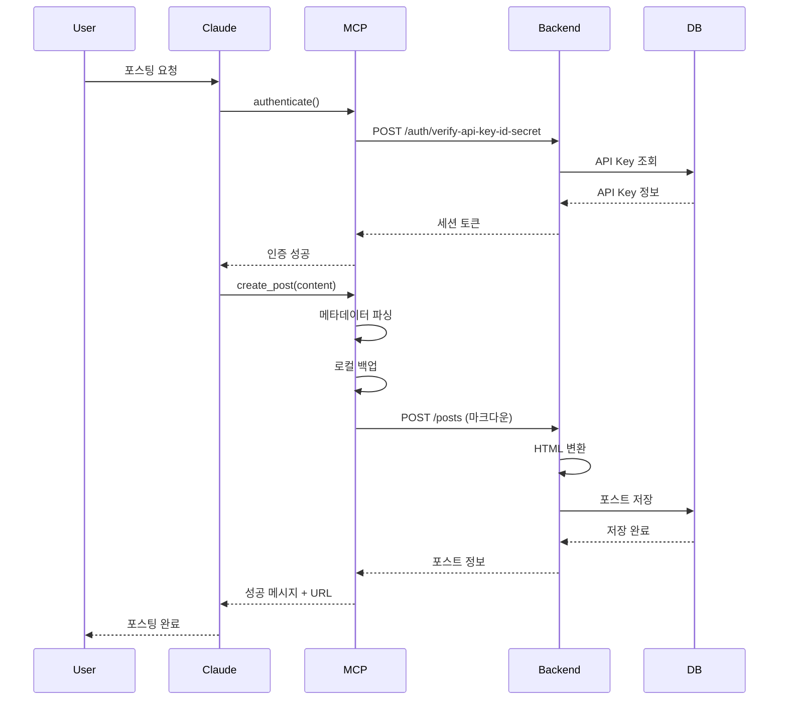

# 🚀 MCP 블로그 자동 포스팅 시스템 완전 분석

## 📋 시스템 개요

MCP (Model Context Protocol) 블로그 자동 포스팅 시스템은 Claude Desktop에서 마크다운 콘텐츠를 작성하면 자동으로 블로그에 포스팅되는 시스템입니다.

## 🏗️ 아키텍처 구성

```
[Claude Desktop] → [MCP Server (Python)] → [Backend API (NestJS)] → [Database (PostgreSQL)]
                                         ↓
                                   [Frontend (Next.js)]
```

## 🔐 보안 체계

### AWS Signature V4 스타일 인증
- **API Key ID** (`akid_xxx...`): 공개 가능한 식별자
- **API Key Secret** (`aks_xxx...`): 절대 비밀, 서명 생성용
- **HMAC-SHA256 서명**: 요청 전체를 서명으로 보호
- **Timestamp & Nonce**: 재사용 공격 방지

## 📱 트리거 방식

### 1. **수동 트리거 (현재 방식)**
```python
# Claude Desktop에서 직접 호출
await mcp__my-blog__authenticate()  # 인증
await mcp__my-blog__create_post(...)  # 포스팅
```

### 2. **파일 기반 트리거**
```python
await mcp__my-blog__create_post_from_file(file_path="posts/article.md")
```

## 🔄 전체 데이터 플로우

### 📊 단계별 상세 흐름

#### **1단계: 인증 (Authentication)**

##### 1.1 환경 변수 설정
```bash
# .env 파일
BLOG_API_KEY_ID=akid_xxxxxxxxxx  # API Key ID
BLOG_API_KEY_SECRET=aks_yyyyyyyyyy  # API Key Secret
BLOG_API_URL=http://localhost:3000
```

##### 1.2 인증 요청 생성
```python
# MCP Server (fastmcp_blog_server.py)
timestamp = str(int(time.time() * 1000))  # 밀리초
nonce = str(uuid.uuid4())  # 일회용 토큰

# AWS V4 스타일 서명 생성
body_hash = hashlib.sha256(body.encode()).hexdigest()
canonical_request = f"{method}\n{uri}\n{timestamp}\n{nonce}\n{body_hash}"
signature = hmac.new(secret.encode(), canonical_request.encode(), hashlib.sha256).hexdigest()
```

##### 1.3 백엔드 검증
```typescript
// Backend (auth-api-key.service.ts)
async verifyWithIdAndSecret(keyId, keySecret, timestamp, nonce, signature) {
  // 1. 타임스탬프 검증 (5분 이내)
  // 2. Nonce 중복 체크 (재사용 방지)
  // 3. API Key 조회 및 검증
  // 4. HMAC 서명 검증
  // 5. 세션 토큰 발급
}
```

##### 1.4 인증 응답
```json
{
  "valid": true,
  "userId": "user-id",
  "blogId": "blog-id",
  "sessionToken": "jwt-token",
  "blog": { "name": "블로그명", "slug": "blog-slug" }
}
```

---

#### **2단계: 콘텐츠 준비 (Content Preparation)**

##### 2.1 마크다운 작성
```markdown
---
title: "포스트 제목"
tags: ["tag1", "tag2"]
date: 2025-08-31T10:00:00
---

# 내용 시작
마크다운 본문...
```

##### 2.2 메타데이터 파싱
```python
def parse_markdown_metadata(content: str) -> Tuple[Dict, str]:
    # Front matter 추출
    if content.startswith('---'):
        # YAML 형식 메타데이터 파싱
        metadata = {
            'title': extract_title(),
            'tags': extract_tags(),
            'category': extract_category()
        }
    # 제목이 없으면 첫 h1에서 추출
    if not metadata['title']:
        metadata['title'] = extract_from_h1()
    
    return metadata, body
```

##### 2.3 로컬 백업
```python
# posts 디렉토리에 자동 저장
filename = f"{date}_{safe_title}.md"  # 예: 20250831_API_키_보안_강화.md
save_path = "mcp-blog-server/posts/{filename}"
```

---

#### **3단계: API 호출 (API Request)**

##### 3.1 포스트 생성 요청
```python
async with httpx.AsyncClient() as client:
    response = await client.post(
        f"{api_url}/posts",
        json={
            "title": final_title,
            "content_markdown": body,  # 마크다운 원본
            "tags": final_tags
        },
        headers={
            "Authorization": f"Bearer {session_token}"
        }
    )
```

##### 3.2 백엔드 처리
```typescript
// posts.service.ts
async create(createPostDto, user) {
  // 1. 마크다운 → HTML 변환
  const processedContent = this.markdownRenderer.convertToHtml(content_markdown);
  
  // 2. Slug 생성 (제목 + UUID)
  const slug = await this.generateUniqueSlug(title);
  
  // 3. 썸네일 추출 (첫 이미지)
  const thumbnail = this.extractThumbnailFromContent(processedContent);
  
  // 4. DB 저장
  const post = this.postsRepository.create({
    title,
    content: processedContent,        // HTML (표시용)
    content_markdown: markdownContent, // 마크다운 (편집용)
    content_type: 'markdown',
    slug,
    thumbnail,
    author: user,
    blog: user.blog
  });
  
  return await this.postsRepository.save(post);
}
```

---

#### **4단계: 마크다운 렌더링 (Markdown Rendering)**

##### 4.1 HTML 변환
```typescript
// markdown-renderer.service.ts
convertToHtml(text: string): string {
  // 1. 테이블 처리
  // 2. 코드 블록 처리 (```...```)
  // 3. 인라인 코드 처리 (`...`)
  // 4. 헤딩 변환 (# → <h1>)
  // 5. 리스트 변환
  // 6. 링크/이미지 변환
  // 7. 텍스트 포맷팅 (bold, italic)
}
```

##### 4.2 코드 하이라이팅
```html
<pre style="background: #f4f4f4; padding: 1em;">
  <code class="language-javascript">
    // 하이라이팅된 코드
  </code>
</pre>
```

---

#### **5단계: 응답 및 확인 (Response & Confirmation)**

##### 5.1 성공 응답
```json
{
  "id": "post-id",
  "title": "포스트 제목",
  "slug": "unique-slug-abc123",
  "blogSlug": "my-blog",
  "createdAt": "2025-08-31T10:00:00Z"
}
```

##### 5.2 MCP 서버 응답
```python
return f"""✅ 포스트 생성 성공!
💾 MD 파일 저장: {filename}
📝 제목: {post['title']}
🔗 슬러그: {post['slug']}
🏷️ 태그: {', '.join(tags)}
📅 생성일: {post['createdAt']}
🌐 URL: {base_url}/blog/{blog_slug}/posts/{post_slug}"""
```

---

## 🔧 핵심 컴포넌트

### 1. **MCP Server** (`fastmcp_blog_server.py`)
- FastMCP 프레임워크 기반
- HMAC-SHA256 서명 인증
- 마크다운 메타데이터 파싱
- HTTP 클라이언트 (httpx)

### 2. **Backend API** (NestJS)
- JWT 토큰 발급 (`auth.service.ts`)
- API Key 검증 (`auth-api-key.service.ts`)
- 마크다운 렌더링 (`markdown-renderer.service.ts`)
- 포스트 CRUD (`posts.service.ts`)

### 3. **Database** (PostgreSQL)
- 하이브리드 저장: HTML + 마크다운
- `content`: 렌더링된 HTML
- `content_markdown`: 원본 마크다운

## 🎯 자동화 트리거 옵션

### 현재 구현
- **수동 실행**: Claude Desktop에서 명령 실행
- **파일 기반**: 마크다운 파일 경로 지정

### 향후 가능한 확장
1. **파일 감시 (File Watcher)**
   ```python
   # posts 폴더 모니터링
   watchdog로 *.md 파일 생성 감지 → 자동 포스팅
   ```

2. **스케줄링 (Cron)**
   ```python
   # 특정 시간에 자동 포스팅
   schedule.every().day.at("10:00").do(auto_post)
   ```

3. **Git Hook 연동**
   ```bash
   # Git commit 시 자동 포스팅
   post-commit hook → MCP 서버 트리거
   ```

4. **CI/CD 파이프라인**
   ```yaml
   # GitHub Actions
   on:
     push:
       paths:
         - 'posts/*.md'
   ```

## 📊 시퀀스 다이어그램



## 🚨 주요 보안 기능

1. **API Secret 미전송**: Secret은 서명 생성에만 사용
2. **시간 제한**: 5분 이내 요청만 유효
3. **Nonce 중복 방지**: 재사용 공격 차단
4. **HTTPS 권장**: 프로덕션에서 필수
5. **JWT 토큰**: 세션 관리용 단기 토큰

## 📈 성능 최적화

- **마크다운 캐싱**: 변환된 HTML 재사용
- **비동기 처리**: async/await 전체 적용
- **연결 풀링**: httpx 클라이언트 재사용
- **배치 처리**: 다중 포스트 일괄 처리 가능

## 🔍 디버깅 가이드

### 자주 발생하는 문제

1. **인증 실패**
   - API Key ID/Secret 확인
   - 환경 변수 설정 확인
   - 시간 동기화 확인

2. **포스팅 실패**
   - 마크다운 형식 검증
   - 네트워크 연결 확인
   - 백엔드 로그 확인

3. **렌더링 오류**
   - 특수문자 이스케이프
   - 코드 블록 구문 확인
   - 테이블 형식 검증

## 📝 결론

MCP 블로그 자동 포스팅 시스템은:
- **보안**: AWS V4 스타일 서명 인증
- **유연성**: 마크다운 + HTML 하이브리드
- **확장성**: 다양한 트리거 방식 지원 가능
- **신뢰성**: 로컬 백업 + 에러 핸들링

현재는 수동 트리거 방식이지만, 파일 감시, 스케줄링, Git 연동 등으로 완전 자동화 가능합니다.