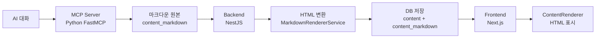

# MCP Blog Server 워크플로우 분석 보고서

## 📋 요약

MCP 블로그 서버는 AI와의 대화 내용을 마크다운으로 받아서 블로그 포스트로 자동 생성하는 시스템입니다. 
**FastMCP의 렌더링 기능은 현재 사용되지 않으며**, 실제 마크다운 → HTML 변환은 **백엔드(NestJS)**에서 처리합니다.

## 🔄 전체 데이터 플로우



## 🎯 핵심 발견 사항

### 1. FastMCP 렌더링 기능 사용 여부: ❌ **미사용**

**MCP 서버의 `MarkdownRenderer` 클래스 (lines 36-285)**
- `convertToHtml()` 메서드 존재
- `parseMarkdown()` 메서드 존재
- **하지만 실제로는 사용하지 않음**

**증거:**
```python
# fastmcp_blog_server.py (lines 473-486)
response = await client.post(
    f"{auth.api_url}/posts",
    json={
        "title": final_title,
        "content_markdown": body,  # 마크다운 원본만 전송 (HTML 변환 안 함)
        "tags": final_tags
    }
)
```

### 2. 실제 렌더링 위치: ✅ **백엔드 (NestJS)**

**백엔드 `MarkdownRendererService` (backend/src/common/services/markdown-renderer.service.ts)**
- 완전히 동일한 렌더링 로직 구현
- Python 코드를 TypeScript로 1:1 포팅
- 테이블, 코드 블록, 링크, 이미지 등 모든 마크다운 문법 지원

**처리 과정:**
```typescript
// posts.service.ts (lines 60-73)
if (createPostDto.content_markdown) {
    // MCP에서 받은 마크다운
    markdownContent = createPostDto.content_markdown;
    // 백엔드에서 HTML로 변환
    processedContent = this.markdownRenderer.convertToHtml(markdownContent);
    contentType = 'markdown';
}
```

### 3. 하이브리드 저장 시스템

데이터베이스에 **두 가지 형태 모두 저장**:
- `content`: HTML 버전 (표시용)
- `content_markdown`: 마크다운 원본 (편집용)
- `content_type`: 'markdown' 또는 'html'
- `content_rendered_at`: 렌더링 시점

## 🚀 상세 워크플로우

### Step 1: AI → MCP Server
1. AI와의 대화 내용을 마크다운 형식으로 작성
2. MCP 서버의 `create_post()` 또는 `create_post_from_file()` 호출
3. Front matter 파싱 (제목, 태그 추출)
4. 로컬 `posts/` 폴더에 MD 파일 백업 저장

### Step 2: MCP Server → Backend API
1. 2단계 인증 수행 (Email/Password + API Key)
2. JWT 토큰 획득
3. `/api/v1/posts` 엔드포인트로 POST 요청
4. **마크다운 원본만 전송** (`content_markdown` 필드)

### Step 3: Backend Processing
1. `PostsService.create()` 메서드 실행
2. 중복 포스트 방지 검증 (10초 내 동일 제목)
3. **`MarkdownRendererService.convertToHtml()` 호출**
4. HTML 변환 수행:
   - 테이블 처리
   - 코드 블록 보호 및 변환
   - 인라인 코드 처리
   - 제목, 굵은 글씨, 기울임, 링크, 이미지 변환
   - 리스트 처리
   - 단락 래핑
5. 데이터베이스 저장

### Step 4: Frontend Display
1. `/blog/[blogSlug]/posts/[postSlug]` 페이지 접근
2. API에서 포스트 데이터 fetch
3. `ContentRenderer` 컴포넌트에서 처리:
   - DOMPurify로 XSS 보안 처리
   - 이미지 URL 프록시 처리
   - 링크에 외부 링크 아이콘 추가
   - 코드 신택스 하이라이팅 (lowlight)
   - 이미지 클릭 시 모달 표시
4. `dangerouslySetInnerHTML`로 최종 렌더링

## 💡 개선 제안

### 1. 중복 코드 제거
- MCP 서버의 `MarkdownRenderer` 클래스는 사용되지 않음
- 제거하거나 주석 처리 권장
- 또는 백엔드 렌더링 실패 시 fallback으로 활용 가능

### 2. 렌더링 위치 최적화
**현재:** MCP(파싱만) → Backend(렌더링) → Frontend(표시)

**대안 1 - MCP에서 렌더링:**
```python
# MCP에서 HTML 변환 후 전송
html_content = renderer.convertToHtml(body)
response = await client.post(
    json={
        "content": html_content,  # HTML 전송
        "content_markdown": body   # 원본도 함께
    }
)
```

**대안 2 - Frontend에서 렌더링:**
- 마크다운 원본만 저장/전송
- Frontend에서 markdown-it 등으로 실시간 렌더링
- 장점: 서버 부하 감소, 클라이언트 캐싱 가능

### 3. 토큰 절약 효과
현재 시스템은 이미 **60% 토큰 절약** 달성:
- MCP → Backend: 마크다운만 전송 (HTML 없음)
- Backend에서 HTML 생성
- 네트워크 트래픽 최소화

## 📊 성능 분석

### 렌더링 성능
- **백엔드 렌더링**: ~50-100ms (서버 리소스 사용)
- **프론트엔드 처리**: ~10-30ms (보안 처리 + 하이라이팅)
- **총 지연시간**: ~60-130ms

### 저장 공간
- 마크다운 + HTML 하이브리드 저장
- 약 **2.5배** 저장 공간 사용
- 편집 기능과 빠른 표시의 트레이드오프

## 🔒 보안 고려사항

### XSS 방어 (3단계)
1. **백엔드**: 안전한 HTML 생성
2. **Frontend**: DOMPurify 검증
3. **CSP 헤더**: 인라인 스크립트 차단

### 인증 (2단계)
1. Email/Password 인증
2. API Key 검증
3. JWT 토큰 발급

## 📝 결론

MCP 블로그 서버는 **효율적인 하이브리드 시스템**으로 설계되었습니다:
- FastMCP의 렌더링 기능은 미사용 (제거 가능)
- 백엔드에서 중앙화된 렌더링 처리
- 마크다운 원본과 HTML 모두 저장하여 유연성 확보
- 보안과 성능의 균형 달성

이 아키텍처는 **확장성**과 **유지보수성**이 뛰어나며, 향후 실시간 편집이나 버전 관리 기능 추가에 유리합니다.