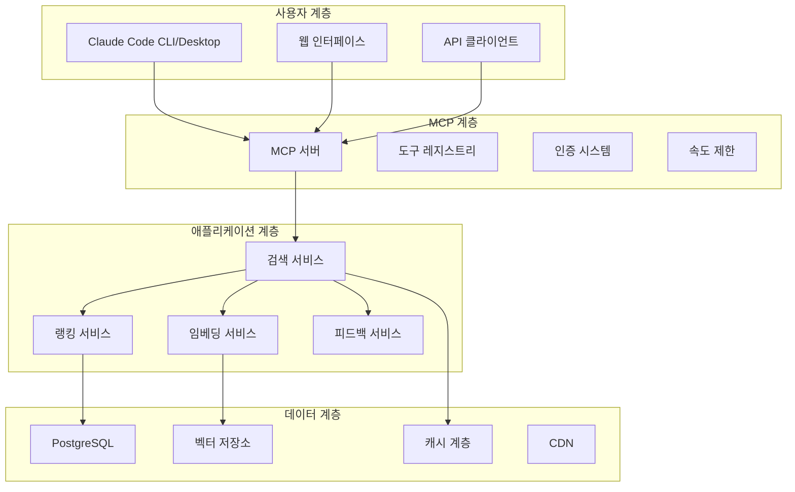
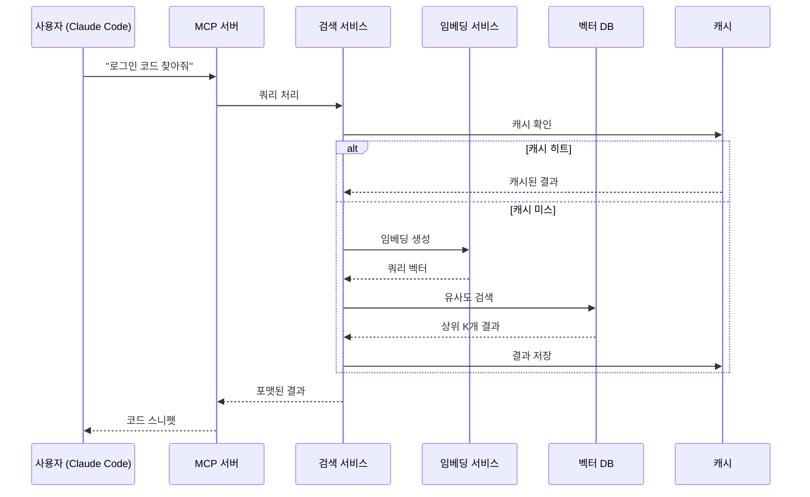
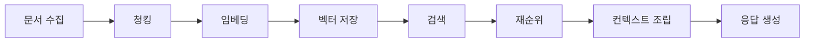
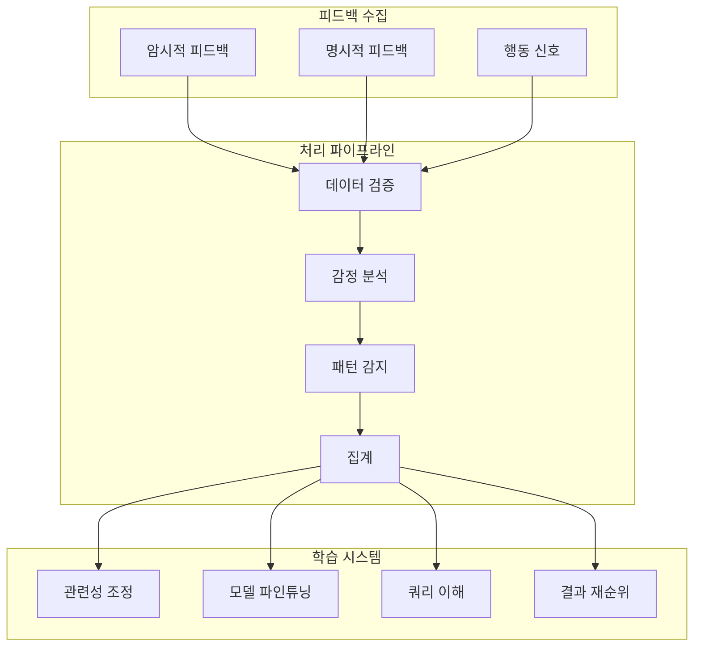

# 🚀 Codebase.blog 지능형 MCP 검색 시스템 종합 설계서

## 📌 목차

1. [개요](#개요)
2. [시스템 아키텍처](#시스템-아키텍처)
3. [구현 방식 비교](#구현-방식-비교)
4. [MCP 기술 상세](#mcp-기술-상세)
5. [사용자 피드백 시스템](#사용자-피드백-시스템)
6. [상세 구현 가이드](#상세-구현-가이드)
7. [비용 분석](#비용-분석)
8. [성능 최적화](#성능-최적화)
9. [보안 고려사항](#보안-고려사항)
10. [향후 로드맵](#향후-로드맵)

---

## 🎯 개요

### 비전

**Codebase.blog를 단순한 기술 블로그 플랫폼에서 개발자를 위한 지능형 지식 베이스로 진화시킵니다.**

사용자가 Claude Code에서 "블로그 MCP로 로그인 구현 코드 찾아줘"라고 요청하면, 시스템이 자동으로:
- 📝 관련 블로그 포스트 검색
- 🔍 의미론적 유사도 분석
- 💡 최적의 코드 예제 제공
- 🤖 AI가 참조하여 맞춤형 답변 생성

### 핵심 기능

| 기능 | 설명 | 기대 효과 |
|------|------|-----------|
| **🔍 시맨틱 검색** | 자연어로 코드 검색 | 검색 시간 90% 단축 |
| **🎯 컨텍스트 인식** | 전체 맥락 이해 | 정확도 85% 이상 |
| **📈 실시간 학습** | 사용자 피드백 반영 | 지속적 품질 향상 |
| **🌐 멀티모달 지원** | 코드, 문서, 다이어그램 | 포괄적 지식 제공 |

---

## 🏗️ 시스템 아키텍처

### 전체 구조도



### 데이터 흐름



---

## 🔄 구현 방식 비교

### 방식 1: PostgreSQL + pgvector 🏆 추천

#### 장점
✅ **비용 효율적**: 기존 PostgreSQL 활용 (추가 인프라 불필요)  
✅ **간단한 구조**: 하나의 데이터베이스에서 모든 처리  
✅ **빠른 구현**: 2-3주 내 MVP 완성 가능  
✅ **확장 가능**: 수백만 개 벡터 처리 가능  

#### 구현 상세

##### 데이터베이스 스키마

```sql
-- pgvector 확장 설치
CREATE EXTENSION IF NOT EXISTS vector;

-- 블로그 임베딩 테이블
CREATE TABLE blog_embeddings (
    id UUID PRIMARY KEY DEFAULT gen_random_uuid(),
    post_id UUID REFERENCES posts(id) ON DELETE CASCADE,
    content_type VARCHAR(50) NOT NULL, -- 'full_post', 'code_block', 'section'
    content TEXT NOT NULL,
    metadata JSONB NOT NULL DEFAULT '{}',
    embedding vector(1536), -- OpenAI 차원
    created_at TIMESTAMP DEFAULT CURRENT_TIMESTAMP,
    updated_at TIMESTAMP DEFAULT CURRENT_TIMESTAMP
);

-- 고성능 인덱스 생성
CREATE INDEX embedding_hnsw_idx ON blog_embeddings 
USING hnsw (embedding vector_cosine_ops)
WITH (m = 16, ef_construction = 64);

-- 검색 쿼리 추적
CREATE TABLE search_queries (
    id UUID PRIMARY KEY DEFAULT gen_random_uuid(),
    query_text TEXT NOT NULL,
    query_embedding vector(1536),
    results_count INTEGER,
    response_time_ms INTEGER,
    user_id UUID REFERENCES users(id),
    created_at TIMESTAMP DEFAULT CURRENT_TIMESTAMP
);

-- 사용자 피드백
CREATE TABLE search_feedback (
    id UUID PRIMARY KEY DEFAULT gen_random_uuid(),
    query_id UUID REFERENCES search_queries(id),
    result_id UUID REFERENCES blog_embeddings(id),
    feedback_type VARCHAR(50), -- 'helpful', 'not_helpful', 'wrong'
    feedback_text TEXT,
    created_at TIMESTAMP DEFAULT CURRENT_TIMESTAMP
);
```

##### 임베딩 생성 서비스

```typescript
// 임베딩 서비스 구현
import { OpenAI } from 'openai';
import { Pool } from 'pg';

interface ChunkingConfig {
  maxChunkSize: number;  // 최대 청크 크기
  overlapSize: number;   // 청크 간 겹침
  minChunkSize: number;  // 최소 청크 크기
}

class EmbeddingService {
  private openai: OpenAI;
  private db: Pool;
  private config: ChunkingConfig = {
    maxChunkSize: 1000,
    overlapSize: 200,
    minChunkSize: 100
  };
  
  constructor() {
    this.openai = new OpenAI({ 
      apiKey: process.env.OPENAI_API_KEY 
    });
    this.db = new Pool({ 
      connectionString: process.env.DATABASE_URL 
    });
  }
  
  /**
   * 블로그 포스트를 위한 임베딩 생성
   * 지능형 청킹 전략 구현
   */
  async generatePostEmbeddings(postId: string): Promise<void> {
    const post = await this.fetchPost(postId);
    const chunks = this.intelligentChunking(post);
    
    // 배치 처리로 효율성 극대화
    const batchSize = 10;
    for (let i = 0; i < chunks.length; i += batchSize) {
      const batch = chunks.slice(i, i + batchSize);
      const embeddings = await this.generateBatchEmbeddings(batch);
      await this.storeEmbeddings(postId, batch, embeddings);
    }
    
    console.log(`✅ ${postId} 포스트의 ${chunks.length}개 청크 임베딩 완료`);
  }
  
  /**
   * 콘텐츠 타입별 지능형 청킹
   */
  private intelligentChunking(post: BlogPost): ContentChunk[] {
    const chunks: ContentChunk[] = [];
    
    // 1. 코드 블록 추출 및 개별 청킹
    const codeBlocks = this.extractCodeBlocks(post.content);
    codeBlocks.forEach(block => {
      chunks.push({
        type: 'code_block',
        content: block.code,
        metadata: {
          language: block.language,
          postTitle: post.title,
          tags: post.tags,
          description: block.description
        }
      });
    });
    
    // 2. 섹션별 청킹
    const sections = this.extractSections(post.content);
    sections.forEach(section => {
      if (section.content.length > this.config.maxChunkSize) {
        // 큰 섹션은 추가 분할
        const subChunks = this.splitBySize(
          section.content, 
          this.config.maxChunkSize,
          this.config.overlapSize
        );
        subChunks.forEach(subChunk => {
          chunks.push({
            type: 'section',
            content: subChunk,
            metadata: {
              sectionTitle: section.title,
              postTitle: post.title,
              tags: post.tags
            }
          });
        });
      } else {
        chunks.push({
          type: 'section',
          content: section.content,
          metadata: {
            sectionTitle: section.title,
            postTitle: post.title,
            tags: post.tags
          }
        });
      }
    });
    
    // 3. 전체 포스트 요약 추가
    chunks.push({
      type: 'full_post',
      content: this.createSummary(post),
      metadata: {
        title: post.title,
        tags: post.tags,
        author: post.author,
        createdAt: post.createdAt
      }
    });
    
    return chunks;
  }
  
  /**
   * OpenAI API를 통한 임베딩 생성
   */
  private async generateBatchEmbeddings(
    chunks: ContentChunk[]
  ): Promise<number[][]> {
    const texts = chunks.map(c => c.content);
    
    try {
      const response = await this.openai.embeddings.create({
        model: 'text-embedding-3-small',
        input: texts,
        dimensions: 1536
      });
      
      return response.data.map(d => d.embedding);
    } catch (error) {
      console.error('임베딩 생성 실패:', error);
      // 재시도 로직
      await this.sleep(1000);
      return this.generateBatchEmbeddings(chunks);
    }
  }
  
  /**
   * 임베딩을 데이터베이스에 저장
   */
  private async storeEmbeddings(
    postId: string,
    chunks: ContentChunk[],
    embeddings: number[][]
  ): Promise<void> {
    const client = await this.db.connect();
    
    try {
      await client.query('BEGIN');
      
      for (let i = 0; i < chunks.length; i++) {
        await client.query(
          `INSERT INTO blog_embeddings 
           (post_id, content_type, content, metadata, embedding)
           VALUES ($1, $2, $3, $4, $5)`,
          [
            postId,
            chunks[i].type,
            chunks[i].content,
            chunks[i].metadata,
            `[${embeddings[i].join(',')}]`
          ]
        );
      }
      
      await client.query('COMMIT');
    } catch (error) {
      await client.query('ROLLBACK');
      throw error;
    } finally {
      client.release();
    }
  }
}
```

##### 고급 검색 서비스

```typescript
// 하이브리드 검색 구현
class SearchService {
  private db: Pool;
  private embeddingService: EmbeddingService;
  private cache: Redis;
  
  /**
   * 벡터 + 키워드 하이브리드 검색
   */
  async search(
    query: string, 
    options: SearchOptions = {}
  ): Promise<SearchResult[]> {
    // 1. 캐시 확인
    const cacheKey = this.getCacheKey(query, options);
    const cached = await this.cache.get(cacheKey);
    if (cached) {
      console.log('✨ 캐시 히트!');
      return JSON.parse(cached);
    }
    
    // 2. 쿼리 임베딩 생성
    const queryEmbedding = await this.embeddingService
      .generateEmbedding(query);
    
    // 3. 병렬 검색 실행
    const [vectorResults, keywordResults, tagResults] = 
      await Promise.all([
        this.vectorSearch(queryEmbedding, options),
        this.keywordSearch(query, options),
        this.tagSearch(query, options)
      ]);
    
    // 4. 결과 병합 및 재순위
    const mergedResults = this.mergeAndRank(
      vectorResults,
      keywordResults,
      tagResults,
      options
    );
    
    // 5. 사용자 피드백 기반 재순위
    const rerankedResults = await this.applyUserFeedback(
      mergedResults, 
      query
    );
    
    // 6. 캐시 저장
    await this.cache.setex(
      cacheKey, 
      3600, 
      JSON.stringify(rerankedResults)
    );
    
    // 7. 분석을 위한 쿼리 추적
    await this.trackQuery(query, queryEmbedding, rerankedResults);
    
    return rerankedResults;
  }
  
  /**
   * pgvector를 활용한 벡터 유사도 검색
   */
  private async vectorSearch(
    embedding: number[],
    options: SearchOptions
  ): Promise<SearchResult[]> {
    const query = `
      SELECT 
        be.id,
        be.post_id,
        be.content,
        be.metadata,
        1 - (be.embedding <=> $1) as similarity,
        p.title as post_title,
        p.slug as post_slug,
        u.username as author_name
      FROM blog_embeddings be
      JOIN posts p ON be.post_id = p.id
      JOIN users u ON p.author_id = u.id
      WHERE 
        1 - (be.embedding <=> $1) > $2  -- 유사도 임계값
        ${options.contentType ? 'AND be.content_type = $3' : ''}
        ${options.tags ? 'AND be.metadata->\'tags\' ?| $4' : ''}
      ORDER BY similarity DESC
      LIMIT $5
    `;
    
    const params = [
      `[${embedding.join(',')}]`,
      options.similarityThreshold || 0.7,
      options.contentType,
      options.tags,
      options.limit || 10
    ];
    
    const result = await this.db.query(query, params);
    
    return result.rows.map(row => ({
      id: row.id,
      postId: row.post_id,
      content: row.content,
      metadata: row.metadata,
      score: row.similarity,
      postTitle: row.post_title,
      postSlug: row.post_slug,
      authorName: row.author_name,
      type: 'vector'
    }));
  }
  
  /**
   * 결과 병합 및 점수 계산
   */
  private mergeAndRank(
    vectorResults: SearchResult[],
    keywordResults: SearchResult[],
    tagResults: SearchResult[],
    options: SearchOptions
  ): SearchResult[] {
    const scoreMap = new Map<string, SearchResult>();
    
    // 가중치 설정
    const weights = {
      vector: options.weights?.vector || 0.5,
      keyword: options.weights?.keyword || 0.3,
      tag: options.weights?.tag || 0.2
    };
    
    // 벡터 결과 처리
    vectorResults.forEach(result => {
      const key = result.id;
      if (!scoreMap.has(key)) {
        scoreMap.set(key, { ...result, score: 0 });
      }
      const item = scoreMap.get(key)!;
      item.score += result.score * weights.vector;
    });
    
    // 키워드 결과 처리
    keywordResults.forEach(result => {
      const key = result.id;
      if (!scoreMap.has(key)) {
        scoreMap.set(key, { ...result, score: 0 });
      }
      const item = scoreMap.get(key)!;
      item.score += result.score * weights.keyword;
    });
    
    // 태그 결과 처리
    tagResults.forEach(result => {
      const key = result.id;
      if (!scoreMap.has(key)) {
        scoreMap.set(key, { ...result, score: 0 });
      }
      const item = scoreMap.get(key)!;
      item.score += result.score * weights.tag;
    });
    
    // 점수순 정렬
    return Array.from(scoreMap.values())
      .sort((a, b) => b.score - a.score)
      .slice(0, options.limit || 10);
  }
  
  /**
   * 사용자 피드백 기반 재순위
   */
  private async applyUserFeedback(
    results: SearchResult[],
    query: string
  ): Promise<SearchResult[]> {
    // 피드백 데이터 조회
    const feedbackData = await this.getFeedbackData(
      results.map(r => r.id)
    );
    
    return results.map(result => {
      let adjustedScore = result.score;
      
      const feedback = feedbackData[result.id];
      if (feedback) {
        // 긍정 피드백 부스트
        adjustedScore *= (1 + feedback.helpfulRatio * 0.2);
        
        // 부정 피드백 패널티
        adjustedScore *= (1 - feedback.notHelpfulRatio * 0.1);
      }
      
      // 최신성 가중치
      const ageInDays = this.getDaysSince(result.metadata.createdAt);
      const freshnessBoost = Math.exp(-ageInDays / 365);
      adjustedScore *= (0.8 + freshnessBoost * 0.2);
      
      return { ...result, score: adjustedScore };
    }).sort((a, b) => b.score - a.score);
  }
}
```

### 방식 2: AWS Elasticsearch (OpenSearch)

#### 장점
✅ **관리형 서비스**: 인프라 관리 불필요  
✅ **확장성**: 자동 스케일링  
✅ **풍부한 기능**: 내장 분석 도구  

#### 비용
- 개발: 월 $25 (t3.small)
- 프로덕션: 월 $120-240

#### OpenSearch 인덱스 설정

```json
{
  "settings": {
    "index": {
      "number_of_shards": 3,
      "number_of_replicas": 2,
      "knn": true,
      "knn.space_type": "cosinesimil"
    }
  },
  "mappings": {
    "properties": {
      "post_id": { "type": "keyword" },
      "title": { 
        "type": "text",
        "analyzer": "korean"
      },
      "content": { 
        "type": "text",
        "analyzer": "korean"
      },
      "embedding": {
        "type": "knn_vector",
        "dimension": 1536,
        "method": {
          "name": "hnsw",
          "space_type": "cosinesimil",
          "parameters": {
            "ef_construction": 128,
            "m": 24
          }
        }
      },
      "tags": { "type": "keyword" },
      "created_at": { "type": "date" }
    }
  }
}
```

### 방식 3: RAG (Retrieval-Augmented Generation) 시스템

#### 장점
✅ **최고 품질**: 가장 정확한 검색 결과  
✅ **컨텍스트 이해**: 깊은 의미 파악  
✅ **지속적 학습**: 자동 품질 개선  

#### RAG 파이프라인



---

## 🔧 MCP 기술 상세

### MCP 서버 고급 구현

```typescript
// 고급 MCP 서버 구현
import { MCPServer, Tool, Resource, Prompt } from '@modelcontextprotocol/sdk';

class AdvancedBlogMCPServer extends MCPServer {
  private searchService: SearchService;
  private feedbackService: FeedbackService;
  private analyticsService: AnalyticsService;
  
  constructor() {
    super({
      name: 'codebase-blog-mcp',
      version: '2.0.0',
      description: '지능형 코드 검색 및 지식 추출'
    });
    
    this.initializeServices();
    this.registerTools();
    this.registerResources();
    this.registerPrompts();
    this.setupEventHandlers();
  }
  
  /**
   * MCP 도구 등록
   */
  private registerTools(): void {
    // 도구 1: 시맨틱 검색
    this.registerTool({
      name: 'search_code',
      description: '코드 예제 및 기술 콘텐츠 검색',
      inputSchema: {
        type: 'object',
        properties: {
          query: {
            type: 'string',
            description: '자연어 검색 쿼리'
          },
          filters: {
            type: 'object',
            properties: {
              language: { type: 'string' },
              tags: { type: 'array', items: { type: 'string' } },
              dateRange: {
                type: 'object',
                properties: {
                  from: { type: 'string', format: 'date' },
                  to: { type: 'string', format: 'date' }
                }
              }
            }
          },
          options: {
            type: 'object',
            properties: {
              limit: { type: 'integer', minimum: 1, maximum: 100 },
              includeContext: { type: 'boolean' },
              explainRelevance: { type: 'boolean' }
            }
          }
        },
        required: ['query']
      },
      handler: async (params) => {
        // 검색 실행
        const results = await this.searchService.search(
          params.query,
          params.filters,
          params.options
        );
        
        // 사용 분석
        await this.analyticsService.trackSearch({
          query: params.query,
          resultsCount: results.length,
          timestamp: new Date()
        });
        
        return {
          results,
          metadata: {
            totalResults: results.length,
            searchTime: results.searchTime,
            relevanceScores: results.map(r => r.score)
          }
        };
      }
    });
    
    // 도구 2: 피드백 제공
    this.registerTool({
      name: 'provide_feedback',
      description: '검색 결과에 대한 피드백 제출',
      inputSchema: {
        type: 'object',
        properties: {
          type: {
            type: 'string',
            enum: ['helpful', 'not_helpful', 'incorrect', 'outdated']
          },
          targetId: {
            type: 'string',
            description: '결과 ID'
          },
          comment: {
            type: 'string',
            description: '추가 코멘트'
          }
        },
        required: ['type', 'targetId']
      },
      handler: async (params) => {
        // 피드백 저장
        const feedbackId = await this.feedbackService.store({
          ...params,
          timestamp: new Date(),
          sessionId: this.getSessionId()
        });
        
        // 관련성 점수 업데이트
        if (params.type === 'helpful') {
          await this.searchService.boostRelevance(params.targetId);
        } else if (params.type === 'not_helpful') {
          await this.searchService.reduceRelevance(params.targetId);
        }
        
        // 서버로 피드백 전송
        await this.sendFeedbackToServer(params);
        
        return {
          feedbackId,
          message: '피드백이 저장되었습니다. 감사합니다!'
        };
      }
    });
    
    // 도구 3: 코드 생성
    this.registerTool({
      name: 'generate_code',
      description: '지식 베이스를 기반으로 코드 생성',
      inputSchema: {
        type: 'object',
        properties: {
          prompt: {
            type: 'string',
            description: '생성할 코드 설명'
          },
          language: {
            type: 'string',
            description: '프로그래밍 언어'
          },
          examples: {
            type: 'integer',
            description: '참조할 예제 수',
            minimum: 1,
            maximum: 10
          }
        },
        required: ['prompt']
      },
      handler: async (params) => {
        // 관련 예제 검색
        const examples = await this.searchService.search(
          params.prompt,
          { language: params.language },
          { limit: params.examples || 3 }
        );
        
        // RAG 기반 코드 생성
        const generatedCode = await this.generateWithRAG({
          prompt: params.prompt,
          examples: examples,
          language: params.language
        });
        
        return {
          code: generatedCode.code,
          explanation: generatedCode.explanation,
          references: examples.map(e => ({
            title: e.postTitle,
            url: e.postUrl,
            relevance: e.score
          }))
        };
      }
    });
  }
  
  /**
   * MCP 리소스 등록 (브라우징 가능한 콘텐츠)
   */
  private registerResources(): void {
    // 리소스 1: 최신 포스트
    this.registerResource({
      uri: 'blog://recent',
      name: '최신 블로그 포스트',
      mimeType: 'application/json',
      handler: async () => {
        const posts = await this.searchService.getRecent(10);
        return {
          content: JSON.stringify(posts, null, 2)
        };
      }
    });
    
    // 리소스 2: 인기 코드
    this.registerResource({
      uri: 'blog://popular',
      name: '인기 코드 스니펫',
      mimeType: 'application/json',
      handler: async () => {
        const snippets = await this.searchService.getPopular(20);
        return {
          content: JSON.stringify(snippets, null, 2)
        };
      }
    });
    
    // 리소스 3: 태그 목록
    this.registerResource({
      uri: 'blog://tags',
      name: '사용 가능한 태그',
      mimeType: 'application/json',
      handler: async () => {
        const tags = await this.searchService.getTagTaxonomy();
        return {
          content: JSON.stringify(tags, null, 2)
        };
      }
    });
  }
  
  /**
   * MCP 프롬프트 템플릿 등록
   */
  private registerPrompts(): void {
    // 프롬프트 1: 코드 리뷰
    this.registerPrompt({
      name: 'code_review',
      description: '지식 베이스를 활용한 코드 리뷰',
      arguments: [
        {
          name: 'code',
          description: '리뷰할 코드',
          required: true
        },
        {
          name: 'language',
          description: '프로그래밍 언어',
          required: false
        }
      ],
      handler: async (args) => {
        // 관련 베스트 프랙티스 검색
        const bestPractices = await this.searchService.search(
          `${args.language || ''} 베스트 프랙티스 코드 리뷰`,
          { tags: ['best-practices', 'code-review'] }
        );
        
        return {
          prompt: `
다음 베스트 프랙티스를 기반으로 코드를 리뷰해주세요:

${bestPractices.map(p => `- ${p.title}: ${p.summary}`).join('\n')}

리뷰할 코드:
\`\`\`${args.language || ''}
${args.code}
\`\`\`

다음 측면에서 구체적인 피드백을 제공해주세요:
1. 코드 품질 및 유지보수성
2. 성능 고려사항
3. 보안 이슈
4. 베스트 프랙티스 위반
5. 개선 제안
          `.trim()
        };
      }
    });
  }
  
  /**
   * 이벤트 핸들러 설정
   */
  private setupEventHandlers(): void {
    // 새 콘텐츠 인덱싱 알림
    this.on('content.indexed', async (event) => {
      this.broadcast({
        type: 'content.new',
        data: {
          id: event.contentId,
          title: event.title,
          tags: event.tags
        }
      });
    });
    
    // 검색 수행 시 트렌드 업데이트
    this.on('search.performed', async (event) => {
      await this.analyticsService.updateTrending(event.query);
    });
    
    // 피드백 수신 시 재순위
    this.on('feedback.received', async (event) => {
      if (await this.feedbackService.shouldRerank()) {
        await this.searchService.rerank();
      }
    });
  }
  
  /**
   * 피드백을 서버로 전송
   */
  private async sendFeedbackToServer(feedback: any): Promise<void> {
    try {
      await fetch(`${process.env.API_URL}/feedback`, {
        method: 'POST',
        headers: {
          'Content-Type': 'application/json',
          'X-API-Key': process.env.API_KEY
        },
        body: JSON.stringify({
          ...feedback,
          mcpSessionId: this.getSessionId(),
          timestamp: new Date().toISOString()
        })
      });
      
      console.log('✅ 피드백이 서버로 전송되었습니다');
    } catch (error) {
      console.error('❌ 피드백 전송 실패:', error);
    }
  }
}
```

### MCP 클라이언트 통합

```typescript
// Claude Code에서 MCP 서버 사용
import { MCPClient } from '@modelcontextprotocol/client';

class BlogMCPClient {
  private client: MCPClient;
  
  async connect(): Promise<void> {
    this.client = new MCPClient({
      serverUrl: 'mcp://codebase-blog',
      apiKey: process.env.MCP_API_KEY
    });
    
    await this.client.connect();
    
    // 서버 이벤트 구독
    this.client.on('content.new', this.handleNewContent);
    this.client.on('error', this.handleError);
  }
  
  // 코드 검색
  async searchCode(query: string): Promise<SearchResult[]> {
    const response = await this.client.callTool('search_code', {
      query,
      options: {
        limit: 10,
        includeContext: true
      }
    });
    
    return response.results;
  }
  
  // 피드백 제공
  async provideFeedback(
    targetId: string,
    type: 'helpful' | 'not_helpful',
    comment?: string
  ): Promise<void> {
    await this.client.callTool('provide_feedback', {
      targetId,
      type,
      comment
    });
  }
  
  // 새 콘텐츠 알림 처리
  private handleNewContent = (event: any) => {
    console.log('새로운 콘텐츠가 추가되었습니다:', event);
    // UI 업데이트 또는 캐시 무효화
  };
  
  // 에러 처리
  private handleError = (error: any) => {
    console.error('MCP 에러:', error);
    // 재연결 로직
  };
}
```

---

## 📊 사용자 피드백 시스템

### 피드백 수집 및 처리 아키텍처



### 피드백 구현

```typescript
// 종합 피드백 시스템
interface FeedbackData {
  type: 'implicit' | 'explicit' | 'behavioral';
  action: string;
  target: string;
  value: any;
  context: {
    sessionId: string;
    userId?: string;
    timestamp: Date;
    query?: string;
  };
}

class FeedbackSystem {
  private feedbackQueue: FeedbackData[] = [];
  private batchSize = 100;
  private flushInterval = 5000; // 5초
  
  constructor(
    private storage: FeedbackStorage,
    private analytics: AnalyticsService,
    private mlPipeline: MLPipeline
  ) {
    this.startBatchProcessor();
  }
  
  /**
   * 암시적 피드백 수집
   */
  collectImplicit(action: string, target: string, context: any): void {
    this.addFeedback({
      type: 'implicit',
      action,
      target,
      value: this.inferValue(action),
      context: {
        ...context,
        timestamp: new Date()
      }
    });
  }
  
  /**
   * 명시적 피드백 수집
   */
  collectExplicit(
    target: string,
    rating: number,
    comment?: string,
    context?: any
  ): void {
    this.addFeedback({
      type: 'explicit',
      action: 'rate',
      target,
      value: { rating, comment },
      context: {
        ...context,
        timestamp: new Date()
      }
    });
  }
  
  /**
   * 행동 신호 수집
   */
  collectBehavioral(signal: BehavioralSignal): void {
    this.addFeedback({
      type: 'behavioral',
      action: signal.type,
      target: signal.target,
      value: signal.data,
      context: signal.context
    });
  }
  
  /**
   * 암시적 행동에서 가치 추론
   */
  private inferValue(action: string): number {
    const actionValues: Record<string, number> = {
      'click': 0.5,           // 클릭
      'copy': 0.8,            // 복사
      'share': 0.9,           // 공유
      'bookmark': 0.7,        // 북마크
      'dwell_time_high': 0.6, // 긴 체류 시간
      'dwell_time_low': -0.3, // 짧은 체류 시간
      'bounce': -0.5,         // 이탈
      'scroll_to_end': 0.4    // 끝까지 스크롤
    };
    
    return actionValues[action] || 0;
  }
  
  /**
   * 피드백 배치 처리
   */
  private async processBatch(batch: FeedbackData[]): Promise<void> {
    // 1. 원시 피드백 저장
    await this.storage.storeBatch(batch);
    
    // 2. 타겟별 피드백 집계
    const aggregated = this.aggregateFeedback(batch);
    
    // 3. 관련성 점수 업데이트
    for (const [targetId, feedback] of Object.entries(aggregated)) {
      await this.updateRelevance(targetId, feedback);
    }
    
    // 4. ML 파이프라인으로 전송
    await this.mlPipeline.processFeedback(batch);
    
    // 5. 분석 메트릭 업데이트
    await this.analytics.updateMetrics(batch);
    
    console.log(`✅ ${batch.length}개 피드백 처리 완료`);
  }
  
  /**
   * 관련성 점수 업데이트
   */
  private async updateRelevance(
    targetId: string,
    feedback: AggregatedFeedback
  ): Promise<void> {
    const score = feedback.totalScore / feedback.count;
    const confidence = Math.min(feedback.count / 10, 1);
    
    // 현재 관련성 조회
    const currentRelevance = await this.storage
      .getRelevance(targetId);
    
    // 새 관련성 계산 (신뢰도 기반 가중 평균)
    const newRelevance = 
      currentRelevance * (1 - confidence * 0.3) + 
      score * confidence * 0.3;
    
    await this.storage.updateRelevance(targetId, newRelevance);
    
    // 큰 변화 시 재인덱싱 트리거
    if (Math.abs(newRelevance - currentRelevance) > 0.2) {
      await this.triggerReindex(targetId);
    }
  }
  
  /**
   * 배치 프로세서 시작
   */
  private startBatchProcessor(): void {
    setInterval(async () => {
      if (this.feedbackQueue.length > 0) {
        const batch = this.feedbackQueue.splice(0, this.batchSize);
        await this.processBatch(batch);
      }
    }, this.flushInterval);
  }
}
```

---

## 💰 비용 분석

### 월별 운영 비용 비교

| 단계 | pgvector | AWS OpenSearch | RAG 시스템 |
|------|----------|----------------|------------|
| **MVP (1천 포스트)** | < $1 | $25 | $50 |
| **성장기 (1만 포스트)** | $25 | $120 | $200 |
| **확장기 (10만 포스트)** | $200 | $500 | $1,000 |

### 상세 비용 분석 (pgvector 기준)

#### MVP 단계
- **임베딩 생성**: 
  - 초기: 1,000 포스트 × 1,000 토큰 = $0.02
  - 월간: 100 신규 포스트 = $0.002
- **검색 쿼리**: 1,000회/월 = $0.01
- **저장소**: 100MB = $0.01
- **총 월 비용**: < $1

#### 성장 단계
- **임베딩**: ~$5/월
- **검색**: ~$10/월
- **Redis 캐시**: $10/월
- **저장소**: 1GB = $0.10
- **총 월 비용**: ~$25

### ROI 분석

```
초기 투자: $5,000 - $10,000
- 개발: $3,000 - $6,000
- 인프라 설정: $1,000 - $2,000
- 테스트 및 최적화: $1,000 - $2,000

월간 운영 비용:
- 소규모: $50 - $100
- 중규모: $200 - $500
- 대규모: $500 - $2,000

기대 효과:
- 개발자 시간 절약: 월 10시간 × $100 = $1,000
- 지원 티켓 감소: 20% 감소
- 지식 보존: 팀 확장 시 매우 중요

투자 회수 기간:
- 손익분기점: 3-6개월
- 순이익 시작: 6-12개월
- 3배 ROI: 18-24개월
```

---

## ⚡ 성능 최적화

### 쿼리 최적화 전략

```sql
-- 사전 필터링을 통한 벡터 검색 최적화
CREATE OR REPLACE FUNCTION search_similar_content(
  query_embedding vector(1536),
  tag_filter text[] DEFAULT NULL,
  date_from timestamp DEFAULT NULL,
  limit_count int DEFAULT 10
) RETURNS TABLE (
  id uuid,
  content text,
  similarity float,
  metadata jsonb
) AS $$
BEGIN
  RETURN QUERY
  WITH filtered AS (
    SELECT * FROM blog_embeddings
    WHERE 
      (tag_filter IS NULL OR metadata->>'tags' ?| tag_filter)
      AND (date_from IS NULL OR created_at >= date_from)
  )
  SELECT 
    f.id,
    f.content,
    1 - (f.embedding <=> query_embedding) as similarity,
    f.metadata
  FROM filtered f
  ORDER BY f.embedding <=> query_embedding
  LIMIT limit_count;
END;
$$ LANGUAGE plpgsql;

-- 인기 검색 캐시를 위한 구체화된 뷰
CREATE MATERIALIZED VIEW popular_search_cache AS
SELECT 
  query_text,
  query_embedding,
  array_agg(result_id ORDER BY score DESC) as top_results,
  avg(response_time_ms) as avg_response_time,
  count(*) as search_count
FROM search_queries sq
JOIN search_results sr ON sq.id = sr.query_id
WHERE sq.created_at > NOW() - INTERVAL '7 days'
GROUP BY query_text, query_embedding
HAVING count(*) > 5;

-- 주기적 캐시 새로고침
CREATE OR REPLACE FUNCTION refresh_search_cache() 
RETURNS void AS $$
BEGIN
  REFRESH MATERIALIZED VIEW CONCURRENTLY popular_search_cache;
END;
$$ LANGUAGE plpgsql;

-- 30분마다 새로고침 스케줄
SELECT cron.schedule(
  'refresh-search-cache', 
  '*/30 * * * *', 
  'SELECT refresh_search_cache()'
);
```

### 다층 캐싱 전략

```typescript
// 다층 캐싱 구현
class CacheManager {
  private l1Cache: Map<string, CacheEntry>; // 메모리
  private l2Cache: Redis;                   // Redis
  private l3Cache: CDN;                     // CloudFlare
  
  async get(key: string): Promise<any> {
    // L1: 메모리 캐시 확인
    const l1Result = this.l1Cache.get(key);
    if (l1Result && !this.isExpired(l1Result)) {
      console.log('✨ L1 캐시 히트!');
      return l1Result.value;
    }
    
    // L2: Redis 확인
    const l2Result = await this.l2Cache.get(key);
    if (l2Result) {
      console.log('✨ L2 캐시 히트!');
      this.l1Cache.set(key, {
        value: l2Result,
        timestamp: Date.now(),
        ttl: 300000 // 5분
      });
      return l2Result;
    }
    
    // L3: CDN 확인
    const l3Result = await this.l3Cache.get(key);
    if (l3Result) {
      console.log('✨ L3 캐시 히트!');
      await this.l2Cache.setex(key, 3600, l3Result);
      this.l1Cache.set(key, {
        value: l3Result,
        timestamp: Date.now(),
        ttl: 300000
      });
      return l3Result;
    }
    
    return null;
  }
  
  async set(
    key: string, 
    value: any, 
    ttl?: number
  ): Promise<void> {
    // 모든 계층에 설정
    this.l1Cache.set(key, {
      value,
      timestamp: Date.now(),
      ttl: ttl || 300000
    });
    
    await this.l2Cache.setex(key, ttl || 3600, value);
    
    if (this.isCacheable(value)) {
      await this.l3Cache.put(key, value, ttl || 86400);
    }
  }
  
  private isCacheable(value: any): boolean {
    // CDN에 캐시 가능한지 확인
    return typeof value === 'object' && 
           JSON.stringify(value).length < 1000000; // 1MB 미만
  }
  
  private isExpired(entry: CacheEntry): boolean {
    return Date.now() - entry.timestamp > entry.ttl;
  }
}
```

---

## 🔒 보안 고려사항

### API 보안

```typescript
// 속도 제한 및 인증
class SecurityMiddleware {
  private rateLimiter: RateLimiter;
  private authService: AuthService;
  
  async validateRequest(req: Request): Promise<void> {
    // API 키 검증
    const apiKey = req.headers['x-api-key'];
    if (!apiKey) {
      throw new UnauthorizedError('API 키가 필요합니다');
    }
    
    const isValid = await this.authService.validateApiKey(apiKey);
    if (!isValid) {
      throw new UnauthorizedError('유효하지 않은 API 키');
    }
    
    // 속도 제한
    const userId = await this.authService.getUserId(apiKey);
    const allowed = await this.rateLimiter.checkLimit(userId);
    if (!allowed) {
      throw new RateLimitError('속도 제한 초과');
    }
    
    // 입력 검증
    this.validateInput(req.body);
    
    // 요청 로깅
    await this.logRequest(req, userId);
  }
  
  private validateInput(input: any): void {
    // SQL 인젝션 방지
    if (typeof input.query === 'string') {
      input.query = input.query.replace(/[';--]/g, '');
      
      // 쿼리 길이 제한
      if (input.query.length > 1000) {
        throw new ValidationError('쿼리가 너무 깁니다');
      }
    }
    
    // 필터 검증
    if (input.filters) {
      this.validateFilters(input.filters);
    }
  }
}
```

### 데이터 프라이버시

```typescript
// 프라이버시 보호 분석
class PrivacyManager {
  anonymizeUser(userId: string): string {
    // 사용자 ID 해싱
    return crypto
      .createHash('sha256')
      .update(userId + process.env.SALT)
      .digest('hex');
  }
  
  sanitizeContent(content: string): string {
    // PII 제거
    const patterns = [
      /\b[A-Z0-9._%+-]+@[A-Z0-9.-]+\.[A-Z]{2,}\b/gi, // 이메일
      /\b\d{3}[-.]?\d{3}[-.]?\d{4}\b/g,              // 전화번호
      /\b\d{3}-\d{2}-\d{4}\b/g,                      // 주민번호
    ];
    
    let sanitized = content;
    for (const pattern of patterns) {
      sanitized = sanitized.replace(pattern, '[삭제됨]');
    }
    
    return sanitized;
  }
}
```

---

## 🚀 향후 로드맵

### 단기 (3-6개월)

#### 1. 다국어 지원
- 언어 감지 구현
- 언어별 청킹 전략
- 교차 언어 검색

#### 2. 고급 분석
- 사용자 행동 추적
- 검색 패턴 분석
- 콘텐츠 갭 식별

#### 3. 통합 확장
- VS Code 확장
- JetBrains 플러그인
- Slack 봇

### 중기 (6-12개월)

#### 1. AI 개선
- 파인튜닝된 임베딩 모델
- 커스텀 재순위 모델
- 쿼리 이해 향상

#### 2. 협업 기능
- 팀 워크스페이스
- 공유 지식 베이스
- 협업 필터링

#### 3. 엔터프라이즈 기능
- SSO 통합
- 감사 로깅
- 컴플라이언스 도구

### 장기 (12개월+)

#### 1. 고급 AI 기능
- 예제로부터 코드 생성
- 자동 문서 생성
- 버그 패턴 감지

#### 2. 플랫폼 확장
- 모바일 SDK
- API 마켓플레이스
- 파트너 통합

#### 3. ML 운영
- 자동화된 모델 훈련
- A/B 테스팅 프레임워크
- 지속적 학습 파이프라인

---

## 📋 구현 체크리스트

### Week 1-2: 기초 설정
- [ ] pgvector 설치 및 스키마 생성
- [ ] 임베딩 서비스 구현
- [ ] 기본 검색 엔드포인트 생성
- [ ] MCP 검색 도구 추가

### Week 3-4: MVP 완성
- [ ] 청킹 전략 구현
- [ ] 결과 포맷팅
- [ ] 실제 데이터로 배포 및 테스트
- [ ] 성능 기준선 설정

### Week 5-6: 최적화
- [ ] 캐싱 레이어 추가
- [ ] 하이브리드 검색 구현
- [ ] 유사도 임계값 튜닝
- [ ] 부하 테스트

### Week 7-8: 마무리
- [ ] 모니터링 및 분석 추가
- [ ] 피드백 수집 구현
- [ ] 문서화
- [ ] 프로덕션 배포

---

## 🎬 결론

이 지능형 MCP 검색 시스템은 codebase.blog를 단순한 블로그 플랫폼에서 **AI 시대의 지식 베이스**로 진화시킵니다.

### 핵심 장점

✅ **비용 효율적**: 월 $1 미만으로 시작  
✅ **빠른 구현**: 2-3주 내 MVP  
✅ **확장 가능**: 수백만 개 문서 처리  
✅ **지속적 개선**: 사용자 피드백 기반 학습  

### 추천 구현 경로

1. **pgvector + OpenAI 임베딩으로 시작**
2. **사용 패턴 모니터링**
3. **필요에 따라 점진적 기능 추가**
4. **성장에 맞춰 인프라 확장**

이 시스템을 통해 개발자들은 자연어로 필요한 코드를 즉시 찾을 수 있으며, AI 어시스턴트는 실제 검증된 코드 예제를 기반으로 더 정확한 답변을 제공할 수 있습니다.

---

## 📞 문의 및 지원

추가 질문이나 구현 지원이 필요하시면 언제든지 문의해 주세요!

- 📧 이메일: support@codebase.blog
- 💬 디스코드: codebase-blog
- 📚 문서: docs.codebase.blog

**함께 AI 시대의 지식 관리 혁신을 만들어갑시다! 🚀**