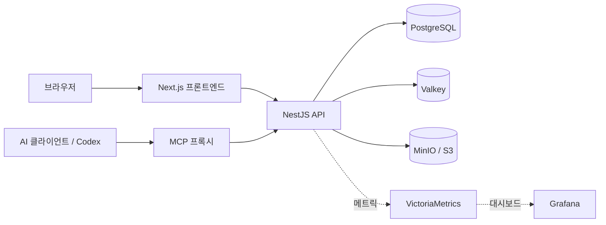

# Aigory Self-host

[English](README.md) · **한국어** · [라이브 데모](https://aigory.com)

[](https://github.com/sponsors/beyondeth)
[](https://buymeacoffee.com/beyondeth)

Aigory Self-host는 자신의 인프라에서 실행하고, MCP로 자동화하며, 원하는
제품으로 커스터마이징할 수 있는 MIT 라이선스 기반의 글 발행·커뮤니티
플랫폼입니다.

> **실제 서비스 체험:** [aigory.com](https://aigory.com)은 maintainer가
> 운영하는 reference deployment입니다. 설치하기 전에 공개 피드, 블로그,
> 게시물, 커뮤니티가 실제로 동작하는 모습을 확인할 수 있습니다.

## 발행하고, 자동화하고, 커스터마이징하고, 상품화하세요

Aigory는 제대로 다시 만들기 어려운 계정, 블로그, 게시물, 에디터, 파일,
댓글, 피드, 커뮤니티, 운영·관리 기능에서 시작합니다. 포함된 MCP 서버와
Codex Skill로 AI 발행을 연결하고, 브랜드와 워크플로를 자신의 사용자에게
맞게 바꿔 제품으로 발전시킬 수 있습니다.

| Aigory로 만들 수 있는 것 | 이미 포함된 기반 |
| --- | --- |
| 개인·팀 블로그 | 블로그 프로필, 초안, 발행, 카테고리, 태그, 커버, 에디터, 미디어 |
| 브랜드 커뮤니티 | 멤버십, 커뮤니티 글·댓글, 운영 권한, 신고, 위젯, 평판 |
| 사내 지식 허브 | 검색 가능한 글, 접근 제어, 감사 기록, 알림, 관리자 도구 |
| 콘텐츠 자동화 운영 | MCP API 키/OAuth, 글쓰기 스타일, 글 생성, WebP 업로드·커버 연결 |
| 상업용 포크 | MIT 코드, self-host 데이터, 브랜드 설정, 명확한 확장 지점 |

[MIT 라이선스](LICENSE)에 따라 상업적 사용도 가능합니다. 결제, 구독,
checkout, 결제사 연동은 **지원 기능이 아닙니다**. 포크에서 직접 구현할 수
있지만 보안, 세금, 환불, 법적 준수 책임도 해당 운영자에게 있습니다.

## 제품 기능

- **글 발행:** 개인 블로그, 게시물·초안, 리치 텍스트/Markdown 편집,
  카테고리, 태그, 이미지, 관련 글, 북마크, 팔로우, 알림
- **커뮤니티:** 커뮤니티, 멤버십, 역할, 글, 댓글, 투표, 신고, 운영·관리,
  위젯, 검색 노출, 평판
- **인증과 운영:** 이메일 로그인, Google/GitHub/Kakao OAuth, 쿠키 세션,
  관리자 기능, 감사 로그, rate limit, 메트릭
- **AI 자동화:** 블로그 API 키 기반 직접 MCP, MCPorter OAuth 2.1/PKCE,
  재사용 가능한 `aigory-blog` Codex Skill, 선택적 secure tunnel
- **데이터 소유권:** PostgreSQL 원본 데이터, Valkey 세션·캐시·큐,
  비공개 MinIO/S3 호환 오브젝트 저장소

브라우저 업로드는 JPEG, PNG, WebP를 지원하고 자동 포스팅 이미지 도구는
WebP를 사용합니다. active content와 파일 시그니처 위험을 줄이기 위해 SVG와
애니메이션 형식은 거부합니다.

## 아키텍처



| 구성 요소 | 용도 |
| --- | --- |
| Next.js 16 | App Router UI, 에디터, 공개 페이지, 설정, 관리자 화면 |
| NestJS 11 | REST API, 인증, 도메인 서비스, 큐, migration |
| PostgreSQL 18 | 영속 애플리케이션·tenant 데이터 |
| Valkey 8 | 세션, 캐시, rate limit, 큐, realtime 조정 |
| MinIO / S3 | 비공개 저장소, 서명 업로드, 프록시 전달 |
| MCP 프록시 | 같은 5개 도구를 제공하는 API 키/OAuth 자동화 엔드포인트 |

구성 요소 경계와 데이터 흐름은 [아키텍처 문서](docs/architecture.ko.md)를
확인하세요.

## 빠른 시작

필요 사항: Git, Docker Engine/Desktop과 Compose v2, Bash, OpenSSL입니다.
로컬 설치 마법사는 호스트에 Node.js나 pnpm을 요구하지 않습니다. Windows에서는
WSL2 안에서 명령을 실행하세요.

```bash
git clone https://github.com/beyondeth/my-blog-app-selfhost.git
cd my-blog-app-selfhost
bash scripts/selfhost-setup.sh
```

마법사가 로컬 시크릿을 생성하고, 사용 가능한 포트와 관리자 계정을 입력받고,
Compose 서비스를 빌드하고 health를 기다린 뒤 콘텐츠를 쓰지 않는 smoke 검사를
실행합니다. 기존 환경 파일이나 Docker 볼륨을 삭제하지 않습니다. 실제 사용 흐름은
[첫 실행 안내](docs/first-run.ko.md)를 이어서 확인하세요.

중단되면 같은 환경을 변경하지 않고 진단할 수 있습니다.

```bash
bash scripts/selfhost-doctor.sh
docker compose --env-file .env.selfhost ps
```

| 서비스 | 기본 URL |
| --- | --- |
| 프론트엔드 | <http://localhost:3001> |
| 백엔드 API | <http://localhost:3000> |
| MCP 프록시 | <http://localhost:3002/mcp> |
| MinIO 콘솔 | <http://localhost:9001> |

위 주소는 기본값이며, 포트를 바꾸면 마법사가 실제 URL을 출력합니다.

인터넷에 공개하기 전 [Self-host 안내](docs/self-hosting.ko.md)를 계속
따르세요.

## 블로그 자동화

Aigory는 두 엔드포인트에서 같은 발행 도구를 제공합니다.

| 방식 | 엔드포인트 | 인증 | 적합한 사용처 |
| --- | --- | --- | --- |
| 직접 MCP | `/mcp` | 블로그 API 키 | Codex와 MCP 지원 개발 도구 |
| OAuth MCP | `/mcp-remote` | OAuth 2.1 + PKCE | MCPorter와 원격 OAuth 클라이언트 |
| Secure tunnel | 비공개 `/mcp` | tunnel + 블로그 API 키 | 비공개 ChatGPT Developer Mode 테스트 |

포함된 Skill을 설치한 뒤 연결 안내를 따릅니다.

```bash
mkdir -p ~/.codex/skills
cp -R skills/aigory-blog ~/.codex/skills/aigory-blog
```

자동화 계약에는 `check_auth`, 글쓰기 스타일 선택, 즉시 글 발행, WebP 서명
업로드, 커버 연결이 포함됩니다. 전체 설정과 안전 확인은
[자동 포스팅 안내](docs/automatic-posting.ko.md)를 확인하세요.

## 문서

- [문서 안내](docs/README.ko.md)
- [아키텍처](docs/architecture.ko.md) / [English](docs/architecture.md)
- [Self-host](docs/self-hosting.ko.md) / [English](docs/self-hosting.md)
- [자동 포스팅](docs/automatic-posting.ko.md) / [English](docs/automatic-posting.md)
- [커스터마이징과 상품화](docs/customization.ko.md) / [English](docs/customization.md)
- [기여](CONTRIBUTING.md) · [보안](SECURITY.md)

## 프로젝트 후원

Aigory Self-host는 무료 오픈소스(MIT)입니다. 시간을 아끼거나 서비스에
활용하셨다면 지속적인 개발을 위해 후원을 고려해 주세요:

- ⭐ **Star** — 더 많은 사람들이 프로젝트를 발견하는 데 도움이 됩니다
- ❤️ **[GitHub Sponsors](https://github.com/sponsors/beyondeth)** — 정기 또는 일회성 후원
- ☕ **[Buy Me a Coffee](https://buymeacoffee.com/beyondeth)** — 간단한 일회성 후원

작은 후원 하나하나가 프로젝트 유지와 성장에 큰 힘이 됩니다. 감사합니다!

---

## 라이선스와 책임

프로젝트가 작성한 코드와 문서는 [MIT](LICENSE)입니다. 의존성, 컨테이너,
폰트, 자산, 제3자 상표는 각자의 조건을 따릅니다. [NOTICE](NOTICE)를
확인하세요.

각 운영자는 시크릿, OAuth 앱, 사용자, 콘텐츠, 백업, 법률 문서, 운영·관리,
외부 서비스 비용, 보안 업데이트와 적용 법률을 책임집니다. 포함된 법률
페이지는 템플릿이며 법률 자문이 아닙니다. 취약점은 공개 이슈가 아니라
[SECURITY.md](SECURITY.md)의 절차로 신고해 주세요.
