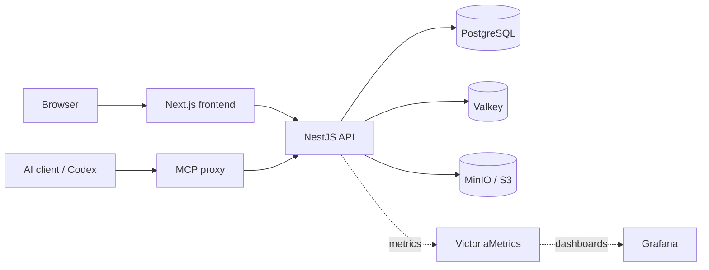

# Aigory Self-host

**English** · [한국어](README.ko.md) · [Live Demo](https://aigory.com)

[](https://github.com/sponsors/beyondeth)
[](https://buymeacoffee.com/beyondeth)

Aigory Self-host is an MIT-licensed publishing and community foundation that
you can run on your own infrastructure, automate through MCP, and customize
into a product of your own.

> **Try the real service:** [aigory.com](https://aigory.com) is the
> maintainer-operated reference deployment. Explore the public feed, blogs,
> posts, and communities before installing your own instance.

## Publish, automate, customize, productize

Aigory starts with the parts that are expensive to rebuild well: accounts,
blogs, posts, rich editing, files, comments, feeds, communities, moderation,
and administration. Add AI-assisted publishing through the included MCP server
and Codex skill, then adapt the brand, workflows, and product surface for your
own audience.

| Build with Aigory | What is already included |
| --- | --- |
| Personal or team blog | Blog profiles, drafts, publishing, categories, tags, covers, editor, and media |
| Branded community | Membership, community posts, comments, moderation, reports, widgets, and reputation |
| Internal knowledge hub | Searchable publishing, access controls, audit records, notifications, and admin tools |
| Automated content operation | MCP API key or OAuth, writing styles, post creation, and WebP upload/cover workflows |
| Commercial fork | MIT-licensed code, self-hosted data, configurable branding, and clear extension points |

Commercial use is permitted by the [MIT License](LICENSE). Payments,
subscriptions, checkout, and payment-provider integrations are **not supported
features**; a fork may implement them and assumes responsibility for security,
tax, refunds, and compliance.

## Product capabilities

- **Publishing:** personal blogs, posts and drafts, rich-text/Markdown editing,
  categories, tags, media, related posts, bookmarks, follows, and notifications
- **Community:** communities, memberships, roles, posts, comments, votes,
  reports, moderation, widgets, discoverability, and reputation
- **Identity and operations:** email login, Google/GitHub/Kakao OAuth,
  cookie-backed sessions, administration, audit logs, rate limits, and metrics
- **AI automation:** direct MCP with a blog API key, OAuth 2.1/PKCE through
  MCPorter, a reusable `aigory-blog` Codex skill, and an optional secure tunnel
- **Data ownership:** PostgreSQL as the source of truth, Valkey for sessions,
  queues and cache, plus private MinIO/S3-compatible object storage

New browser uploads accept JPEG, PNG, and WebP. Automatic-posting image tools
accept WebP. SVG and animated formats are rejected to reduce active-content
and content-signature risks.

## Architecture



| Component | Purpose |
| --- | --- |
| Next.js 16 | App Router UI, editor, public pages, settings, and administration |
| NestJS 11 | REST API, authentication, domain services, queues, and migrations |
| PostgreSQL 18 | Durable application and tenant data |
| Valkey 8 | Sessions, cache, rate limits, queues, and realtime coordination |
| MinIO / S3 | Private object storage, signed uploads, and proxied delivery |
| MCP proxy | API-key and OAuth automation endpoints with the same five tools |

See [Architecture](docs/architecture.md) for component boundaries, data flows,
and security controls.

## Quick start

Requirements: Git, Docker Engine/Desktop with Compose v2, Bash, and OpenSSL.
The guided local setup does not require Node.js or pnpm on the host. Windows
users should run the commands inside WSL2.

```bash
git clone https://github.com/beyondeth/my-blog-app-selfhost.git
cd my-blog-app-selfhost
bash scripts/selfhost-setup.sh
```

The wizard generates local secrets, asks for available ports and an administrator
account, builds the Compose services, waits for health, and runs a non-writing
smoke check. It never deletes existing environment files or Docker volumes.
Continue with the [first-run guide](docs/first-run.md) for the real user journey.

If setup stops, diagnose the same environment without changing it:

```bash
bash scripts/selfhost-doctor.sh
docker compose --env-file .env.selfhost ps
```

| Service | Default URL |
| --- | --- |
| Frontend | <http://localhost:3001> |
| Backend API | <http://localhost:3000> |
| MCP proxy | <http://localhost:3002/mcp> |
| MinIO console | <http://localhost:9001> |

These are defaults; the wizard prints the actual URLs when it selects alternate
ports.

Continue with the [self-hosting guide](docs/self-hosting.md) before exposing an
instance to the Internet.

## Automate a blog

Aigory exposes the same publishing tools through two endpoints:

| Route | Endpoint | Authentication | Best for |
| --- | --- | --- | --- |
| Direct MCP | `/mcp` | Blog API key | Codex and MCP-capable developer tools |
| OAuth MCP | `/mcp-remote` | OAuth 2.1 + PKCE | MCPorter and remote OAuth clients |
| Secure tunnel | Private `/mcp` | Tunnel + blog API key | Private ChatGPT Developer Mode testing |

Install the included skill and follow the connection guide:

```bash
mkdir -p ~/.codex/skills
cp -R skills/aigory-blog ~/.codex/skills/aigory-blog
```

The automation contract includes `check_auth`, writing-style selection,
immediate post creation, signed WebP upload, and cover attachment. See
[Automatic posting](docs/automatic-posting.md) for complete setup and safety
checks.

## Documentation

- [Documentation map](docs/README.md)
- [Architecture](docs/architecture.md) / [한국어](docs/architecture.ko.md)
- [Self-hosting](docs/self-hosting.md) / [한국어](docs/self-hosting.ko.md)
- [Automatic posting](docs/automatic-posting.md) / [한국어](docs/automatic-posting.ko.md)
- [Customization and productization](docs/customization.md) / [한국어](docs/customization.ko.md)
- [Contributing](CONTRIBUTING.md) · [Security](SECURITY.md)

## Support the project

Aigory Self-host is free and open-source (MIT). If it saves you time or
powers something you ship, consider supporting continued development:

- ⭐ **Star the repo** — it helps others discover the project
- ❤️ **[GitHub Sponsors](https://github.com/sponsors/beyondeth)** — recurring or one-time support
- ☕ **[Buy Me a Coffee](https://buymeacoffee.com/beyondeth)** — quick one-time contribution

Every bit of support helps keep the project maintained and growing. Thank you!

---

## License and responsibility

Project-authored code and documentation are licensed under [MIT](LICENSE).
Dependencies, container services, fonts, assets, and third-party marks keep
their own terms; see [NOTICE](NOTICE).

Each operator is responsible for credentials, OAuth applications, users,
content, backups, legal documents, moderation, provider costs, security
updates, and applicable law. The bundled legal pages are templates, not legal
advice. Report vulnerabilities through [SECURITY.md](SECURITY.md), not a public
issue.
