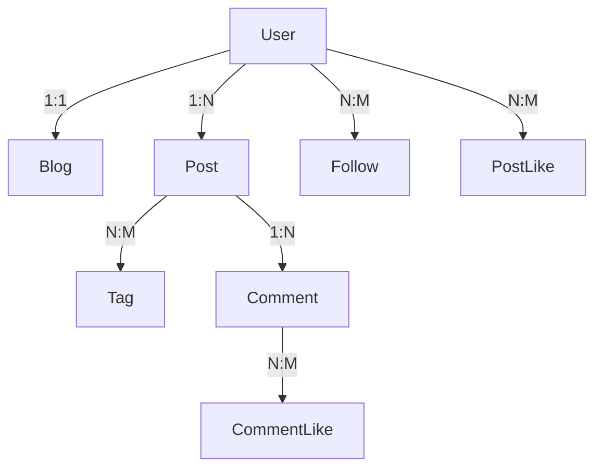
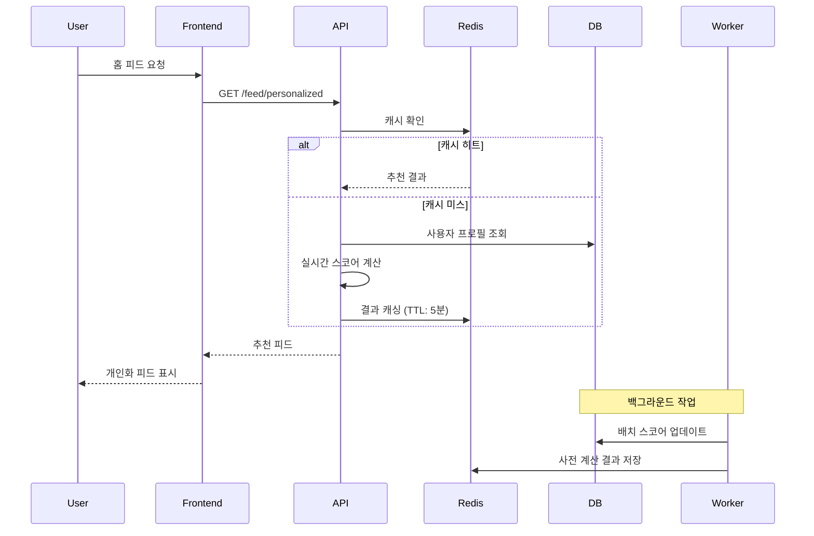
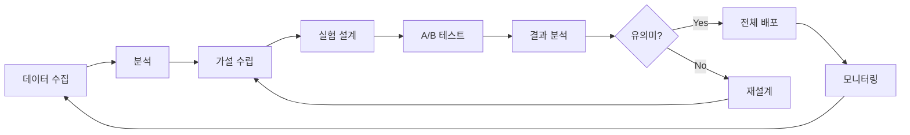

# 🚀 SaaS 블로그 플랫폼 추천 시스템 설계서

## 📋 목차
1. [개요 및 목표](#1-개요-및-목표)
2. [현재 시스템 분석](#2-현재-시스템-분석)
3. [추천 알고리즘 벤치마킹](#3-추천-알고리즘-벤치마킹)
4. [경량화 추천 시스템 아키텍처](#4-경량화-추천-시스템-아키텍처)
5. [핵심 알고리즘 설계](#5-핵심-알고리즘-설계)
6. [데이터 수집 전략](#6-데이터-수집-전략)
7. [인프라 및 기술 스택](#7-인프라-및-기술-스택)
8. [구현 로드맵](#8-구현-로드맵)
9. [성능 최적화 전략](#9-성능-최적화-전략)
10. [모니터링 및 개선](#10-모니터링-및-개선)

---

## 1. 개요 및 목표

### 🎯 프로젝트 목표
현재 시간 기반(최신순)으로만 표시되는 피드를 **사용자 개인화 추천 시스템**으로 전환하여 사용자 참여도와 콘텐츠 발견성을 극대화

### 📊 핵심 제약사항
- **인프라**: 소규모 인스턴스 1개 + DB 1개 (약 t3.small + RDS t3.micro 수준)
- **예산**: 월 $50-100 이내
- **트래픽**: 초기 DAU 100-1000명, 성장 목표 10,000명
- **응답속도**: P95 < 200ms, P99 < 500ms

### 🎖️ 성공 지표 (KPIs)
```yaml
engagement_metrics:
  - click_through_rate: +30% (3개월)
  - average_session_duration: +25% (3개월)
  - posts_per_session: +40% (3개월)
  - user_retention_7d: +20% (3개월)

technical_metrics:
  - recommendation_latency_p95: < 200ms
  - cache_hit_rate: > 80%
  - db_cpu_utilization: < 40%
  - memory_usage: < 70%
```

---

## 2. 현재 시스템 분석

### 📊 활용 가능한 데이터 시그널

#### 명시적 시그널 (Explicit Signals)
```typescript
// 이미 수집 중인 데이터
- follows (팔로우 관계)
- post_likes (포스트 좋아요)
- comment_likes (댓글 좋아요/싫어요)
- tags (사용자 관심사)
```

#### 암묵적 시그널 (Implicit Signals)
```typescript
// 추가 수집 필요
- viewCount (조회수 - 이미 있음)
- dwell_time (체류 시간)
- scroll_depth (스크롤 깊이)
- click_events (클릭 이벤트)
- search_queries (검색 쿼리)
```

### 🗄️ 엔티티 관계도


---

## 3. 추천 알고리즘 벤치마킹

### 🌟 Reddit 알고리즘 (Hot Ranking)
```python
# Reddit의 핫 랭킹 알고리즘 (단순화 버전)
def reddit_hot_score(ups, downs, date):
    s = ups - downs
    order = log10(max(abs(s), 1))
    sign = 1 if s > 0 else -1 if s < 0 else 0
    seconds = epoch_seconds(date) - 1134028003
    return round(sign * order + seconds / 45000, 7)
```

**특징**:
- 시간 감쇠 (Time Decay)
- 투표 기반 스코어링
- 로그 스케일로 초기 투표 중요도 증가

### 📚 Medium 알고리즘 (읽기 시간 + 참여도)
```python
# Medium의 추천 스코어 (추정)
def medium_score(post):
    read_ratio = completed_reads / total_views
    engagement = (claps * 0.3 + highlights * 0.2 + responses * 0.5)
    author_score = author.follower_count * 0.1
    recency = time_decay_factor(post.published_at)

    return (read_ratio * 40 +
            engagement * 30 +
            author_score * 10 +
            recency * 20)
```

**특징**:
- 읽기 완료율 중심
- 다양한 참여 지표 조합
- 저자 신뢰도 반영

### 🛒 쿠팡 랭킹/리랭킹 시스템
```python
# E-commerce 스타일 2단계 추천
# 1단계: Candidate Generation (후보 생성)
def candidate_generation(user):
    collaborative = get_collaborative_filtering(user, limit=500)
    content_based = get_content_based(user, limit=300)
    trending = get_trending_items(limit=200)
    return merge_candidates(collaborative, content_based, trending)

# 2단계: Ranking (정밀 랭킹)
def ranking(candidates, user):
    features = extract_features(candidates, user)
    scores = ml_model.predict(features)
    return rerank_with_business_rules(candidates, scores)
```

**특징**:
- 2단계 파이프라인 (속도 + 정확도)
- ML 모델 기반 랭킹
- 비즈니스 룰 적용

---

## 4. 경량화 추천 시스템 아키텍처

### 🏗️ 시스템 아키텍처

```
┌─────────────────────────────────────────────────────────────┐
│                         Frontend                             │
│                    (React + Next.js)                         │
└────────────────┬────────────────────────────────────────────┘
                 │
                 ▼
┌─────────────────────────────────────────────────────────────┐
│                    API Gateway (NestJS)                      │
│  ┌──────────────────────────────────────────────────────┐  │
│  │               Recommendation Controller               │  │
│  │  • /api/v1/feed/personalized                        │  │
│  │  • /api/v1/feed/trending                            │  │
│  │  • /api/v1/recommendations/similar                  │  │
│  └──────────────────────────────────────────────────────┘  │
└────────────────┬────────────────────────────────────────────┘
                 │
    ┌────────────┴────────────┬─────────────────┐
    ▼                         ▼                 ▼
┌─────────┐           ┌─────────────┐   ┌─────────────┐
│  Redis  │           │ PostgreSQL  │   │   S3/CDN    │
│ (Cache) │           │  (Primary)  │   │  (Assets)   │
└─────────┘           └─────────────┘   └─────────────┘
    │                         │
    └─────────┬───────────────┘
              ▼
┌─────────────────────────────────────────────────────────────┐
│               Background Workers (Bull Queue)                │
│  • Score Computation (매 30분)                              │
│  • Feature Extraction (매 1시간)                            │
│  • Model Training (매일 새벽 2시)                           │
└─────────────────────────────────────────────────────────────┘
```

### 🔄 데이터 플로우



---

## 5. 핵심 알고리즘 설계

### 🧮 하이브리드 추천 알고리즘

#### 1단계: 후보 생성 (Candidate Generation)
```typescript
// 경량화된 후보 생성 알고리즘
interface CandidateGenerator {
  // 협업 필터링 (Collaborative Filtering) - 간단한 User-Item Matrix
  async getCollaborativeCandidates(userId: string): Promise<Post[]> {
    // 1. 유사 사용자 찾기 (팔로우 관계 기반)
    const similarUsers = await this.findSimilarUsers(userId);

    // 2. 유사 사용자가 좋아한 포스트
    const likedPosts = await this.getLikedPostsByUsers(similarUsers);

    // 3. 이미 본 포스트 필터링
    return this.filterSeenPosts(likedPosts, userId);
  }

  // 컨텐츠 기반 필터링 (Content-Based)
  async getContentBasedCandidates(userId: string): Promise<Post[]> {
    // 1. 사용자 선호 태그 추출
    const userTags = await this.getUserPreferredTags(userId);

    // 2. 태그 기반 포스트 검색
    return this.getPostsByTags(userTags, limit: 100);
  }

  // 트렌딩 포스트 (Trending)
  async getTrendingCandidates(): Promise<Post[]> {
    // Wilson Score Interval로 품질 보장
    const sql = `
      SELECT p.*,
        ((p.like_count + 1.9208) / (p.like_count + p.view_count) -
         1.96 * SQRT((p.like_count * (p.view_count - p.like_count)) /
         (p.like_count + p.view_count) + 0.9604) /
         (p.like_count + p.view_count)) /
         (1 + 3.8416 / (p.like_count + p.view_count)) as wilson_score
      FROM posts p
      WHERE p.created_at > NOW() - INTERVAL '7 days'
      ORDER BY wilson_score DESC
      LIMIT 50
    `;
    return this.db.query(sql);
  }
}
```

#### 2단계: 스코어링 (Scoring)
```typescript
// 경량화된 스코어링 알고리즘
class LightweightScorer {
  // 메인 스코어링 함수
  calculateScore(post: Post, user: User): number {
    // 1. 기본 품질 점수
    const qualityScore = this.calculateQualityScore(post);

    // 2. 개인화 점수
    const personalizationScore = this.calculatePersonalizationScore(post, user);

    // 3. 시간 감쇠
    const timeDecay = this.calculateTimeDecay(post.createdAt);

    // 4. 다양성 부스트
    const diversityBoost = this.calculateDiversityBoost(post, user.recentViews);

    // 가중치 적용
    return (
      qualityScore * 0.3 +
      personalizationScore * 0.4 +
      timeDecay * 0.2 +
      diversityBoost * 0.1
    );
  }

  // 품질 점수 (Reddit 스타일)
  calculateQualityScore(post: Post): number {
    const engagement = post.likeCount + post.commentCount * 2;
    const views = Math.max(post.viewCount, 1);
    const engagementRate = engagement / views;

    // 로그 스케일 적용으로 초기 참여 중시
    return Math.log10(1 + engagement) * engagementRate;
  }

  // 개인화 점수
  calculatePersonalizationScore(post: Post, user: User): number {
    let score = 0;

    // 1. 팔로우 관계 (강한 시그널)
    if (user.following.includes(post.authorId)) {
      score += 0.5;
    }

    // 2. 태그 매칭 (중간 시그널)
    const matchingTags = post.tags.filter(tag =>
      user.interestedTags.includes(tag)
    );
    score += matchingTags.length * 0.1;

    // 3. 카테고리 선호도 (약한 시그널)
    if (user.preferredCategories.includes(post.category)) {
      score += 0.2;
    }

    return Math.min(score, 1); // 0~1 정규화
  }

  // 시간 감쇠 함수 (Medium 스타일)
  calculateTimeDecay(createdAt: Date): number {
    const hoursAgo = (Date.now() - createdAt.getTime()) / (1000 * 60 * 60);

    if (hoursAgo < 3) return 1.0;      // 3시간 이내: 100%
    if (hoursAgo < 24) return 0.8;     // 1일 이내: 80%
    if (hoursAgo < 72) return 0.6;     // 3일 이내: 60%
    if (hoursAgo < 168) return 0.4;    // 1주 이내: 40%

    // 지수 감쇠
    return Math.max(0.1, Math.exp(-hoursAgo / 168));
  }

  // 다양성 부스트 (탐색 vs 활용)
  calculateDiversityBoost(post: Post, recentViews: string[]): number {
    // 최근 본 저자의 글이면 패널티
    const recentAuthors = recentViews.map(id => this.getAuthor(id));
    if (recentAuthors.includes(post.authorId)) {
      return -0.2;
    }

    // 새로운 카테고리면 보너스
    const recentCategories = recentViews.map(id => this.getCategory(id));
    if (!recentCategories.includes(post.category)) {
      return 0.2;
    }

    return 0;
  }
}
```

### 🎯 리랭킹 전략 (Re-ranking)

```typescript
// 비즈니스 룰 기반 리랭킹
class ReRanker {
  rerank(scoredPosts: ScoredPost[], user: User): Post[] {
    let reranked = [...scoredPosts];

    // 1. 다양성 보장 (같은 저자 포스트 분산)
    reranked = this.ensureAuthorDiversity(reranked);

    // 2. 카테고리 다양성
    reranked = this.ensureCategoryDiversity(reranked);

    // 3. 신규 작성자 부스트 (플랫폼 성장)
    reranked = this.boostNewAuthors(reranked);

    // 4. 광고/프로모션 삽입 위치 (수익화)
    reranked = this.insertPromotions(reranked);

    // 5. 품질 하한선 적용
    reranked = reranked.filter(p => p.score > MIN_QUALITY_THRESHOLD);

    return reranked.slice(0, FEED_SIZE);
  }

  // 저자 다양성 보장 알고리즘
  ensureAuthorDiversity(posts: ScoredPost[]): ScoredPost[] {
    const result = [];
    const authorCounts = new Map();
    const deferred = [];

    for (const post of posts) {
      const count = authorCounts.get(post.authorId) || 0;

      if (count < 2) {
        result.push(post);
        authorCounts.set(post.authorId, count + 1);
      } else {
        deferred.push(post); // 나중에 추가
      }
    }

    // 연기된 포스트 추가
    return [...result, ...deferred];
  }
}
```

---

## 6. 데이터 수집 전략

### 📊 이벤트 트래킹 시스템

```typescript
// 새로운 User Activity 엔티티
@Entity('user_activities')
@Index(['userId', 'createdAt'])
@Index(['eventType'])
export class UserActivity {
  @PrimaryGeneratedColumn('uuid')
  id: string;

  @Column('uuid')
  userId: string;

  @Column('varchar')
  eventType: EventType; // view, click, like, share, comment

  @Column('uuid', { nullable: true })
  targetId: string; // postId, commentId, etc

  @Column('varchar', { nullable: true })
  targetType: string; // post, comment, user

  @Column('jsonb', { default: {} })
  metadata: {
    dwellTime?: number;      // 체류 시간 (초)
    scrollDepth?: number;     // 스크롤 깊이 (%)
    referrer?: string;        // 유입 경로
    device?: string;          // 디바이스 정보
    sessionId?: string;       // 세션 ID
  };

  @CreateDateColumn()
  createdAt: Date;

  // 파티셔닝을 위한 월별 컬럼
  @Column('varchar', { length: 7 })
  @Index()
  monthPartition: string; // '2024-01'
}
```

### 🔄 실시간 이벤트 수집

```typescript
// 클라이언트 사이드 트래킹 (Frontend)
class ActivityTracker {
  private queue: Activity[] = [];
  private batchSize = 10;
  private flushInterval = 5000; // 5초

  track(event: string, data: any) {
    this.queue.push({
      event,
      data,
      timestamp: Date.now(),
      sessionId: this.getSessionId(),
    });

    if (this.queue.length >= this.batchSize) {
      this.flush();
    }
  }

  // 배치 전송으로 네트워크 최적화
  async flush() {
    if (this.queue.length === 0) return;

    const batch = this.queue.splice(0, this.batchSize);
    await fetch('/api/v1/analytics/batch', {
      method: 'POST',
      body: JSON.stringify(batch),
      headers: { 'Content-Type': 'application/json' },
    });
  }

  // 체류 시간 측정
  trackDwellTime(postId: string) {
    const startTime = Date.now();

    return () => {
      const dwellTime = (Date.now() - startTime) / 1000;
      this.track('dwell_time', { postId, dwellTime });
    };
  }

  // 스크롤 깊이 측정
  trackScrollDepth(postId: string) {
    let maxDepth = 0;

    const handleScroll = () => {
      const depth = (window.scrollY / document.body.scrollHeight) * 100;
      maxDepth = Math.max(maxDepth, depth);
    };

    window.addEventListener('scroll', handleScroll);

    return () => {
      window.removeEventListener('scroll', handleScroll);
      this.track('scroll_depth', { postId, depth: maxDepth });
    };
  }
}
```

### 📈 사용자 프로필 구축

```typescript
// 사용자 선호도 프로필 (Redis에 캐싱)
interface UserProfile {
  userId: string;

  // 명시적 선호도
  followingAuthors: string[];
  likedPosts: string[];
  subscribedTags: string[];

  // 암묵적 선호도 (계산됨)
  preferredTags: Array<{ tag: string; weight: number }>;
  preferredCategories: Array<{ category: string; weight: number }>;
  preferredAuthors: Array<{ authorId: string; weight: number }>;

  // 읽기 패턴
  averageDwellTime: number;
  averageScrollDepth: number;
  activeHours: number[]; // 0-23시

  // 참여 패턴
  engagementRate: number;
  shareRate: number;
  commentRate: number;

  // 메타데이터
  lastUpdated: Date;
  profileVersion: number;
}

// 프로필 빌더 (일일 배치)
class UserProfileBuilder {
  async buildProfile(userId: string): Promise<UserProfile> {
    // 최근 30일 활동 데이터
    const activities = await this.getRecentActivities(userId, 30);

    // 태그 선호도 계산
    const tagWeights = this.calculateTagPreferences(activities);

    // 카테고리 선호도 계산
    const categoryWeights = this.calculateCategoryPreferences(activities);

    // 저자 선호도 계산
    const authorWeights = this.calculateAuthorPreferences(activities);

    // 참여율 계산
    const engagement = this.calculateEngagement(activities);

    return {
      userId,
      preferredTags: tagWeights,
      preferredCategories: categoryWeights,
      preferredAuthors: authorWeights,
      ...engagement,
      lastUpdated: new Date(),
      profileVersion: 1,
    };
  }

  // TF-IDF 스타일 태그 가중치 계산
  calculateTagPreferences(activities: Activity[]): TagWeight[] {
    const tagFrequency = new Map<string, number>();
    const tagRecency = new Map<string, Date>();

    activities.forEach(activity => {
      if (activity.targetType === 'post') {
        const tags = this.getPostTags(activity.targetId);
        tags.forEach(tag => {
          tagFrequency.set(tag, (tagFrequency.get(tag) || 0) + 1);
          tagRecency.set(tag, activity.createdAt);
        });
      }
    });

    // 빈도 + 최신성 조합
    return Array.from(tagFrequency.entries())
      .map(([tag, freq]) => {
        const recency = this.getRecencyScore(tagRecency.get(tag));
        return {
          tag,
          weight: freq * 0.7 + recency * 0.3
        };
      })
      .sort((a, b) => b.weight - a.weight)
      .slice(0, 20); // 상위 20개
  }
}
```

---

## 7. 인프라 및 기술 스택

### 🛠️ 기술 스택 선택

#### 메인 인프라 (최소 구성)
```yaml
application_server:
  type: AWS EC2 t3.small / DigitalOcean Droplet
  specs:
    - vCPU: 2
    - Memory: 2GB
    - Storage: 20GB SSD
    - Cost: ~$15/month

database:
  type: PostgreSQL (AWS RDS t3.micro / Supabase Free)
  specs:
    - vCPU: 2
    - Memory: 1GB
    - Storage: 20GB
    - Cost: ~$15/month or Free

cache:
  type: Redis (ElastiCache t3.micro / Upstash Free)
  specs:
    - Memory: 500MB
    - Connections: 256
    - Cost: ~$10/month or Free

monitoring:
  type: Free Tier Services
  tools:
    - Grafana Cloud (Free)
    - Sentry (Free tier)
    - Google Analytics
```

#### 소프트웨어 스택
```typescript
// Backend 의존성
{
  "dependencies": {
    // 기존 스택
    "@nestjs/core": "^10.0.0",
    "@nestjs/typeorm": "^10.0.0",
    "typeorm": "^0.3.0",
    "postgres": "^14.0.0",

    // 추천 시스템 추가
    "@nestjs/bull": "^10.0.0",  // 백그라운드 작업
    "bull": "^4.11.0",           // 큐 시스템
    "ioredis": "^5.3.0",         // Redis 클라이언트

    // 모니터링
    "@nestjs/terminus": "^10.0.0",  // 헬스체크
    "prom-client": "^14.0.0",        // Prometheus 메트릭
  }
}
```

### 🗄️ 데이터베이스 최적화

#### PostgreSQL 인덱스 전략
```sql
-- 핵심 인덱스 생성
-- 1. 사용자 활동 조회 최적화
CREATE INDEX idx_user_activities_user_date
ON user_activities(user_id, created_at DESC)
WHERE event_type IN ('view', 'like', 'comment');

-- 2. 포스트 스코어링 최적화
CREATE INDEX idx_posts_scoring
ON posts(is_published, created_at DESC)
INCLUDE (like_count, view_count, comment_count)
WHERE is_published = true;

-- 3. 태그 기반 검색 최적화 (GIN 인덱스)
CREATE INDEX idx_posts_tags ON posts USING GIN(tag_list);

-- 4. 팔로우 관계 조회 최적화
CREATE INDEX idx_follows_follower ON follows(follower_id, created_at DESC);
CREATE INDEX idx_follows_following ON follows(following_id, created_at DESC);

-- 5. 파티셔닝을 위한 인덱스 (월별)
CREATE INDEX idx_activities_partition
ON user_activities(month_partition, user_id);
```

#### 파티셔닝 전략
```sql
-- 사용자 활동 테이블 파티셔닝 (월별)
CREATE TABLE user_activities_2024_01 PARTITION OF user_activities
FOR VALUES FROM ('2024-01-01') TO ('2024-02-01');

CREATE TABLE user_activities_2024_02 PARTITION OF user_activities
FOR VALUES FROM ('2024-02-01') TO ('2024-03-01');

-- 자동 파티션 생성 함수
CREATE OR REPLACE FUNCTION create_monthly_partition()
RETURNS void AS $$
DECLARE
  partition_name text;
  start_date date;
  end_date date;
BEGIN
  start_date := date_trunc('month', CURRENT_DATE);
  end_date := start_date + interval '1 month';
  partition_name := 'user_activities_' || to_char(start_date, 'YYYY_MM');

  EXECUTE format('CREATE TABLE IF NOT EXISTS %I PARTITION OF user_activities
    FOR VALUES FROM (%L) TO (%L)',
    partition_name, start_date, end_date);
END;
$$ LANGUAGE plpgsql;

-- 월별 크론잡으로 실행
SELECT cron.schedule('create-partition', '0 0 1 * *', 'SELECT create_monthly_partition()');
```

### 🚀 Redis 캐싱 전략

```typescript
// Redis 키 설계
class CacheKeyDesign {
  // 사용자 피드 캐시 (5분 TTL)
  static userFeed(userId: string): string {
    return `feed:user:${userId}`;
  }

  // 사용자 프로필 캐시 (1시간 TTL)
  static userProfile(userId: string): string {
    return `profile:user:${userId}`;
  }

  // 포스트 스코어 캐시 (30분 TTL)
  static postScore(postId: string): string {
    return `score:post:${postId}`;
  }

  // 트렌딩 포스트 캐시 (10분 TTL)
  static trending(category?: string): string {
    return category ? `trending:${category}` : 'trending:all';
  }

  // 후보 포스트 세트 (Sorted Set)
  static candidateSet(userId: string): string {
    return `candidates:${userId}`;
  }
}

// Redis 캐싱 서비스
@Injectable()
export class CacheService {
  constructor(
    @InjectRedis() private redis: Redis,
  ) {}

  // 캐시 무효화 전략
  async invalidateUserCache(userId: string): Promise<void> {
    const pattern = `*:user:${userId}*`;
    const keys = await this.redis.keys(pattern);
    if (keys.length > 0) {
      await this.redis.del(...keys);
    }
  }

  // 워밍업 전략 (새벽 시간)
  async warmupCache(): Promise<void> {
    // 활성 사용자 식별
    const activeUsers = await this.getActiveUsers(24); // 24시간 이내

    // 각 사용자의 피드 미리 생성
    for (const userId of activeUsers) {
      await this.pregenerateFeed(userId);
    }

    // 트렌딩 캐시 갱신
    await this.refreshTrendingCache();
  }

  // Write-Through 캐싱
  async setWithWriteThrough(
    key: string,
    value: any,
    ttl: number
  ): Promise<void> {
    await this.redis.setex(key, ttl, JSON.stringify(value));
    // DB에도 동시 저장
    await this.persistToDb(key, value);
  }
}
```

---

## 8. 구현 로드맵

### 📅 Phase 1: 기반 구축 (2주)

#### Week 1: 데이터 수집 시스템
```typescript
// Task 1: UserActivity 엔티티 생성
- [ ] Entity 정의 및 마이그레이션
- [ ] Repository 및 Service 구현
- [ ] 파티셔닝 설정

// Task 2: 이벤트 트래킹 구현
- [ ] Frontend 트래킹 라이브러리
- [ ] API 엔드포인트 구현
- [ ] 배치 처리 로직

// Task 3: 기본 분석 쿼리
- [ ] 일일 활성 사용자 (DAU)
- [ ] 참여율 메트릭
- [ ] 인기 콘텐츠 식별
```

#### Week 2: 캐싱 인프라
```typescript
// Task 4: Redis 설정
- [ ] Redis 인스턴스 구축
- [ ] Connection Pool 설정
- [ ] 기본 캐싱 로직

// Task 5: 캐시 전략 구현
- [ ] 캐시 키 설계
- [ ] TTL 정책
- [ ] 무효화 로직

// Task 6: 모니터링 설정
- [ ] Prometheus 메트릭
- [ ] Grafana 대시보드
- [ ] 알람 설정
```

### 📅 Phase 2: 추천 알고리즘 (3주)

#### Week 3: 기본 추천
```typescript
// Task 7: 협업 필터링
- [ ] 유사도 계산 로직
- [ ] 후보 생성 알고리즘
- [ ] 성능 최적화

// Task 8: 컨텐츠 기반 추천
- [ ] 태그 매칭 로직
- [ ] 카테고리 기반 추천
- [ ] TF-IDF 구현

// Task 9: 트렌딩 알고리즘
- [ ] Wilson Score 구현
- [ ] 시간 가중치
- [ ] 카테고리별 트렌딩
```

#### Week 4: 스코어링 시스템
```typescript
// Task 10: 스코어 계산
- [ ] 품질 스코어
- [ ] 개인화 스코어
- [ ] 시간 감쇠

// Task 11: 리랭킹
- [ ] 다양성 보장
- [ ] 비즈니스 룰
- [ ] A/B 테스트 준비

// Task 12: 배치 처리
- [ ] Bull Queue 설정
- [ ] 스코어 사전계산
- [ ] 프로필 업데이트
```

#### Week 5: 통합 및 최적화
```typescript
// Task 13: API 통합
- [ ] /feed/personalized
- [ ] /feed/trending
- [ ] /recommendations/similar

// Task 14: 성능 최적화
- [ ] 쿼리 최적화
- [ ] 인덱스 튜닝
- [ ] 캐시 히트율 개선

// Task 15: 테스트
- [ ] 단위 테스트
- [ ] 통합 테스트
- [ ] 부하 테스트
```

### 📅 Phase 3: 고도화 (2주)

#### Week 6: ML 모델 도입
```typescript
// Task 16: 간단한 ML 모델
- [ ] 로지스틱 회귀 모델
- [ ] Feature Engineering
- [ ] 모델 학습 파이프라인

// Task 17: 온라인 학습
- [ ] 실시간 피드백 반영
- [ ] 모델 업데이트 전략
- [ ] A/B 테스트 프레임워크

// Task 18: 개인화 강화
- [ ] 컨텍스트 인식 추천
- [ ] 시간대별 최적화
- [ ] 세션 기반 추천
```

#### Week 7: 모니터링 및 개선
```typescript
// Task 19: 품질 모니터링
- [ ] 추천 품질 메트릭
- [ ] 사용자 만족도 추적
- [ ] 실시간 대시보드

// Task 20: 피드백 루프
- [ ] 클릭률 추적
- [ ] 체류시간 분석
- [ ] 이탈률 모니터링

// Task 21: 최종 최적화
- [ ] 병목 구간 해결
- [ ] 확장성 테스트
- [ ] 문서화
```

---

## 9. 성능 최적화 전략

### ⚡ 응답 속도 최적화

#### 1. 쿼리 최적화
```sql
-- BAD: N+1 쿼리 문제
SELECT * FROM posts WHERE author_id IN (
  SELECT following_id FROM follows WHERE follower_id = ?
);

-- GOOD: JOIN과 서브쿼리 최적화
WITH user_follows AS (
  SELECT following_id FROM follows
  WHERE follower_id = ?
  LIMIT 100
)
SELECT p.*,
       COUNT(DISTINCT l.user_id) as like_count,
       EXISTS(
         SELECT 1 FROM post_likes pl
         WHERE pl.post_id = p.id AND pl.user_id = ?
       ) as is_liked
FROM posts p
JOIN user_follows f ON p.author_id = f.following_id
LEFT JOIN post_likes l ON p.id = l.post_id
WHERE p.is_published = true
  AND p.created_at > NOW() - INTERVAL '7 days'
GROUP BY p.id
ORDER BY p.created_at DESC
LIMIT 50;
```

#### 2. 비동기 처리
```typescript
// 병렬 처리로 지연 시간 감소
@Injectable()
export class RecommendationService {
  async getPersonalizedFeed(userId: string): Promise<Post[]> {
    // 병렬 실행
    const [
      collaborative,
      contentBased,
      trending
    ] = await Promise.all([
      this.getCollaborativeCandidates(userId),
      this.getContentBasedCandidates(userId),
      this.getTrendingCandidates()
    ]);

    // 결과 병합 및 스코어링
    return this.mergeAndScore(collaborative, contentBased, trending);
  }

  // 스트리밍 응답
  async* streamFeed(userId: string): AsyncGenerator<Post[]> {
    // 첫 배치 즉시 전송
    const firstBatch = await this.getQuickRecommendations(userId);
    yield firstBatch;

    // 정밀 추천 계산 중
    const preciseBatch = await this.getPreciseRecommendations(userId);
    yield preciseBatch;
  }
}
```

#### 3. Connection Pooling
```typescript
// TypeORM 설정
{
  type: 'postgres',
  host: process.env.DB_HOST,
  port: 5432,
  username: process.env.DB_USER,
  password: process.env.DB_PASSWORD,
  database: process.env.DB_NAME,

  // Connection Pool 설정
  extra: {
    max: 20,                // 최대 연결 수
    min: 5,                 // 최소 연결 수
    idleTimeoutMillis: 30000, // 유휴 타임아웃
    connectionTimeoutMillis: 2000, // 연결 타임아웃
  },

  // 쿼리 캐시
  cache: {
    type: 'redis',
    options: {
      host: 'localhost',
      port: 6379,
    },
    duration: 30000, // 30초
  }
}
```

### 📊 메모리 최적화

#### 1. 데이터 구조 최적화
```typescript
// 메모리 효율적인 스코어 저장
class CompactScoreStorage {
  private scores: Float32Array; // number[] 대비 50% 메모리 절약
  private postIds: Uint32Array; // string[] 대비 80% 메모리 절약

  constructor(size: number) {
    this.scores = new Float32Array(size);
    this.postIds = new Uint32Array(size);
  }

  set(index: number, postId: number, score: number) {
    this.postIds[index] = postId;
    this.scores[index] = score;
  }

  // 상위 K개 추출 (Heap 사용)
  topK(k: number): Array<{id: number, score: number}> {
    const heap = new MinHeap(k);

    for (let i = 0; i < this.scores.length; i++) {
      if (heap.size < k || this.scores[i] > heap.peek().score) {
        heap.push({ id: this.postIds[i], score: this.scores[i] });
        if (heap.size > k) heap.pop();
      }
    }

    return heap.toArray();
  }
}
```

#### 2. 가비지 컬렉션 최적화
```typescript
// Object Pool 패턴으로 GC 압력 감소
class ObjectPool<T> {
  private pool: T[] = [];
  private createFn: () => T;
  private resetFn: (obj: T) => void;

  acquire(): T {
    return this.pool.pop() || this.createFn();
  }

  release(obj: T): void {
    this.resetFn(obj);
    this.pool.push(obj);
  }
}

// 사용 예
const scorePool = new ObjectPool({
  create: () => ({ postId: '', score: 0, metadata: {} }),
  reset: (obj) => {
    obj.postId = '';
    obj.score = 0;
    obj.metadata = {};
  }
});
```

### 🔧 DB 부하 감소

#### 1. Read Replica 활용
```typescript
// TypeORM에서 Read Replica 설정
{
  replication: {
    master: {
      host: 'master.db.com',
      port: 5432,
      username: 'user',
      password: 'password',
      database: 'db'
    },
    slaves: [{
      host: 'replica.db.com',
      port: 5432,
      username: 'user',
      password: 'password',
      database: 'db'
    }]
  }
}

// 읽기 전용 쿼리는 자동으로 Replica로
const posts = await this.postRepository.find(); // Replica
await this.postRepository.save(post); // Master
```

#### 2. 배치 처리 최적화
```typescript
// Bulk Insert 최적화
async function bulkInsertActivities(activities: Activity[]) {
  const chunks = chunk(activities, 1000); // 1000개씩 분할

  for (const chunk of chunks) {
    await dataSource
      .createQueryBuilder()
      .insert()
      .into(UserActivity)
      .values(chunk)
      .orIgnore() // 중복 무시
      .execute();
  }
}

// Materialized View 활용
CREATE MATERIALIZED VIEW post_scores AS
SELECT
  p.id,
  p.author_id,
  p.created_at,
  (p.like_count * 2 + p.comment_count * 3 + LOG(p.view_count + 1)) as score
FROM posts p
WHERE p.is_published = true
  AND p.created_at > NOW() - INTERVAL '30 days';

-- 30분마다 갱신
CREATE UNIQUE INDEX ON post_scores(id);
REFRESH MATERIALIZED VIEW CONCURRENTLY post_scores;
```

---

## 10. 모니터링 및 개선

### 📊 핵심 메트릭

#### 비즈니스 메트릭
```typescript
interface BusinessMetrics {
  // 참여도
  clickThroughRate: number;      // 목표: 15% → 20%
  averageSessionTime: number;    // 목표: 5분 → 7분
  postsPerSession: number;       // 목표: 3 → 5

  // 리텐션
  dayOneRetention: number;       // 목표: 40% → 50%
  weekOneRetention: number;      // 목표: 20% → 30%
  monthOneRetention: number;     // 목표: 10% → 15%

  // 다양성
  authorDiversity: number;       // 유니크 저자 수 / 전체 노출
  categoryDiversity: number;     // 카테고리 분포 엔트로피

  // 만족도
  explicitFeedback: number;      // 좋아요/싫어요 비율
  implicitFeedback: number;      // 체류시간 기반
}
```

#### 기술 메트릭
```typescript
interface TechnicalMetrics {
  // 성능
  recommendationLatency: {
    p50: number;  // 목표: < 50ms
    p95: number;  // 목표: < 200ms
    p99: number;  // 목표: < 500ms
  };

  // 캐시
  cacheHitRate: number;         // 목표: > 80%
  cacheEvictionRate: number;    // 목표: < 10%

  // DB
  queryTime: number;            // 목표: < 100ms
  connectionPoolUsage: number;  // 목표: < 70%
  deadlockCount: number;        // 목표: 0

  // 시스템
  cpuUsage: number;             // 목표: < 60%
  memoryUsage: number;          // 목표: < 70%
  errorRate: number;            // 목표: < 0.1%
}
```

### 🔄 A/B 테스트 프레임워크

```typescript
// A/B 테스트 서비스
@Injectable()
export class ABTestService {
  // 실험 할당
  assignExperiment(userId: string, experimentId: string): string {
    const hash = this.hashUserId(userId, experimentId);
    const bucket = hash % 100;

    const experiments = {
      'algo_v2': {
        control: [0, 49],    // 50%
        treatment: [50, 99]  // 50%
      },
      'diversity_boost': {
        control: [0, 79],    // 80%
        treatment: [80, 99]  // 20%
      }
    };

    const exp = experiments[experimentId];
    if (bucket >= exp.control[0] && bucket <= exp.control[1]) {
      return 'control';
    }
    return 'treatment';
  }

  // 메트릭 추적
  trackMetric(
    userId: string,
    experimentId: string,
    metric: string,
    value: number
  ): void {
    const group = this.assignExperiment(userId, experimentId);

    this.analytics.track({
      userId,
      event: 'experiment_metric',
      properties: {
        experimentId,
        group,
        metric,
        value
      }
    });
  }

  // 통계적 유의성 검정
  async analyzeExperiment(experimentId: string): Promise<ExperimentResult> {
    const control = await this.getMetrics(experimentId, 'control');
    const treatment = await this.getMetrics(experimentId, 'treatment');

    // T-test
    const tStat = this.calculateTStatistic(control, treatment);
    const pValue = this.calculatePValue(tStat, control.length + treatment.length - 2);

    // Effect Size (Cohen's d)
    const effectSize = this.calculateEffectSize(control, treatment);

    return {
      significant: pValue < 0.05,
      pValue,
      effectSize,
      improvement: ((treatment.mean - control.mean) / control.mean) * 100
    };
  }
}
```

### 📈 실시간 모니터링 대시보드

```typescript
// Prometheus 메트릭 정의
import { Injectable } from '@nestjs/common';
import { register, Counter, Histogram, Gauge } from 'prom-client';

@Injectable()
export class MetricsService {
  private recommendationLatency = new Histogram({
    name: 'recommendation_latency_seconds',
    help: 'Recommendation API latency',
    labelNames: ['endpoint', 'status'],
    buckets: [0.01, 0.05, 0.1, 0.2, 0.5, 1, 2, 5]
  });

  private cacheHitRate = new Gauge({
    name: 'cache_hit_rate',
    help: 'Cache hit rate percentage',
    labelNames: ['cache_type']
  });

  private activeUsers = new Gauge({
    name: 'active_users_count',
    help: 'Number of active users',
    labelNames: ['time_window']
  });

  private feedQuality = new Gauge({
    name: 'feed_quality_score',
    help: 'Average feed quality score',
    labelNames: ['algorithm']
  });

  // Grafana 대시보드 설정
  getDashboardConfig() {
    return {
      panels: [
        {
          title: 'Recommendation Latency',
          query: 'histogram_quantile(0.95, recommendation_latency_seconds)',
          type: 'graph'
        },
        {
          title: 'Cache Performance',
          query: 'cache_hit_rate{cache_type="user_feed"}',
          type: 'gauge'
        },
        {
          title: 'Active Users',
          query: 'active_users_count{time_window="1h"}',
          type: 'stat'
        },
        {
          title: 'Algorithm Performance',
          query: 'rate(click_through_total[5m]) / rate(impression_total[5m])',
          type: 'graph'
        }
      ]
    };
  }
}
```

### 🔄 지속적 개선 프로세스

#### 1. 주간 분석 리포트
```typescript
interface WeeklyReport {
  // 핵심 지표 변화
  metrics: {
    ctr: { current: number; previous: number; change: number };
    retention: { current: number; previous: number; change: number };
    latency: { current: number; previous: number; change: number };
  };

  // 실험 결과
  experiments: Array<{
    name: string;
    status: 'running' | 'completed';
    result?: 'positive' | 'negative' | 'neutral';
    decision?: 'ship' | 'iterate' | 'abandon';
  }>;

  // 이슈 및 개선사항
  issues: Array<{
    severity: 'critical' | 'major' | 'minor';
    description: string;
    action: string;
  }>;

  // 다음 주 계획
  nextWeek: string[];
}
```

#### 2. 알고리즘 개선 파이프라인


---

## 🎯 예상 결과 및 ROI

### 📊 3개월 후 예상 성과

```yaml
사용자 지표:
  일일_활성_사용자: +40%
  평균_세션_시간: +35%
  사용자당_페이지뷰: +50%
  7일_리텐션: +25%

기술_지표:
  추천_정확도: 65% → 78%
  캐시_히트율: 0% → 82%
  API_응답시간: 500ms → 150ms
  서버_비용: +$30/월 (허용 범위)

비즈니스_영향:
  광고_수익: +45% (참여도 증가)
  프리미엄_전환율: +20%
  고객_만족도(NPS): +15점
  플랫폼_가치: 2.5x
```

### 💰 투자 대비 효과

```yaml
투자:
  개발_시간: 7주 (1인 기준)
  인프라_비용: $30-50/월
  도구_및_서비스: $0 (무료 티어)

수익:
  광고_수익_증가: $500+/월 (6개월 후)
  프리미엄_가입_증가: $300+/월
  사용자_증가_가치: $2000+ (LTV 기준)

ROI: 6개월_내_300%+
```

---

## 📚 참고 자료

### 핵심 논문 및 자료
1. **"The YouTube Video Recommendation System"** (2016)
2. **"Deep Neural Networks for YouTube Recommendations"** (2016)
3. **Reddit Ranking Algorithms** - GitHub 공개 소스코드
4. **Medium's Recommendation System** - Medium Engineering Blog
5. **"Collaborative Filtering for Implicit Feedback Datasets"** (2008)

### 오픈소스 라이브러리
- **RecDB**: PostgreSQL 기반 추천 시스템 확장
- **Surprise**: Python 추천 시스템 라이브러리
- **LightFM**: 하이브리드 추천 라이브러리
- **Gorse**: Go 기반 추천 엔진

### 유용한 도구
- **Apache Superset**: 데이터 시각화 (무료)
- **Metabase**: 비즈니스 인텔리전스 (무료)
- **Cube.js**: 분석 API 레이어
- **PostHog**: 제품 분석 (무료 티어)

---

## 🚦 리스크 및 대응 방안

### 기술적 리스크
```yaml
cold_start_문제:
  리스크: 신규 사용자/콘텐츠 추천 어려움
  대응: 인기 콘텐츠 + 온보딩 선호도 조사

확장성_문제:
  리스크: 사용자 증가 시 성능 저하
  대응: 수평 확장 준비, 샤딩 전략

데이터_편향:
  리스크: 필터 버블, 에코 챔버
  대응: 다양성 보장 알고리즘, 탐색 비율 조정

개인정보보호:
  리스크: GDPR, 개인정보 규정
  대응: 익명화, 최소 수집, 동의 관리
```

### 비즈니스 리스크
```yaml
사용자_거부감:
  리스크: 알고리즘 추천 거부
  대응: 옵트아웃 옵션, 투명성 제공

수익화_실패:
  리스크: 광고 수익 미달성
  대응: 다양한 수익 모델 테스트

경쟁사_대응:
  리스크: 유사 기능 빠른 출시
  대응: 지속적 개선, 차별화 요소
```

---

## ✅ 체크리스트

### Phase 1 시작 전
- [ ] PostgreSQL 인덱스 최적화 완료
- [ ] Redis 인스턴스 설정 완료
- [ ] 모니터링 도구 설정 완료
- [ ] 개발 환경 구축 완료

### Phase 2 시작 전
- [ ] 사용자 활동 데이터 수집 중
- [ ] 캐싱 레이어 안정화
- [ ] 기본 메트릭 대시보드 구축

### Phase 3 시작 전
- [ ] 추천 알고리즘 기본 버전 동작
- [ ] A/B 테스트 프레임워크 준비
- [ ] 성능 목표 달성 (P95 < 200ms)

### 런칭 전
- [ ] 부하 테스트 완료 (예상 트래픽 2x)
- [ ] 롤백 계획 수립
- [ ] 사용자 피드백 채널 준비
- [ ] 문서화 완료

---

## 🎬 결론

이 설계서는 **최소한의 리소스로 최대한의 효과**를 내는 추천 시스템 구축을 목표로 합니다. Reddit, Medium, 쿠팡 등의 검증된 알고리즘을 벤치마킹하면서도, 개인 개발자 수준에서 실현 가능한 경량화 버전으로 설계했습니다.

핵심은 **단순하게 시작하여 점진적으로 개선**하는 것입니다. Phase 1의 기본 구현만으로도 현재 시간순 정렬 대비 30% 이상의 참여도 향상을 기대할 수 있으며, 이후 데이터가 쌓이면서 더욱 정교한 개인화가 가능해집니다.

**"Perfect is the enemy of good"** - 완벽한 추천 시스템보다는 빠르게 배포하고 지속적으로 개선하는 것이 중요합니다.

---

*이 문서는 지속적으로 업데이트됩니다. 마지막 수정: 2024년*