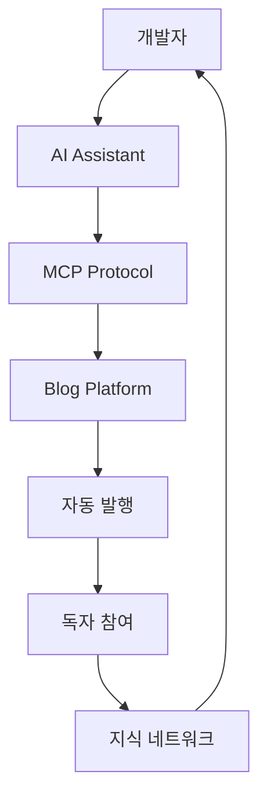
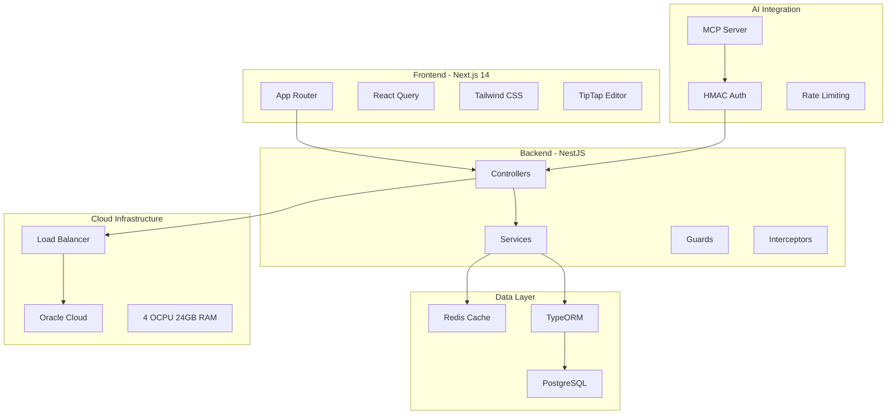
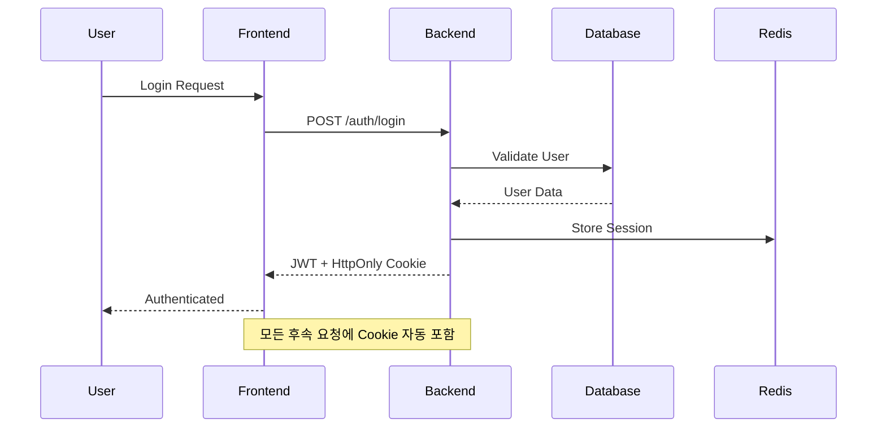

# Mermaid 다이어그램 테스트

## 플로우차트 예제



## 시스템 아키텍처



## 시퀀스 다이어그램



## 일반 코드 블록 (테스트)

```javascript
// 일반 JavaScript 코드 - highlight.js로 하이라이팅되어야 함
function test() {
    console.log('Hello, World!');
}
```

```python
# Python 코드 예제
def main():
    print("This is not a mermaid diagram")
```