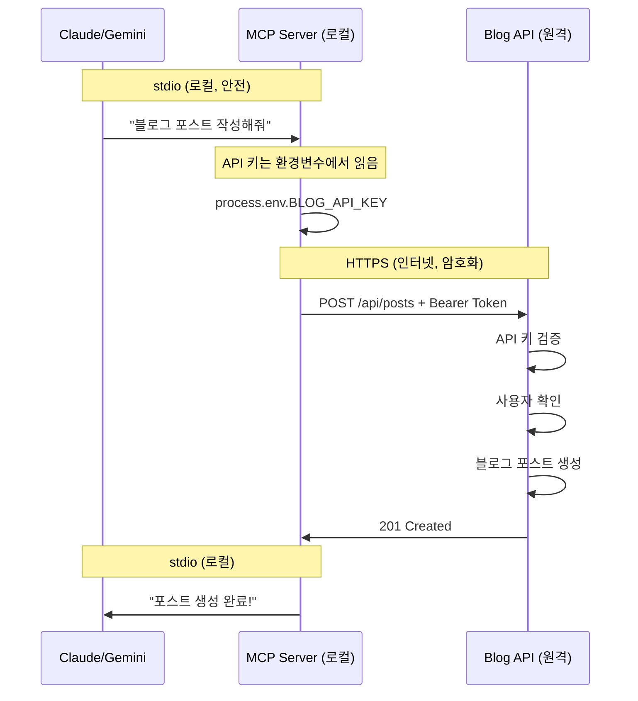

# MCP 서버 보안 아키텍처 완벽 이해: stdio는 왜 안전한가?

## 🚨 정정: Gemini도 stdio를 지원합니다!

제가 이전 포스트에서 잘못된 정보를 전달했습니다. **Gemini CLI도 stdio transport를 지원하며, 오히려 기본(default) 방식입니다.**

### 실제 Gemini CLI 트랜스포트 지원:
1. **Stdio Transport** (기본) - 서브프로세스 생성, stdin/stdout 통신
2. **SSE Transport** - Server-Sent Events 엔드포인트  
3. **Streamable HTTP Transport** - HTTP 스트리밍

이제 Claude와 Gemini 모두 stdio를 지원하므로 통합이 훨씬 간단해졌습니다!

## 🤔 그런데 잠깐, stdio가 안전하다고?

"stdio가 가장 안전하다"고 했는데, 그럼 어떻게 인터넷을 통해 블로그 API 서버에 접속해서 포스팅을 할 수 있을까요? 

좋은 질문입니다. 제가 명확하게 설명하지 못한 부분이 있네요.

## 🔄 실제 통신 구조 이해하기

### 전체 아키텍처:

```
[Claude/Gemini] <--stdio--> [MCP Server] <--HTTPS--> [Blog API Server]
     (로컬)         (로컬)        (로컬)              (인터넷)
```

**핵심: stdio는 첫 구간만 담당합니다!**

### 상세 데이터 흐름:



## 🔐 각 구간별 보안 분석

### 1. Claude/Gemini ↔ MCP Server (stdio)

```typescript
// 이 구간은 로컬 프로세스 간 통신
// 네트워크를 전혀 사용하지 않음!
{
  "mcpServers": {
    "blog": {
      "command": "npx",
      "args": ["@myblog/mcp-server"],
      "env": {
        "BLOG_API_KEY": "$BLOG_API_KEY"  // 환경변수 직접 전달
      }
    }
  }
}
```

**보안 수준: ⭐⭐⭐⭐⭐**
- 네트워크 미사용 = 외부 가로채기 불가능
- OS 수준에서 프로세스 격리
- 환경 변수는 프로세스 메모리에만 존재

### 2. MCP Server → Blog API (HTTPS)

```typescript
// MCP Server 내부 코드
async createPost(content: string) {
  // 1. stdio로 받은 API 키 (로컬, 안전)
  const apiKey = process.env.BLOG_API_KEY;
  
  // 2. HTTPS로 블로그 서버에 요청 (인터넷, 암호화)
  const response = await fetch('https://api.myblog.com/posts', {
    method: 'POST',
    headers: {
      'Authorization': `Bearer ${apiKey}`,  // TLS로 암호화되어 전송
      'Content-Type': 'application/json'
    },
    body: JSON.stringify({ content })
  });
}
```

**보안 수준: ⭐⭐⭐⭐**
- TLS/SSL 암호화
- 중간자 공격 방지
- 표준 웹 보안 프로토콜

## 💡 쉬운 비유로 이해하기

```
stdio = 집 안에서 가족끼리 대화 (초안전)
HTTPS = 집 밖에서 암호화된 전화 통화 (안전)

MCP Server = 믿을 수 있는 비서
- 집 안에서 당신의 명령을 듣고 (stdio)
- 밖에 나가서 은행 업무를 처리하고 (HTTPS)
- 결과를 집으로 가져옴 (stdio)
```

## 🎯 API 키의 안전한 여정

```bash
# 1단계: 사용자가 로컬에 설정
export BLOG_API_KEY="secret123"

# 2단계: Claude/Gemini가 MCP 서버 시작 시 전달
# (로컬 프로세스 생성, 네트워크 없음)
process.spawn('mcp-server', { 
  env: { BLOG_API_KEY: "secret123" }
})

# 3단계: MCP Server가 받아서 사용
const apiKey = process.env.BLOG_API_KEY;

# 4단계: HTTPS로 블로그 서버에 전송
# (이때 처음으로 네트워크 사용, 하지만 암호화됨)
Authorization: Bearer secret123  # TLS로 암호화
```

## 🔒 HTTP 헤더 보안 위험 분석

### 위험 요소들:

1. **평문 전송 (HTTP 사용 시)**
   ```http
   GET /api HTTP/1.1
   X-API-KEY: secret123  # 와이어샤크로 다 보임!
   ```
   ✅ 해결: HTTPS 필수

2. **로그 노출**
   - 웹서버가 헤더를 액세스 로그에 기록
   - API 키가 로그 파일에 영원히 남음
   ✅ 해결: 민감한 헤더는 로그 제외

3. **브라우저 개발자 도구**
   - 네트워크 탭에서 모든 헤더 확인 가능
   ✅ 해결: 로컬 서버만 사용, localhost 제한

4. **프록시/중간자 공격**
   - 중간 서버가 헤더 가로채기
   ✅ 해결: TLS 인증서 검증

## 📊 보안 방식 비교

| 방식 | 보안 수준 | 장점 | 단점 |
|------|-----------|------|------|
| **stdio + 환경변수** | ⭐⭐⭐⭐⭐ | 네트워크 미사용, OS 보호 | 로컬 실행만 가능 |
| **HTTPS 헤더** | ⭐⭐⭐ | 암호화, 표준 방식 | 로그 노출 위험 |
| **HTTP 헤더** | ⭐ | 간단함 | 평문 전송, 매우 위험 |
| **URL 파라미터** | ☠️ | 절대 사용 금지 | 브라우저 히스토리에 남음 |

## 🚀 최종 권장 아키텍처

```typescript
class SecureMCPServer {
  constructor() {
    // 1. 트랜스포트는 stdio 사용 (Claude ↔ MCP)
    this.transport = new StdioServerTransport();
    
    // 2. API 키는 환경변수로 받기
    this.apiKey = process.env.BLOG_API_KEY;
    
    // 3. 블로그 API 호출은 HTTPS 사용
    this.apiClient = new HTTPSClient('https://api.myblog.com');
  }
  
  async createPost(content: string) {
    // stdio로 명령 받음 (로컬, 안전)
    // HTTPS로 API 호출 (암호화)
    // stdio로 결과 반환 (로컬, 안전)
    return await this.apiClient.post('/posts', content);
  }
}
```

## 🎬 결론

1. **stdio는 "첫 구간"의 보안을 담당** - AI ↔ MCP Server 간 로컬 통신
2. **HTTPS는 "두 번째 구간" 담당** - MCP Server ↔ Blog API 간 인터넷 통신
3. **MCP Server가 안전한 중계자 역할** - 로컬에서 명령 받아 원격 실행

이 구조로 API 키가 불필요하게 노출되지 않으면서도 원격 블로그 서버와 안전하게 통신할 수 있습니다.

**"로컬은 stdio로, 원격은 HTTPS로"** - 이것이 MCP 서버 보안의 핵심입니다! 🔐

---

*이 포스트는 이전 포스트의 오류를 정정하고, 보안 아키텍처를 명확히 설명하기 위해 작성되었습니다.*