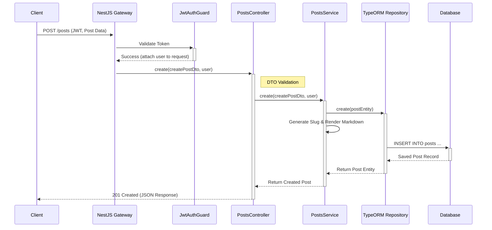

# 프로젝트 핵심 코드베이스 분석: 블로그 포스트 생성 흐름

이 문서는 우리 블로그 애플리케이션의 핵심 기능인 '새 포스트 작성'이 백엔드에서 어떻게 처리되는지 분석하고, 그 흐름을 코드와 데이터 관점에서 설명합니다. 전체적인 아키텍처 이해를 돕기 위해 코드 흐름도와 Mermaid 다이어그램을 포함했습니다.

## 1. 개요: 기술 스택 및 아키텍처

백엔드는 **NestJS** 프레임워크를 기반으로 구축되었으며, 데이터베이스와의 상호작용은 **TypeORM**을 통해 이루어집니다. 아키텍처는 계층형 구조(Layered Architecture)를 따르며, 주요 모듈은 다음과 같습니다.

-   `AppModule`: 모든 모듈과 설정을 총괄하는 루트 모듈
-   `AuthModule`: JWT 기반 인증 및 권한 부여 처리
-   `UsersModule`: 사용자 정보 관리
-   `PostsModule`: 블로그 포스트 CRUD 로직 담당
-   `FilesModule`: 파일(이미지 등) 업로드 및 S3 연동 관리
-   `CommentsModule`, `BlogsModule` 등 기타 기능 모듈

이 분석에서는 클라이언트의 포스트 생성 요청이 어떤 과정을 거쳐 데이터베이스에 저장되는지 집중적으로 살펴보겠습니다.

## 2. 코드 흐름 (Code Flow)

새 포스트 생성 요청(`POST /posts`)이 들어왔을 때의 코드 실행 순서는 다음과 같습니다.

1.  **Client Request**: 사용자가 제목, 내용 등을 담아 `POST /posts` API를 호출합니다. 요청 헤더에는 인증을 위한 JWT(JSON Web Token)가 포함됩니다.

2.  **NestJS Gateway & Middleware**: NestJS 서버가 요청을 수신합니다.

3.  **Guard (인증 및 권한 검사)**:
    -   `JwtAuthGuard`: `app.module.ts`에 전역 가드로 설정되어 있어 대부분의 요청을 먼저 가로챕니다. 요청 헤더의 JWT를 검증하고, 유효한 경우 해당 토큰의 사용자 정보(payload)를 `request` 객체에 첨부합니다. 토큰이 없거나 유효하지 않으면 `401 Unauthorized` 오류를 반환합니다.
    -   `PostsThrottlerGuard`: `posts.controller.ts`에 설정된 가드로, 특정 시간 동안의 요청 횟수를 제한하여 무분별한 포스팅을 방지합니다. (시간당 15개)

4.  **Controller (`posts.controller.ts`)**:
    -   `create(@Body() createPostDto: CreatePostDto, @CurrentUser() user: User)` 메소드가 요청을 처리합니다.
    -   `@Body()` 데코레이터: 요청의 본문을 `createPostDto` 객체로 변환하고, 내장된 `ValidationPipe`가 DTO에 정의된 규칙(예: `title`은 비어있지 않아야 함)에 따라 데이터 유효성을 검사합니다.
    -   `@CurrentUser()` 커스텀 데코레이터: `JwtAuthGuard`가 `request`에 첨부한 사용자 정보를 `user` 파라미터에 주입합니다.
    -   컨트롤러는 비즈니스 로직을 직접 처리하지 않고, `postsService.create()`를 호출하여 작업을 위임합니다.

5.  **Service (`posts.service.ts`)**:
    -   `create(createPostDto: CreatePostDto, user: User)` 메소드가 핵심 비즈니스 로직을 수행합니다.
    -   사용자의 블로그 정보를 조회합니다 (`blogsRepository.findOne`).
    -   `postsRepository.create()`를 사용해 `Post` 엔티티 인스턴스를 생성합니다. DTO의 데이터와 `user` 객체를 엔티티 속성에 매핑합니다.
    -   콘텐츠가 마크다운 형식인 경우, `markdownRenderer`를 사용해 HTML로 변환하여 `content` 필드에 저장하고, 원본 마크다운은 `content_markdown` 필드에 저장합니다.
    -   `@BeforeInsert` 데코레이터가 붙은 `generateSlug()` 메소드가 엔티티 저장 전에 자동으로 호출되어, 포스트 제목을 기반으로 고유한 URL 슬러그(slug)를 생성합니다.
    -   `postsRepository.save(post)`를 호출하여 새 포스트 데이터를 데이터베이스에 저장(INSERT)합니다.
    -   포스트 본문에 포함된 이미지 URL을 분석하여 관련 `File` 엔티티와 연결합니다 (`linkFilesFromContent`).
    -   생성된 `post` 객체를 컨트롤러에 반환합니다.

6.  **Controller & Client Response**: 컨트롤러는 서비스로부터 받은 `post` 객체를 클라이언트에 `201 Created` 상태 코드와 함께 JSON 형태로 응답합니다.

## 3. 데이터 흐름 (Data Flow)

데이터가 시스템을 통과하며 어떻게 변환되고 이동하는지는 다음과 같습니다.

-   **Request (Client -> Server)**
    -   `Header`: `Authorization: Bearer <jwt_token>`
    -   `Body (JSON)`: `{ "title": "...", "content": "...", "tags": [...] }`

-   **Transformation (In Server)**
    1.  **JWT** -> `User` 객체 (by `JwtAuthGuard`)
    2.  **Request Body** -> `CreatePostDto` 객체 (by `ValidationPipe`)
    3.  `CreatePostDto` + `User` 객체 -> `Post` 엔티티 인스턴스 (in `PostsService`)
    4.  `Post` 엔티티 -> SQL `INSERT` 쿼리 (by `TypeORM`)

-   **Persistence (Server -> Database)**
    -   `posts` 테이블에 새로운 레코드가 삽입됩니다.
    -   `post_files` 등 연관 테이블에도 관계가 설정될 수 있습니다.

-   **Response (Database -> Server -> Client)**
    1.  **Database Record** -> `Post` 엔티티 (by `TypeORM`)
    2.  `Post` 엔티티 -> `JSON` 객체 (by `NestJS`)
    3.  `Response Body (JSON)`: `{ "id": "...", "title": "...", "author": { ... } }`

## 4. Mermaid 시각화

아래는 위에서 설명한 코드 및 데이터 흐름을 시각화한 Mermaid 시퀀스 다이어그램입니다.

## 5. 결론

블로그 포스트 생성 기능은 NestJS의 DI(의존성 주입), 가드, 파이프 등 핵심 기능을 활용하여 명확하게 분리된 계층 구조로 구현되어 있습니다. 컨트롤러는 요청/응답 처리를, 서비스는 비즈니스 로직을, 레포지토리는 데이터베이스 접근을 담당하여 각자의 역할에 충실합니다. 이러한 구조는 코드의 유지보수성, 테스트 용이성, 확장성을 높이는 데 기여합니다.