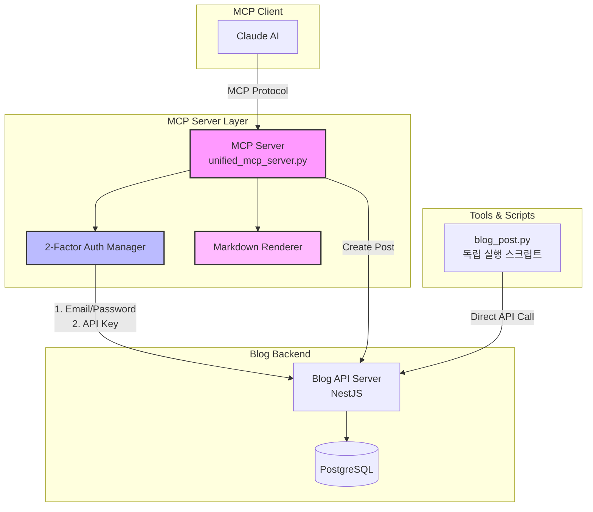
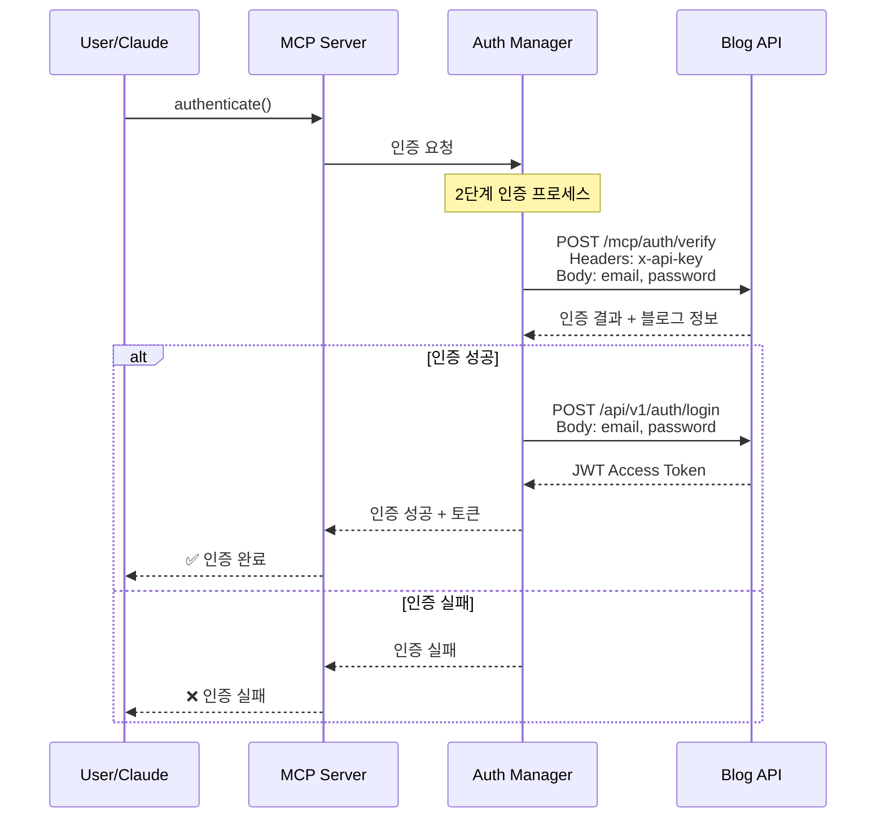
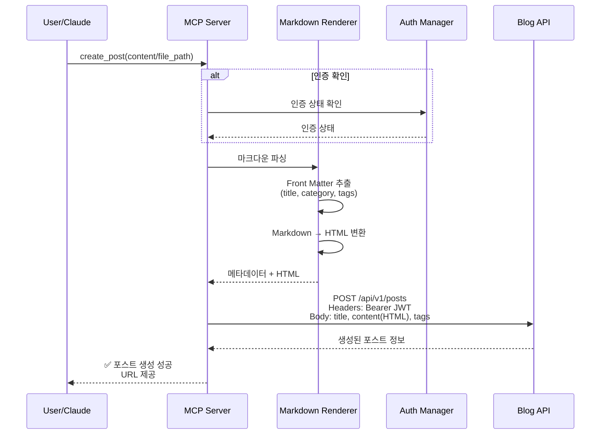
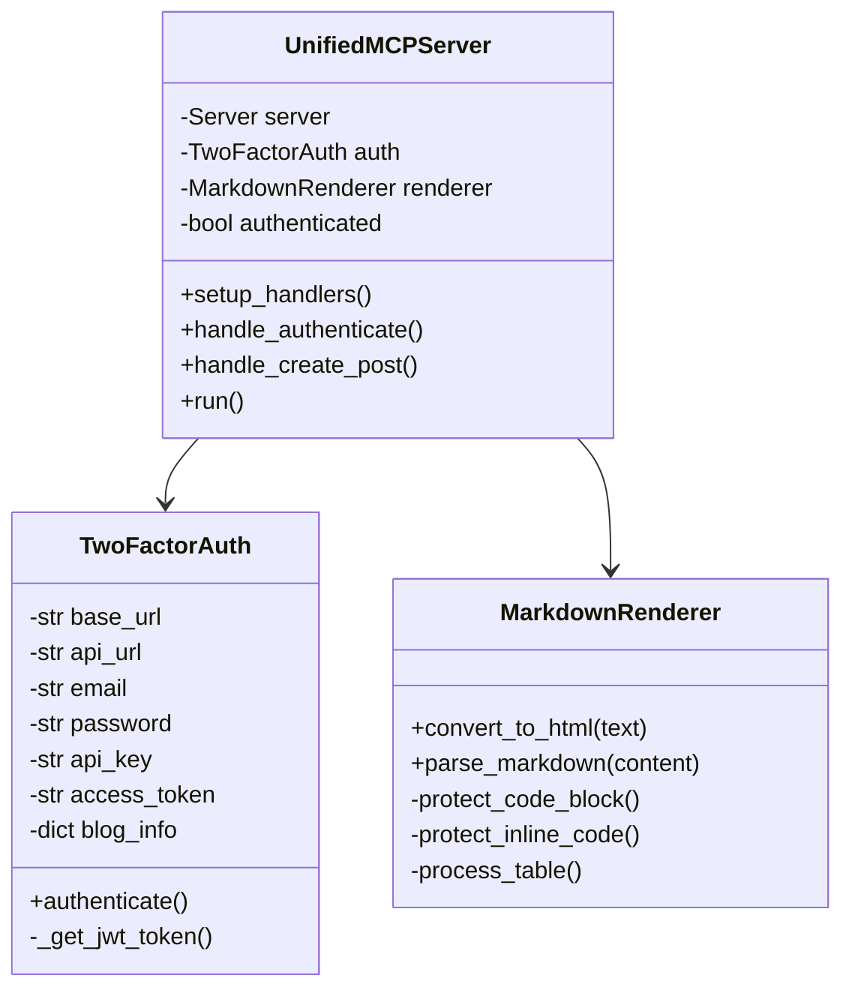
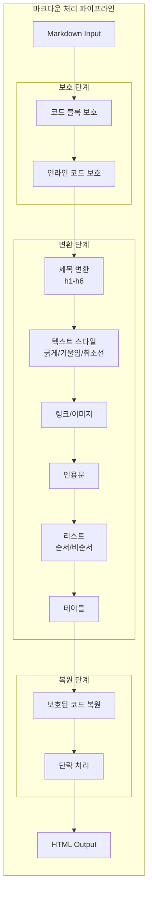
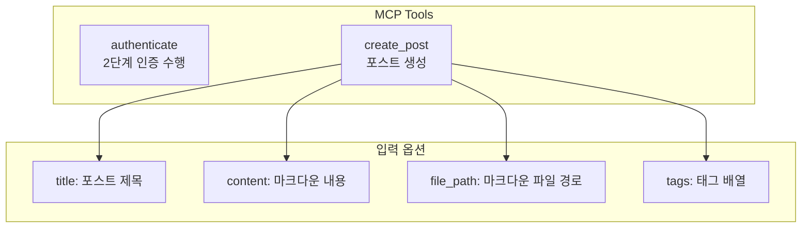
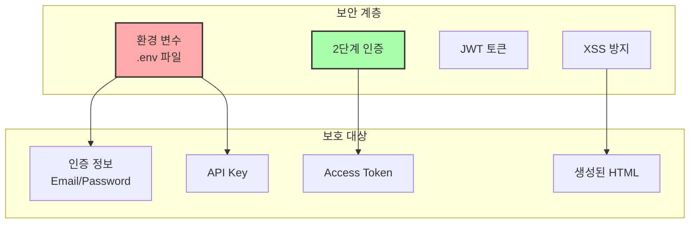
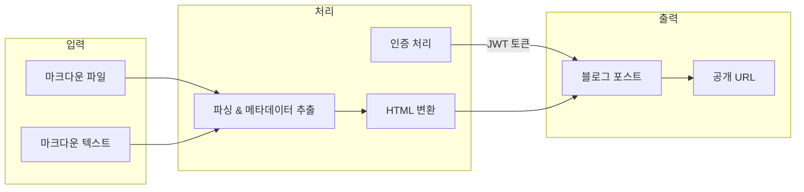

# MCP 블로그 서버 아키텍처 및 기능 분석

## 📊 시스템 아키텍처 다이어그램

### 전체 시스템 구조



### 인증 플로우



### 포스트 생성 플로우



## 🏗️ 핵심 컴포넌트 분석

### 1. UnifiedMCPServer (메인 서버)



### 2. Markdown 변환 엔진



## 🔑 주요 기능

### 1. 2단계 인증 시스템

**보안 강화를 위한 이중 인증 메커니즘:**

- **1차 인증**: 이메일/패스워드 기반 사용자 검증
- **2차 인증**: API Key를 통한 애플리케이션 레벨 인증
- **JWT 토큰**: 포스트 생성 등 API 호출 시 사용
- **세션 관리**: 인증 상태 유지 및 자동 재인증

### 2. 마크다운 렌더링 엔진

**고급 마크다운 변환 기능:**

```python
지원 문법:
- 제목 (# ~ ######)
- 코드 블록 (```language)
- 인라인 코드 (`code`)
- 테이블
- 순서/비순서 리스트
- 링크 및 이미지
- 텍스트 스타일 (굵게, 기울임, 취소선)
- 인용문 (>)
- 수평선 (---)
```

**특별 기능:**
- 코드 블록 보호 메커니즘 (HTML 이스케이프 방지)
- Front Matter 파싱 (YAML 메타데이터)
- 스타일이 적용된 HTML 출력
- XSS 방지를 위한 안전한 변환

### 3. MCP 도구 인터페이스



## 🚀 사용 시나리오

### 시나리오 1: MCP를 통한 자동 포스팅

```python
# 1. MCP 서버 시작
python src/unified_mcp_server.py

# 2. Claude에서 MCP 도구 사용
- authenticate() 실행
- create_post(file_path="posts/my-post.md") 실행
```

### 시나리오 2: 독립 스크립트 실행

```python
# 직접 포스팅 (초안)
python blog_post.py posts/my-post.md

# 즉시 발행
python blog_post.py posts/my-post.md --publish
```

## 🔒 보안 아키텍처



## 📁 파일 구조 및 역할

```
mcp-blog-server/
│
├── src/
│   └── unified_mcp_server.py    # 핵심 MCP 서버
│       ├── UnifiedMCPServer     # 메인 서버 클래스
│       ├── TwoFactorAuth        # 인증 관리자
│       └── MarkdownRenderer     # 마크다운 변환기
│
├── blog_post.py                 # 독립 실행 스크립트
│   ├── markdown_to_html()       # HTML 변환 함수
│   ├── parse_markdown()         # 메타데이터 추출
│   ├── login()                  # API 로그인
│   └── create_post()            # 포스트 생성
│
├── posts/                       # 마크다운 포스트 저장소
├── requirements.txt             # Python 의존성
└── .env                        # 환경 변수 설정
```

## 🎯 주요 특징 및 장점

### 1. 통합 아키텍처
- **단일 진입점**: unified_mcp_server.py로 모든 기능 통합
- **일관된 언어**: Python 전용으로 복잡성 감소
- **모듈화**: 각 컴포넌트가 독립적으로 동작

### 2. 강력한 보안
- **다층 인증**: 이메일/패스워드 + API Key
- **환경 변수 보호**: 민감 정보 분리
- **XSS 방지**: 안전한 HTML 변환

### 3. 유연한 사용성
- **MCP 프로토콜**: AI 에이전트와 통합
- **독립 실행**: 스크립트로 직접 실행 가능
- **파일/내용 지원**: 다양한 입력 방식

### 4. 확장 가능성
- **마크다운 확장**: 새로운 문법 추가 용이
- **API 통합**: RESTful API 표준 준수
- **도구 추가**: MCP 도구 확장 가능

## 🔄 데이터 플로우 요약



## 💡 결론

MCP 블로그 서버는 **보안**, **자동화**, **확장성**을 고려한 현대적인 블로그 자동화 시스템입니다. 2단계 인증과 깔끔한 마크다운 변환 기능을 통해 안전하고 효율적인 콘텐츠 관리를 제공합니다.

주요 강점:
- ✅ 강력한 보안 (2단계 인증)
- ✅ 완벽한 마크다운 지원
- ✅ AI 통합 가능 (MCP 프로토콜)
- ✅ 유연한 사용 방식
- ✅ 확장 가능한 아키텍처

이 시스템은 개발자와 콘텐츠 크리에이터 모두에게 효율적인 블로그 관리 솔루션을 제공합니다.