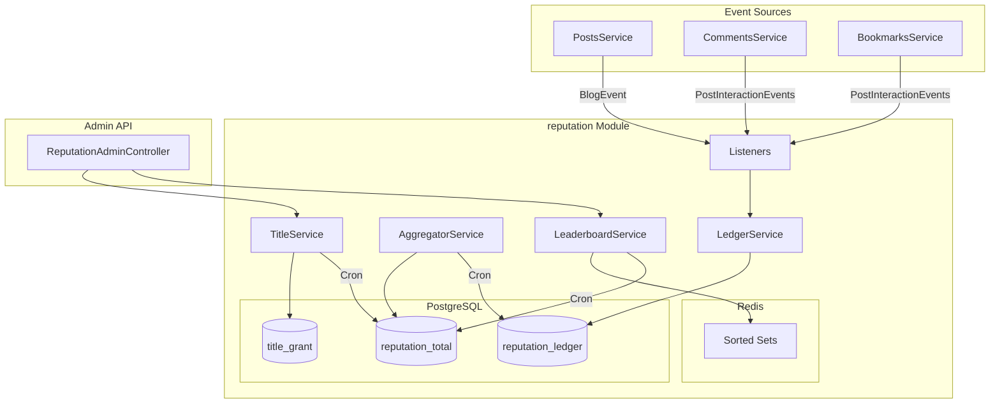

# 평판 시스템 (Reputation System) 문서

**작성일**: 2026-01-08  
**최종 수정일**: 2026-01-09  
**작성자**: Antigravity AI  

---

## 목차

1. [시스템 개요](#1-시스템-개요)
2. [점수 정책](#2-점수-정책)
3. [집계 방식](#3-집계-방식)
4. [API 명세](#4-api-명세)
5. [아키텍처](#5-아키텍처)
6. [테스트 결과](#6-테스트-결과)

---

## 1. 시스템 개요

사용자 평판(Ranking) 시스템으로, 포스트 작성, 댓글, 좋아요, 북마크 등 활동에 따라 점수를 부여하고 리더보드를 제공합니다.

### 핵심 기능

- **점수 기록**: 활동별 점수 Ledger에 기록 (불변)
- **기간별 집계**: L7, L30, L90, ALL_TIME 기간별 합산
- **감쇠 적용**: 오래된 점수일수록 가중치 감소
- **리더보드**: Redis Sorted Set 기반 실시간 순위
- **타이틀 부여**: 조건 충족 시 배지 부여

### 파일 구조

```
backend/src/reputation/
├── reputation.module.ts       # NestJS 모듈
├── reputation.keys.ts         # Redis 키 정의
├── controllers/               # Admin REST API
├── dto/                       # 데이터 전송 객체
├── entities/                  # TypeORM 엔티티
├── enums/                     # 열거형 정의
├── events/                    # 이벤트 상수
├── jobs/                      # Cron 작업
├── listeners/                 # 이벤트 리스너
├── services/                  # 비즈니스 로직
└── __tests__/                 # 단위 테스트
```

---

## 2. 점수 정책

| 액션 | 점수 | 수혜자 | 비고 |
|-----|------|--------|------|
| 포스트 작성 | +10 | 작성자 | POST_PUBLISHED |
| 댓글 작성 | +3 | 작성자 | COMMENT_ADDED |
| 좋아요 받기 | +2 | 포스트 작성자 | LIKE_RECEIVED |
| 북마크 받기 | +1 | 포스트 작성자 | BOOKMARK_RECEIVED |

### 셀프 반응 차단

자기 자신의 포스트에 좋아요/북마크를 해도 점수가 부여되지 않습니다.

```typescript
// 셀프 반응 차단 로직
if (dto.actorId && dto.actorId === dto.userId) {
  this.logger.debug('Self-reaction blocked');
  return null;
}
```

---

## 3. 집계 방식

### 3.1 집계 주기

| 작업 | 스케줄 | 설명 |
|-----|--------|------|
| 일일 집계 | 매일 03:00 | 기간별 점수 합산 및 감쇠 적용 |
| 주간 리더보드 | 매주 월요일 04:00 | Redis Sorted Set 갱신 |
| 수동 집계 | Admin 버튼 | 즉시 실행 |

### 3.2 감쇠 공식

```
decayedScore = rawScore × 0.9^(일수/7)
```

- 7일마다 10% 감소
- 최소 감쇠율: 10% (30일 이상)

### 3.3 기간별 리더보드

| 기간 | 설명 |
|-----|------|
| L7 | 최근 7일간 감쇠 점수 합산 |
| L30 | 최근 30일간 감쇠 점수 합산 |
| L90 | 최근 90일간 감쇠 점수 합산 |
| ALL_TIME | 전체 기간 원본 점수 합산 (감쇠 없음) |

---

## 4. API 명세

Base URL: `/api/v1/admin/reputation`

### 4.1 리더보드 조회

```
GET /leaderboard?period=l7&limit=100
```

**Parameters:**
- `period`: `l7` | `l30` (기본값: `l7`)
- `limit`: 조회할 상위 N명 (기본값: 100)

**Response:**
```json
{
  "period": "l7",
  "entries": [
    {
      "rank": 1,
      "userId": "uuid",
      "username": "user1",
      "avatarUrl": "https://...",
      "score": 150,
      "titles": ["TOP_CONTRIBUTOR"]
    }
  ],
  "lastUpdatedAt": "2026-01-09T00:00:00Z",
  "totalParticipants": 500
}
```

### 4.2 사용자 검색

```
GET /search?q=username
```

**Parameters:**
- `q`: 검색어 (사용자명 또는 이메일, 2글자 이상)

**Response:**
```json
{
  "users": [
    {
      "id": "uuid",
      "username": "user1",
      "email": "user1@example.com",
      "profileImage": "https://..."
    }
  ]
}
```

### 4.3 사용자 평판 조회

```
GET /user/:userId
```

**Response:**
```json
{
  "userId": "uuid",
  "username": "user1",
  "scores": [
    { "period": "L7", "score": 50, "decayedScore": 45, "rank": 10 }
  ],
  "activeTitles": [
    { "code": "TOP_CONTRIBUTOR", "displayName": "탑 기여자", "icon": "🏆" }
  ],
  "totalEarnedScore": 500,
  "memberDays": 120
}
```

### 4.4 수동 집계

```
POST /aggregate
```

**Response:**
```json
{ "success": true, "elapsed": 1234 }
```

### 4.5 리더보드 갱신

```
POST /leaderboard/refresh
```

**Response:**
```json
{ "success": true, "elapsed": 567 }
```

---

## 5. 아키텍처



---

## 6. 테스트 결과

### 단위 테스트 (2026-01-08)

```
✅ Test Suites: 3 passed
✅ Tests:       12 passed
⏱️ Time:        6.28s
```

| 파일 | 테스트 수 |
|-----|---------|
| ledger.service.spec.ts | 4 |
| aggregator.service.spec.ts | 4 |
| event-listeners.spec.ts | 4 |

### E2E 테스트 (2026-01-08)

- ✅ 로그인 성공
- ✅ Admin 페이지 접근
- ✅ 리더보드 API 호출 (200 OK)
- ✅ 새로고침 버튼 동작
