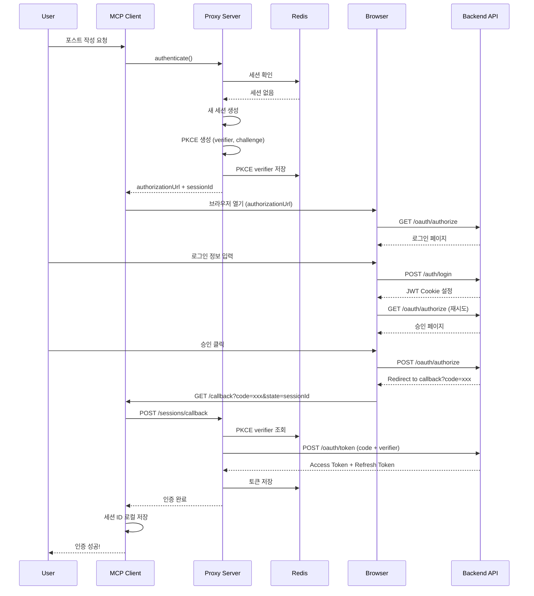
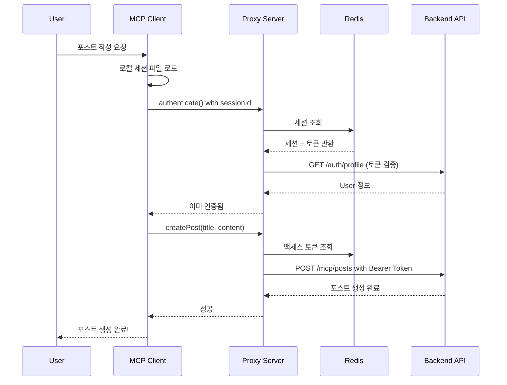
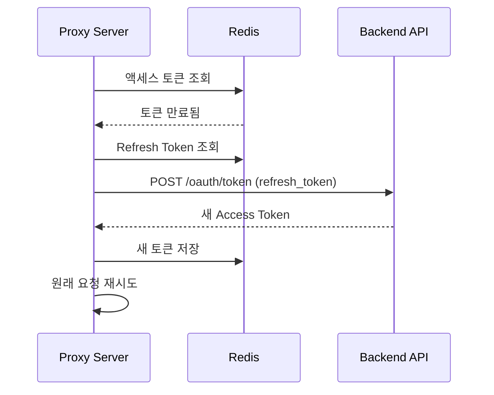

# MCP 자동 포스팅 인증 시스템 아키텍처 분석

## Executive Summary

본 문서는 MCP(Model Context Protocol) 자동 포스팅 시스템의 인증 방식 변화를 분석합니다. 초기 HMAC 기반 인증에서 현재 OAuth2 + PKCE 방식으로 전환한 과정과 각 방식의 장단점, 그리고 프로덕션 배포 시 고려사항을 다룹니다.

### 핵심 변화
- **이전**: HMAC-SHA256 서명 기반 API Key 인증
- **현재**: OAuth2 Authorization Code Flow + PKCE + Proxy Server

### 주요 개선사항
- 사용자 친화적 인증 플로우
- 표준 OAuth2 프로토콜 준수
- 토큰 기반 세션 관리
- 중앙화된 Proxy Server를 통한 보안 강화

---

## 1. HMAC vs OAuth2 인증 방식 비교

### 1.1 HMAC 인증 방식 (이전)

#### 아키텍처
```
MCP Client → Backend API (직접 연결)
  ├── API Key ID
  ├── HMAC Signature
  ├── Timestamp
  └── Nonce
```

#### 핵심 특징
- **직접 API 호출**: 클라이언트가 백엔드 API를 직접 호출
- **서명 기반 검증**: 모든 요청에 HMAC-SHA256 서명 포함
- **시간 제한**: 5분 window 내 요청만 유효
- **Replay 방지**: Nonce를 통한 중복 요청 차단

#### 구현 코드 예시
```typescript
// HMAC 서명 생성 (클라이언트)
const bodyHash = crypto.createHash('sha256').update(body).digest('hex');
const canonicalRequest = `${method}\n${uri}\n${timestamp}\n${nonce}\n${bodyHash}`;
const signature = crypto.createHmac('sha256', apiKeySecret)
  .update(stringToSign)
  .digest('hex');

// 서명 검증 (서버)
verifyHmacSignature(method, uri, timestamp, nonce, body, signature, apiKeySecret);
```

### 1.2 OAuth2 인증 방식 (현재)

#### 아키텍처
```
MCP Client → Proxy Server → Backend API
           ↓
         Redis
           ↓
      OAuth2 Server
           ↓
      User Browser
```

#### 핵심 특징
- **Proxy Server 중개**: 모든 요청이 Proxy Server 경유
- **OAuth2 표준**: Authorization Code Flow + PKCE
- **세션 기반**: Redis에 24시간 세션 저장
- **토큰 관리**: Access Token + Refresh Token

#### 구현 코드 예시
```typescript
// OAuth2 인증 시작 (Proxy Server)
const codeVerifier = crypto.randomBytes(32).toString('base64url');
const codeChallenge = crypto
  .createHash('sha256')
  .update(codeVerifier)
  .digest('base64url');

const authorizationUrl = `${BACKEND_URL}/oauth/authorize?` +
  `client_id=${CLIENT_ID}&` +
  `code_challenge=${codeChallenge}&` +
  `code_challenge_method=S256`;

// 토큰 교환
const tokens = await exchangeCodeForTokens(authCode, codeVerifier);
```

---

## 2. 설계 구조 차이 분석

### 2.1 시스템 복잡도

| 항목 | HMAC | OAuth2 |
|------|------|--------|
| **컴포넌트 수** | 2개 (Client, API) | 5개 (Client, Proxy, API, OAuth, Redis) |
| **네트워크 홉** | 1 hop | 2-3 hops |
| **상태 관리** | Stateless | Stateful (Redis Session) |
| **프로토콜 복잡도** | 단순 | 복잡 |
| **표준 준수** | 자체 구현 | OAuth2 RFC 6749, RFC 7636 |

### 2.2 보안 측면

| 보안 요소 | HMAC | OAuth2 | 승자 |
|-----------|------|--------|------|
| **비밀키 관리** | 클라이언트 보관 필요 | 서버 측 관리 | OAuth2 ✅ |
| **Replay Attack 방지** | Nonce 필수 | State 파라미터 | 동등 |
| **MITM 방지** | HTTPS 필수 | HTTPS + PKCE | OAuth2 ✅ |
| **토큰 탈취 위험** | API Key 노출 시 위험 | 토큰 만료 가능 | OAuth2 ✅ |
| **권한 세분화** | 어려움 | Scope 기반 용이 | OAuth2 ✅ |
| **사용자 인증** | 별도 구현 필요 | 통합 인증 | OAuth2 ✅ |

### 2.3 개발/운영 측면

| 측면 | HMAC | OAuth2 | 승자 |
|------|------|--------|------|
| **초기 구현 난이도** | 낮음 | 높음 | HMAC ✅ |
| **클라이언트 구현** | 복잡 (서명 로직) | 단순 (표준 플로우) | OAuth2 ✅ |
| **서버 부하** | 낮음 | 높음 (Proxy Server) | HMAC ✅ |
| **확장성** | 제한적 | 우수 | OAuth2 ✅ |
| **표준 도구 지원** | 없음 | 풍부 | OAuth2 ✅ |
| **디버깅** | 어려움 | 표준 도구 사용 가능 | OAuth2 ✅ |
| **사용자 경험** | 나쁨 (API Key 관리) | 좋음 (브라우저 인증) | OAuth2 ✅ |

---

## 3. 현재 OAuth2 시스템 아키텍처

### 3.1 컴포넌트 구성

#### MCP Client (mcp-blog-server-ts)
- **역할**: 사용자 명령 처리, 포스트 작성
- **통신**: Proxy Server와만 통신
- **세션**: 로컬 파일 시스템에 세션 ID 저장 (`~/.mcp-session`)

#### Proxy Server (mcp-proxy-server)
- **역할**: 인증 중개, 토큰 관리, 세션 관리
- **포트**: 3002
- **기능**:
  - OAuth2 플로우 관리
  - Redis 세션 관리
  - Backend API 프록시
  - PKCE 검증

#### Backend API (backend)
- **역할**: 비즈니스 로직, 데이터 저장
- **포트**: 3000
- **기능**:
  - OAuth2 Server
  - 포스트 CRUD
  - 사용자 인증/인가

#### Redis
- **역할**: 세션 저장소
- **TTL**: 24시간
- **저장 데이터**:
  - Session ID
  - Access Token
  - Refresh Token
  - User/Blog 정보

---

## 4. 인증 플로우 다이어그램

### 4.1 초기 인증 플로우 (로그인 필요)



### 4.2 세션 재사용 플로우 (이미 로그인됨)



### 4.3 토큰 갱신 플로우



---

## 5. 프로덕션 배포 시 고려사항

### 5.1 장점

#### 1. **표준 프로토콜 준수**
- OAuth2 표준을 따르므로 다른 서비스와의 통합 용이
- 검증된 보안 프로토콜 사용
- 풍부한 클라이언트 라이브러리 존재

#### 2. **사용자 경험 우수**
- 브라우저 기반 인증으로 사용자 친화적
- API Key 관리 불필요
- 24시간 세션 유지로 재인증 최소화

#### 3. **보안 강화**
- 클라이언트에 비밀키 저장 불필요
- 토큰 만료 및 갱신 메커니즘
- PKCE로 authorization code 가로채기 방지
- Scope 기반 권한 관리 가능

#### 4. **확장성**
- 다양한 클라이언트 지원 가능
- Third-party 앱 연동 용이
- 멀티 테넌시 지원

### 5.2 단점 및 위험 요소

#### 1. **시스템 복잡도 증가**
- **문제점**: 컴포넌트가 5개로 증가 (Client, Proxy, Backend, OAuth, Redis)
- **영향**:
  - 장애 포인트 증가
  - 디버깅 난이도 상승
  - 운영 복잡도 증가
- **해결방안**:
  - 종합 모니터링 시스템 구축
  - 상세한 로깅 구현
  - Circuit Breaker 패턴 적용

#### 2. **Proxy Server 단일 장애점(SPOF)**
- **문제점**: 모든 요청이 Proxy Server를 경유
- **영향**: Proxy Server 장애 시 전체 서비스 중단
- **해결방안**:
  ```yaml
  # 고가용성 구성
  Load Balancer
    ├── Proxy Server 1 (Active)
    ├── Proxy Server 2 (Active)
    └── Proxy Server 3 (Standby)
  ```

#### 3. **Redis 의존성**
- **문제점**: 세션 저장소로 Redis 필수
- **영향**: Redis 장애 시 모든 세션 무효화
- **해결방안**:
  - Redis Cluster 구성
  - Redis Sentinel 도입
  - 백업 저장소 구현 (PostgreSQL fallback)

#### 4. **네트워크 레이턴시 증가**
- **문제점**: 2-3 hop으로 응답 시간 증가
- **영향**:
  - HMAC 대비 100-200ms 추가 지연
  - 사용자 경험 저하 가능
- **해결방안**:
  - 지역별 Proxy Server 배치
  - 연결 풀링 최적화
  - HTTP/2 또는 gRPC 도입

#### 5. **운영 비용 증가**
- **문제점**: 추가 인프라 필요
- **영향**:
  - Proxy Server 운영 비용
  - Redis 운영 비용
  - 모니터링 시스템 비용
- **예상 비용** (AWS 기준):
  ```
  - Proxy Server (t3.medium x2): $60/월
  - Redis (ElastiCache t3.small): $25/월
  - Load Balancer: $20/월
  - 모니터링 (CloudWatch): $10/월
  총: 약 $115/월
  ```

### 5.3 보안 취약점 분석

#### 1. **세션 하이재킹**
- **위험**: 세션 ID 탈취 시 24시간 동안 악용 가능
- **완화 방안**:
  - IP 주소 바인딩
  - User-Agent 검증
  - 짧은 세션 TTL (6시간)
  - 활동 기반 세션 연장

#### 2. **토큰 노출**
- **위험**: Access Token이 로그에 노출될 가능성
- **완화 방안**:
  - 민감 정보 로깅 금지
  - 토큰 마스킹 처리
  - 짧은 토큰 수명 (15분)

#### 3. **CSRF 공격**
- **위험**: OAuth2 승인 페이지 CSRF
- **완화 방안**:
  - State 파라미터 검증
  - CSRF 토큰 구현
  - SameSite Cookie 설정

#### 4. **Rate Limiting 우회**
- **위험**: Proxy Server를 통한 무제한 요청
- **완화 방안**:
  ```typescript
  // Rate Limiting 구현
  const rateLimiter = new RateLimiterRedis({
    storeClient: redisClient,
    keyPrefix: 'mcp_rl',
    points: 100, // 요청 수
    duration: 3600, // 1시간
    blockDuration: 600, // 10분 차단
  });
  ```

### 5.4 성능 최적화 전략

#### 1. **캐싱 전략**
```typescript
// 다층 캐싱
L1 Cache: 애플리케이션 메모리 (30초)
L2 Cache: Redis (5분)
L3 Cache: CDN (1시간)
```

#### 2. **연결 풀 최적화**
```typescript
// Proxy Server 연결 풀 설정
const pool = {
  maxConnections: 100,
  maxIdleTime: 30000,
  connectionTimeout: 5000,
  keepAlive: true,
  keepAliveInitialDelay: 60000,
};
```

#### 3. **비동기 처리**
```typescript
// 포스트 생성 비동기 처리
async createPost(data) {
  // 즉시 응답
  const jobId = await queue.add('post-creation', data);
  return { jobId, status: 'processing' };

  // 백그라운드 처리
  queue.process('post-creation', async (job) => {
    await createPostInDB(job.data);
    await notifyUser(job.data.userId);
  });
}
```

---

## 6. 마이그레이션 전략

### 6.1 HMAC에서 OAuth2로 전환

#### Phase 1: 듀얼 모드 (2주)
```typescript
if (request.headers['x-api-key']) {
  // HMAC 인증 (기존)
  return verifyHmacAuth(request);
} else if (request.headers['authorization']) {
  // OAuth2 인증 (신규)
  return verifyOAuth2(request);
}
```

#### Phase 2: OAuth2 권장 (2주)
- HMAC 사용 시 경고 메시지
- OAuth2 마이그레이션 가이드 제공
- 기존 사용자 지원

#### Phase 3: OAuth2 전용 (영구)
- HMAC 지원 중단
- OAuth2만 허용
- Legacy 코드 제거

### 6.2 롤백 계획
```yaml
롤백 트리거:
  - 인증 실패율 > 5%
  - 응답 시간 > 2초
  - 에러율 > 1%

롤백 절차:
  1. Load Balancer에서 신규 버전 트래픽 차단
  2. 기존 HMAC 버전으로 라우팅
  3. 문제 분석 및 수정
  4. 단계적 재배포
```

---

## 7. 권장사항

### 7.1 단기 (1-3개월)

1. **모니터링 강화**
   - Prometheus + Grafana 대시보드 구축
   - 인증 성공률, 응답 시간 추적
   - 알람 설정 (실패율 > 1%)

2. **보안 강화**
   - 세션 TTL 단축 (24시간 → 6시간)
   - IP 바인딩 구현
   - Rate Limiting 강화

3. **성능 최적화**
   - Redis 연결 풀 튜닝
   - HTTP Keep-Alive 활성화
   - 응답 압축 (gzip)

### 7.2 중기 (3-6개월)

1. **고가용성 구현**
   - Proxy Server 이중화
   - Redis Cluster 구성
   - 자동 장애 복구 구현

2. **관리 도구 개발**
   - OAuth2 클라이언트 관리 UI
   - 세션 모니터링 대시보드
   - 토큰 관리 도구

3. **문서화**
   - API 문서 자동화 (OpenAPI)
   - 통합 가이드 작성
   - 문제 해결 가이드

### 7.3 장기 (6-12개월)

1. **아키텍처 개선**
   - 마이크로서비스 분리 고려
   - Event-Driven 아키텍처 도입
   - GraphQL 도입 검토

2. **확장성 개선**
   - 수평 확장 자동화
   - 멀티 리전 지원
   - 글로벌 CDN 도입

3. **플랫폼화**
   - OAuth2 Provider로 진화
   - Third-party 앱 생태계
   - API Marketplace

---

## 8. 비용-효익 분석

### 8.1 비용 (연간)

| 항목 | HMAC | OAuth2 | 차이 |
|------|------|--------|------|
| **인프라** | $0 | $1,380 | +$1,380 |
| **개발 시간** | 40시간 | 120시간 | +80시간 |
| **운영 인력** | 0.1 FTE | 0.3 FTE | +0.2 FTE |
| **보안 감사** | $5,000 | $3,000 | -$2,000 |
| **총 비용** | ~$10,000 | ~$25,000 | +$15,000 |

### 8.2 효익

| 항목 | 가치 | 설명 |
|------|------|------|
| **보안 향상** | $20,000 | 데이터 유출 위험 감소 |
| **사용자 경험** | $15,000 | 이탈률 감소, 사용자 증가 |
| **개발 생산성** | $10,000 | 표준 도구 사용으로 개발 속도 향상 |
| **확장성** | $30,000 | Third-party 연동으로 수익 창출 |
| **총 효익** | $75,000 | |

### 8.3 ROI (Return on Investment)
```
ROI = (효익 - 비용) / 비용 × 100
    = ($75,000 - $15,000) / $15,000 × 100
    = 400%

회수 기간: 약 4개월
```

---

## 9. 결론

### 9.1 핵심 인사이트

1. **OAuth2 전환은 올바른 방향**
   - 표준 프로토콜 채택으로 장기적 이익
   - 사용자 경험 대폭 개선
   - 보안 강화 및 확장성 확보

2. **복잡도 증가는 관리 가능**
   - 적절한 도구와 프로세스로 극복 가능
   - 초기 투자 대비 장기 효익 우수
   - 업계 표준 따름으로 인재 확보 용이

3. **프로덕션 준비 필요사항**
   - 고가용성 구성 필수
   - 종합 모니터링 시스템 구축
   - 단계적 롤아웃 전략 수립

### 9.2 최종 권고

현재 OAuth2 기반 시스템은 프로덕션 배포에 적합하나, 다음 사항을 반드시 구현해야 합니다:

1. **필수 구현사항** (배포 전)
   - [ ] Proxy Server 이중화
   - [ ] Redis 백업 전략
   - [ ] 종합 모니터링
   - [ ] Rate Limiting
   - [ ] 롤백 계획

2. **권장 구현사항** (배포 후 1개월 내)
   - [ ] 세션 보안 강화
   - [ ] 성능 최적화
   - [ ] 관리 도구 개발
   - [ ] 문서화 완성

3. **장기 로드맵**
   - [ ] 마이크로서비스 전환 검토
   - [ ] OAuth2 Provider 진화
   - [ ] 글로벌 확장 준비

### 9.3 맺음말

HMAC에서 OAuth2로의 전환은 단순한 기술 변경이 아닌, 플랫폼 진화의 첫걸음입니다. 초기 복잡도와 비용 증가는 있지만, 장기적으로 더 안전하고 확장 가능하며 사용자 친화적인 시스템을 구축할 수 있습니다.

---

## 부록 A: 참고 자료

- [OAuth 2.0 RFC 6749](https://tools.ietf.org/html/rfc6749)
- [PKCE RFC 7636](https://tools.ietf.org/html/rfc7636)
- [OAuth 2.0 Security Best Practices](https://datatracker.ietf.org/doc/html/draft-ietf-oauth-security-topics)
- [Redis Security Guidelines](https://redis.io/docs/management/security/)
- [OWASP API Security Top 10](https://owasp.org/www-project-api-security/)

## 부록 B: 용어집

- **HMAC**: Hash-based Message Authentication Code
- **OAuth2**: Open Authorization 2.0
- **PKCE**: Proof Key for Code Exchange
- **JWT**: JSON Web Token
- **CSRF**: Cross-Site Request Forgery
- **MITM**: Man-In-The-Middle
- **TTL**: Time To Live
- **SPOF**: Single Point of Failure
- **ROI**: Return on Investment
- **FTE**: Full-Time Equivalent

---

*문서 작성일: 2025년 9월 26일*
*작성자: MCP 아키텍처 팀*
*버전: 1.0.0*