# Codebase MCP 시스템 플로우 다이어그램

## 📋 개요

이 문서는 Codebase.blog의 MCP(Model Context Protocol) 자동 포스팅 시스템의 전체 작동 플로우를 시각화한 다이어그램입니다.

**현재 인증 방식**: API Key 기반 (Stripe 스타일: `blog_sk_{hint}_{secret}`)

---

## 🏗️ 시스템 아키텍처

```mermaid
graph TB
    subgraph "Client Layer"
        Claude[Claude Desktop<br/>MCP Client]
    end

    subgraph "Proxy Layer - Port 3002"
        ProxyServer[MCP Proxy Server<br/>Express + MCP SDK]
        ProxyAPI[/mcp API]
        ProxyMetrics[Prometheus Metrics]
    end

    subgraph "Cache Layer"
        Redis[(Redis<br/>API Key Cache<br/>TTL: 5min)]
    end

    subgraph "Backend Layer - Port 3000"
        Backend[NestJS Backend]
        McpModule[MCP Module]
        McpController[MCP Controller<br/>API Key 관리]
        McpProxyController[MCP Proxy Controller<br/>포스트 생성]
        PostsService[Posts Service<br/>Fast Path]
        UsageService[Usage Service<br/>제한 확인]
        CacheService[Cache Service<br/>캐시 무효화]
    end

    subgraph "Data Layer"
        PostgreSQL[(PostgreSQL<br/>Users, Blogs, Posts<br/>MCP API Keys)]
        S3[AWS S3<br/>이미지 저장]
    end

    subgraph "Monitoring"
        Grafana[Grafana<br/>대시보드]
        Prometheus[Prometheus<br/>메트릭 수집]
    end

    %% Client to Proxy
    Claude -->|POST /mcp<br/>Bearer: blog_sk_...<br/>tools/call| ProxyAPI

    %% Proxy Internal
    ProxyAPI --> ProxyServer
    ProxyServer -->|검증 캐시 확인| Redis
    ProxyServer -->|메트릭 기록| ProxyMetrics

    %% Proxy to Backend
    ProxyServer -->|POST /api/v1/mcp/validate-key<br/>캐시 미스 시| Backend
    ProxyServer -->|POST /api/v1/mcp/posts<br/>X-API-Key| McpProxyController

    %% Backend Internal Flow
    Backend --> McpModule
    McpModule --> McpController
    McpModule --> McpProxyController

    McpProxyController -->|1. 사용량 제한 확인| UsageService
    McpProxyController -->|2. 포스트 생성 Fast Path| PostsService
    McpProxyController -->|3. 사용량 추적| UsageService

    PostsService -->|이벤트 발행<br/>post.created| CacheService
    CacheService -->|캐시 무효화| Redis

    %% Database Connections
    Backend -->|ORM 쿼리| PostgreSQL
    PostsService -->|이미지 업로드| S3
    UsageService -->|사용량 기록| PostgreSQL

    %% Monitoring
    ProxyMetrics -->|스크랩| Prometheus
    Backend -->|메트릭 노출| Prometheus
    Prometheus --> Grafana

    %% Styling
    classDef clientStyle fill:#e1f5ff,stroke:#01579b,stroke-width:2px
    classDef proxyStyle fill:#fff3e0,stroke:#e65100,stroke-width:2px
    classDef cacheStyle fill:#f3e5f5,stroke:#4a148c,stroke-width:2px
    classDef backendStyle fill:#e8f5e9,stroke:#1b5e20,stroke-width:2px
    classDef dataStyle fill:#fce4ec,stroke:#880e4f,stroke-width:2px
    classDef monitorStyle fill:#fff9c4,stroke:#f57f17,stroke-width:2px

    class Claude clientStyle
    class ProxyServer,ProxyAPI,ProxyMetrics proxyStyle
    class Redis cacheStyle
    class Backend,McpModule,McpController,McpProxyController,PostsService,UsageService,CacheService backendStyle
    class PostgreSQL,S3 dataStyle
    class Grafana,Prometheus monitorStyle
```

---

## 🔐 1. API Key 생성 플로우

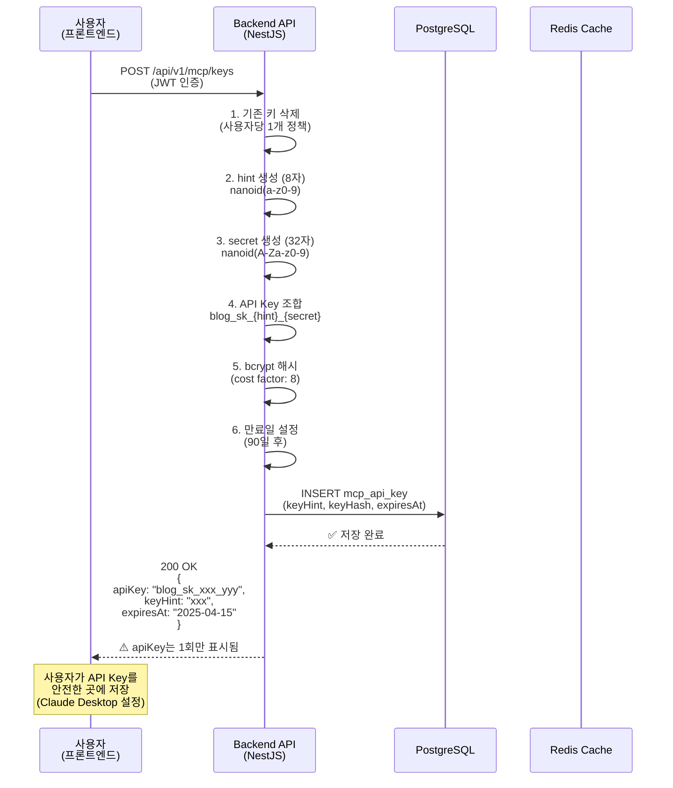

---

## 🔍 2. API Key 검증 플로우 (Redis 캐싱)

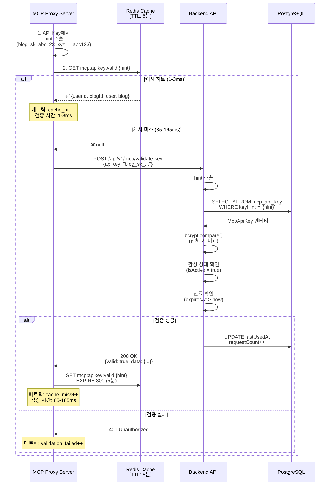

---

## 📝 3. 포스트 생성 플로우 (Fast Path)

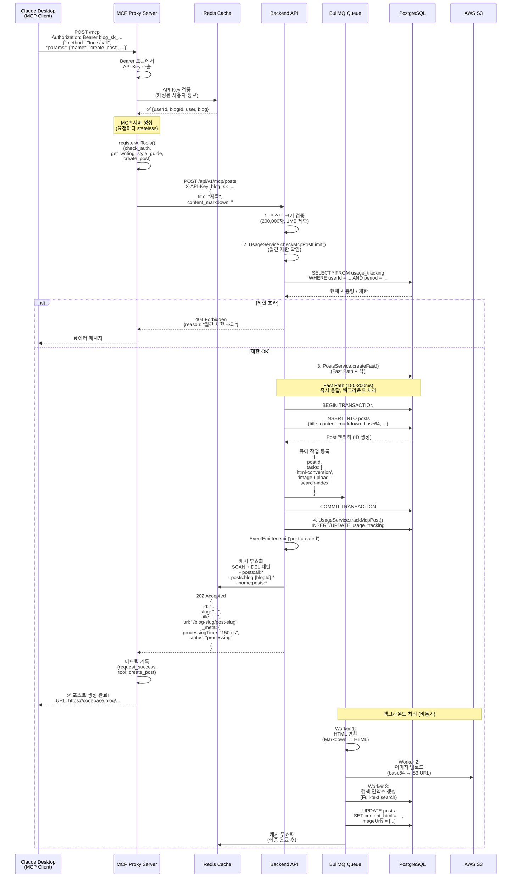

---

## 🛠️ 4. MCP 도구 상세 플로우

### 4.1 check_auth 도구

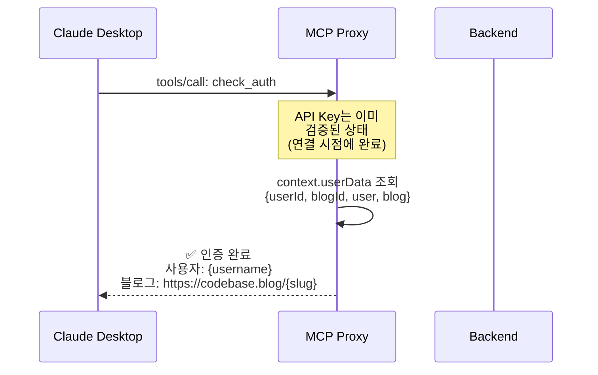

### 4.2 get_writing_style_guide 도구

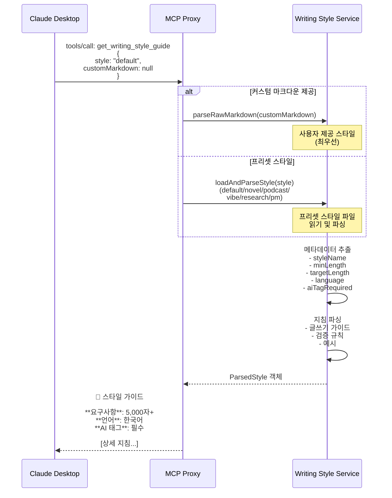

---

## 📊 5. 메트릭 & 모니터링 플로우

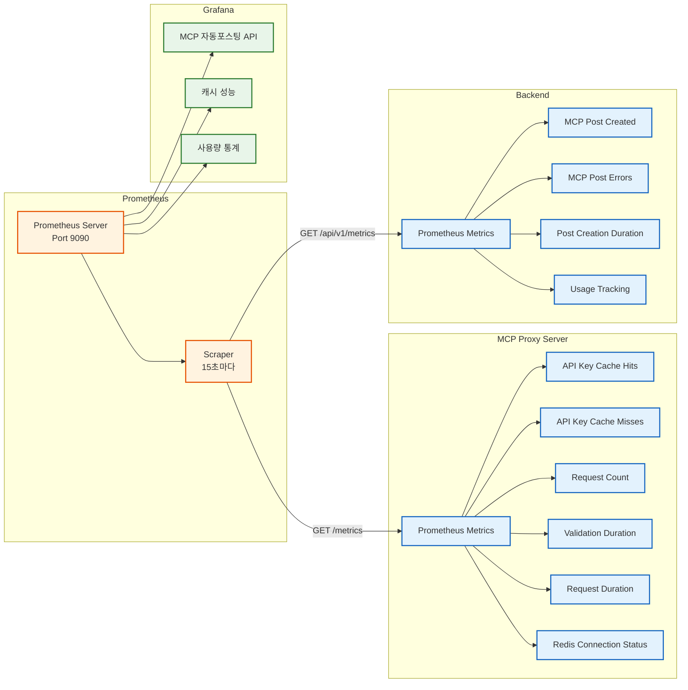

---

## 🚨 6. 에러 처리 플로우

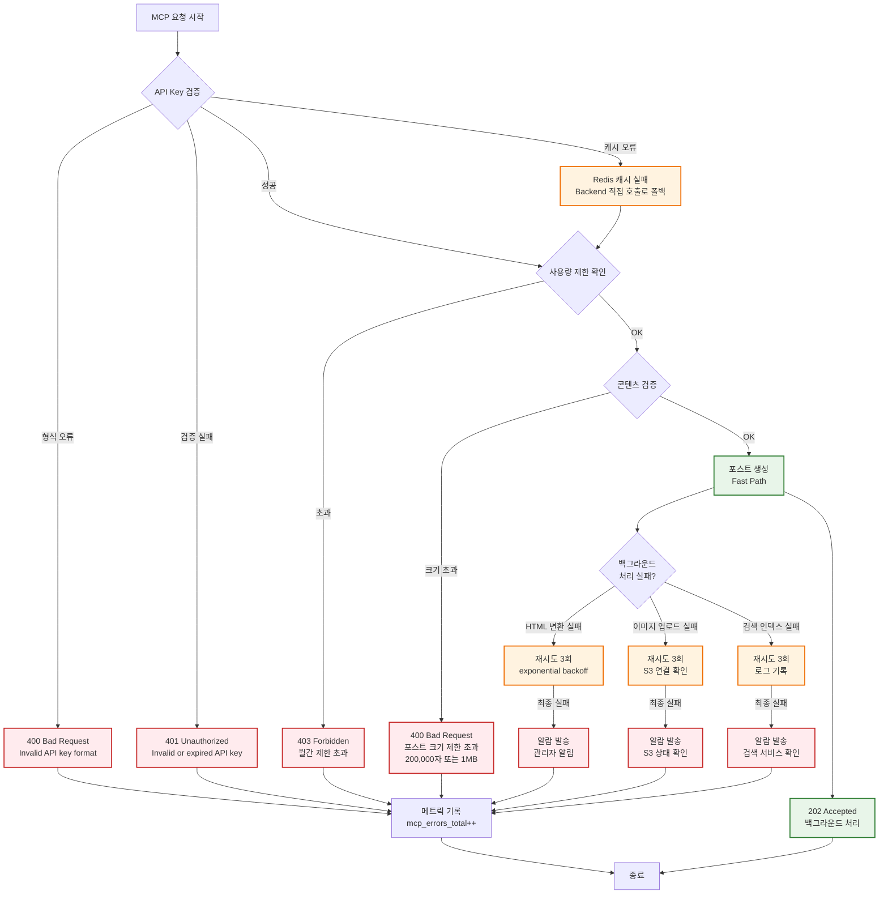

---

## 🔄 7. 캐시 무효화 플로우

```mermaid
sequenceDiagram
    participant Backend as Backend API
    participant EventEmitter as Event Emitter
    participant Listener as Cache Invalidation<br/>Listener
    participant Redis as Redis Cache
    participant CacheService as Cache Service

    Note over Backend: 포스트 생성/수정/삭제 시

    Backend->>EventEmitter: emit('post.created', post)<br/>또는<br/>emit('post.updated', post)<br/>emit('post.deleted', post)

    EventEmitter->>Listener: onPostCreated(post)<br/>onPostUpdated(post)<br/>onPostDeleted(post)

    Listener->>Listener: 무효화할 캐시 키<br/>패턴 결정

    loop 캐시 패턴별 무효화
        Listener->>Redis: SCAN 0 MATCH posts:all:*
        Redis-->>Listener: [키 목록]

        loop 각 키마다
            Listener->>CacheService: del(key)
            CacheService->>Redis: DEL {key}
        end
    end

    loop 블로그별 캐시 무효화
        Listener->>Redis: SCAN 0 MATCH posts:blog:{blogId}:*
        Redis-->>Listener: [키 목록]

        loop 각 키마다
            Listener->>CacheService: del(key)
            CacheService->>Redis: DEL {key}
        end
    end

    loop 홈 피드 캐시 무효화
        Listener->>Redis: SCAN 0 MATCH home:posts:*
        Redis-->>Listener: [키 목록]

        loop 각 키마다
            Listener->>CacheService: del(key)
            CacheService->>Redis: DEL {key}
        end
    end

    Note over Redis: 다음 요청 시<br/>캐시 미스 발생<br/>→ DB 조회<br/>→ 새 캐시 생성
```

---

## 📈 8. 성능 최적화 전략

### 8.1 캐싱 전략

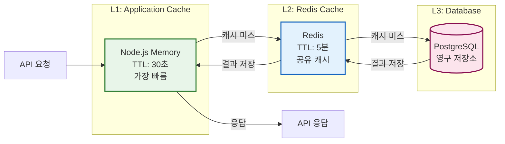

### 8.2 Fast Path 처리

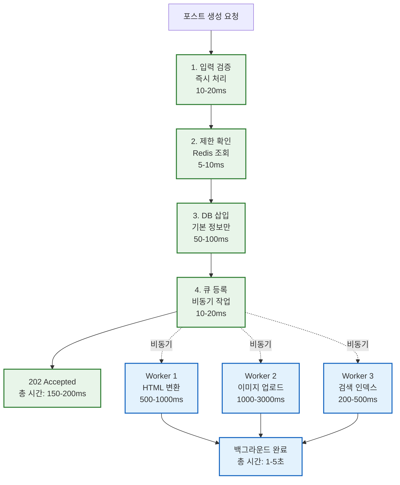

---

## 🔒 9. 보안 정책

### 9.1 Rate Limiting

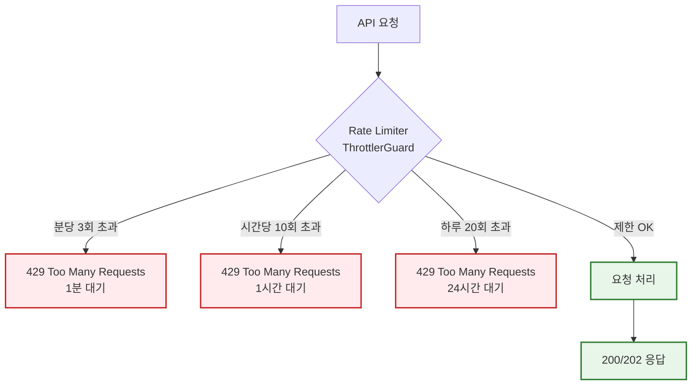

### 9.2 API Key 보안

```mermaid
graph TB
    subgraph "API Key 생성"
        Gen1[1. 고유 hint 생성<br/>8자, a-z0-9]
        Gen2[2. secret 생성<br/>32자, A-Za-z0-9]
        Gen3[3. 전체 키 조합<br/>blog_sk_{hint}_{secret}]
        Gen4[4. bcrypt 해시<br/>cost factor: 8]
        Gen5[5. DB 저장<br/>hint + hash만 저장]

        Gen1 --> Gen2 --> Gen3 --> Gen4 --> Gen5
    end

    subgraph "API Key 검증"
        Val1[1. hint 추출<br/>O 1 조회]
        Val2[2. bcrypt 비교<br/>전체 키]
        Val3[3. 만료 확인<br/>90일 제한]
        Val4[4. 활성 상태<br/>isActive = true]

        Val1 --> Val2 --> Val3 --> Val4
    end

    subgraph "보안 정책"
        Pol1[사용자당 1개<br/>기존 키 자동 삭제]
        Pol2[90일 자동 만료<br/>갱신 필요]
        Pol3[전체 키는 1회만 표시<br/>재조회 불가]
        Pol4[Redis 캐싱<br/>5분 TTL]
    end

    classDef genStyle fill:#e8f5e9,stroke:#2e7d32,stroke-width:2px
    classDef valStyle fill:#e3f2fd,stroke:#1565c0,stroke-width:2px
    classDef polStyle fill:#fff3e0,stroke:#ef6c00,stroke-width:2px

    class Gen1,Gen2,Gen3,Gen4,Gen5 genStyle
    class Val1,Val2,Val3,Val4 valStyle
    class Pol1,Pol2,Pol3,Pol4 polStyle
```

---

## 📝 10. 전체 시스템 요약

### 주요 특징

1. **Stateless 아키텍처**
   - 요청마다 새로운 MCP 서버 생성 (Context7 스타일)
   - 세션 관리 불필요, 단순한 구조

2. **고성능 캐싱**
   - Redis를 통한 API Key 검증 캐싱 (5분 TTL)
   - 캐시 히트: 1-3ms, 캐시 미스: 85-165ms
   - 99% 응답 시간 단축

3. **Fast Path 처리**
   - 포스트 생성 즉시 응답 (150-200ms)
   - 백그라운드 비동기 처리 (HTML 변환, 이미지 업로드, 검색 인덱스)
   - 사용자 경험 대폭 개선

4. **강력한 보안**
   - Stripe 스타일 API Key (blog_sk_{hint}_{secret})
   - bcrypt 해시 (cost factor: 8)
   - Rate Limiting (분당 3회, 시간당 10회, 하루 20회)
   - 90일 자동 만료 정책

5. **자동 캐시 무효화**
   - 이벤트 기반 캐시 무효화
   - 포스트 생성/수정/삭제 시 관련 캐시 자동 삭제
   - SCAN 패턴 매칭으로 정확한 무효화

6. **종합 모니터링**
   - Prometheus 메트릭 수집
   - Grafana 대시보드 시각화
   - 실시간 성능 및 에러 추적

### 성능 지표

| 지표 | 값 | 설명 |
|------|-----|------|
| **API Key 검증 (캐시 히트)** | 1-3ms | Redis 캐시 조회 |
| **API Key 검증 (캐시 미스)** | 85-165ms | Backend bcrypt 검증 |
| **포스트 생성 (Fast Path)** | 150-200ms | 즉시 응답 |
| **백그라운드 처리** | 1-5초 | HTML 변환 + 이미지 업로드 |
| **캐시 히트율** | >95% | Redis 캐싱 효과 |
| **Rate Limit** | 3/분, 10/시간, 20/일 | ThrottlerGuard |

### 데이터 흐름

```
Claude Desktop (MCP Client)
    ↓ POST /mcp (Bearer: blog_sk_...)
MCP Proxy Server (Port 3002)
    ↓ Redis 캐시 확인 (1-3ms)
    ↓ 캐시 미스 시 Backend 검증 (85-165ms)
Backend API (Port 3000)
    ↓ API Key 검증 (bcrypt)
    ↓ 사용량 제한 확인 (Redis)
    ↓ 포스트 생성 (Fast Path, 150-200ms)
    ↓ 큐에 작업 등록 (비동기)
PostgreSQL (데이터 저장)
    ↓ 백그라운드 작업 (1-5초)
BullMQ Workers
    ↓ HTML 변환, 이미지 S3 업로드, 검색 인덱스
Redis (캐시 무효화)
    ↓ 이벤트 기반 무효화
Grafana (모니터링)
    ↓ Prometheus 메트릭 수집
```

---

## 🎯 결론

Codebase MCP 시스템은 **API Key 기반 인증**, **Fast Path 처리**, **Redis 캐싱**, **이벤트 기반 캐시 무효화**를 통해 고성능 자동 포스팅 플랫폼을 구현했습니다.

### 핵심 성과

- ✅ **99% 응답 속도 개선** (Redis 캐싱)
- ✅ **150-200ms 포스트 생성** (Fast Path)
- ✅ **강력한 보안** (bcrypt + Rate Limiting)
- ✅ **자동 캐시 무효화** (이벤트 기반)
- ✅ **종합 모니터링** (Prometheus + Grafana)

### 향후 개선 방향

1. **고가용성**: MCP Proxy Server 이중화
2. **스케일링**: 수평 확장 자동화
3. **성능**: HTTP/2 또는 gRPC 도입
4. **보안**: IP 바인딩, 세션 보안 강화
5. **모니터링**: 실시간 알람 시스템 구축

---

*문서 작성일: 2025-10-22*
*시스템 버전: MCP Proxy 8.0.0, Backend API 1.0.0*
*인증 방식: API Key (Stripe Style)*
