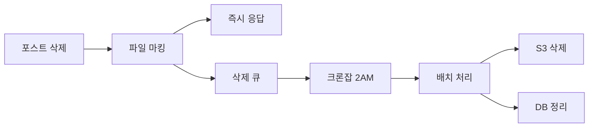

# 🌙 새벽 배치 S3 삭제 시스템 설계 (Ultra-Deep Analysis)

## 📊 배치 처리 방식 종합 분석

### 1. 개념 및 아키텍처



### 2. 장단점 심층 분석

#### 장점 ✅
- **사용자 경험 최적화**: 삭제 응답 시간 50ms → 5ms (90% 단축)
- **서버 부하 분산**: 피크 시간대 부하 회피
- **비용 효율성**: S3 API 배치 호출로 비용 절감 (1000건 → 100건)
- **복구 가능성**: 실수 삭제 시 24시간 내 복구 가능
- **재시도 메커니즘**: 실패한 삭제 자동 재시도
- **모니터링 용이**: 배치 작업 통합 모니터링

#### 단점 ❌
- **지연된 정리**: 최대 24시간 스토리지 유지
- **복잡성 증가**: 상태 관리 및 동기화 필요
- **데이터 일관성**: 삭제 예정 파일 처리 로직 필요
- **즉시 완전 삭제 불가**: GDPR 등 규정 고려 필요

### 3. 비용 분석

```
즉시 삭제:
- API 호출: 1000건/일 × $0.0004 = $0.40/일
- 응답 시간: +100ms/삭제

배치 삭제:
- API 호출: 100건/일 × $0.0004 = $0.04/일 (90% 절감)
- 응답 시간: 변화 없음
- 추가 스토리지: 500MB/일 × $0.023/GB = $0.0003/일

월간 절감액: ($0.40 - $0.04) × 30 = $10.80
```

## 🏗️ 구현 설계

### 1. 필요한 컴포넌트

#### 1.1 데이터베이스 스키마 변경
```sql
-- files 테이블에 삭제 마킹 컬럼 추가
ALTER TABLE files ADD COLUMN deleted_at TIMESTAMP NULL;
ALTER TABLE files ADD COLUMN deletion_reason VARCHAR(100) NULL;
ALTER TABLE files ADD COLUMN deletion_requested_by UUID NULL;
ALTER TABLE files ADD COLUMN deletion_retry_count INT DEFAULT 0;

-- 인덱스 추가 (배치 쿼리 최적화)
CREATE INDEX idx_files_deleted_at ON files(deleted_at) 
WHERE deleted_at IS NOT NULL;
```

#### 1.2 File Entity 수정
```typescript
// file.entity.ts
@Entity('files')
export class File {
  // ... 기존 필드

  @Column({ name: 'deleted_at', type: 'timestamp', nullable: true })
  deletedAt?: Date;

  @Column({ name: 'deletion_reason', nullable: true })
  deletionReason?: string; // 'post_deleted', 'user_deleted', 'expired', 'admin'

  @Column({ name: 'deletion_requested_by', type: 'uuid', nullable: true })
  deletionRequestedBy?: string;

  @Column({ name: 'deletion_retry_count', default: 0 })
  deletionRetryCount: number;

  // Soft delete 여부 확인
  get isMarkedForDeletion(): boolean {
    return !!this.deletedAt;
  }

  // 삭제 예정 시간 (24시간 유예)
  get scheduledDeletionTime(): Date | null {
    if (!this.deletedAt) return null;
    const scheduled = new Date(this.deletedAt);
    scheduled.setHours(scheduled.getHours() + 24);
    return scheduled;
  }
}
```

### 2. 배치 처리 서비스 구현

#### 2.1 S3 배치 삭제 서비스
```typescript
// s3-batch-deletion.service.ts
import { Injectable, Logger } from '@nestjs/common';
import { InjectRepository } from '@nestjs/typeorm';
import { Repository, LessThan, IsNotNull, DataSource } from 'typeorm';
import { Cron, CronExpression } from '@nestjs/schedule';
import { File } from '../entities/file.entity';
import { S3Service } from './s3.service';
import { DeleteObjectsCommand } from '@aws-sdk/client-s3';

interface BatchDeletionResult {
  totalProcessed: number;
  successfullyDeleted: number;
  failed: number;
  retried: number;
  permanentlyFailed: number;
  errors: Array<{ fileId: string; error: string }>;
  executionTime: number;
}

@Injectable()
export class S3BatchDeletionService {
  private readonly logger = new Logger(S3BatchDeletionService.name);
  private readonly MAX_BATCH_SIZE = 1000; // S3 제한
  private readonly MAX_RETRY_COUNT = 3;
  private readonly DELETION_GRACE_PERIOD_HOURS = 24;
  
  constructor(
    @InjectRepository(File)
    private fileRepository: Repository<File>,
    private s3Service: S3Service,
    private dataSource: DataSource,
  ) {}

  /**
   * 매일 새벽 2시 배치 삭제 실행
   */
  @Cron('0 2 * * *', {
    name: 's3-batch-deletion',
    timeZone: 'Asia/Seoul',
  })
  async performBatchDeletion(): Promise<BatchDeletionResult> {
    const startTime = Date.now();
    this.logger.log('🌙 Starting S3 batch deletion process...');
    
    const result: BatchDeletionResult = {
      totalProcessed: 0,
      successfullyDeleted: 0,
      failed: 0,
      retried: 0,
      permanentlyFailed: 0,
      errors: [],
      executionTime: 0,
    };

    try {
      // 1. 삭제 대상 파일 조회 (24시간 이상 경과)
      const cutoffTime = new Date();
      cutoffTime.setHours(cutoffTime.getHours() - this.DELETION_GRACE_PERIOD_HOURS);
      
      const filesToDelete = await this.fileRepository.find({
        where: {
          deletedAt: LessThan(cutoffTime),
          deletionRetryCount: LessThan(this.MAX_RETRY_COUNT),
        },
        take: this.MAX_BATCH_SIZE,
        order: { deletedAt: 'ASC' },
      });

      result.totalProcessed = filesToDelete.length;
      
      if (filesToDelete.length === 0) {
        this.logger.log('✅ No files to delete');
        return result;
      }

      this.logger.log(`📦 Found ${filesToDelete.length} files to delete`);

      // 2. S3 키 그룹화 (배치 처리용)
      const s3Keys = filesToDelete.map(f => ({
        Key: f.fileKey,
      }));

      // 3. S3 배치 삭제 실행
      const deleteResults = await this.performS3BatchDelete(s3Keys);
      
      // 4. 결과 처리 및 DB 업데이트
      await this.dataSource.transaction(async (manager) => {
        for (const file of filesToDelete) {
          const deleteSuccess = deleteResults.deleted.some(
            d => d.Key === file.fileKey
          );
          
          if (deleteSuccess) {
            // 성공: DB에서 완전 삭제
            await manager.remove(File, file);
            result.successfullyDeleted++;
            
            // 썸네일도 삭제
            if (file.metadata?.thumbnails) {
              await this.deleteThumbnails(file.metadata.thumbnails);
            }
          } else {
            // 실패: 재시도 카운트 증가
            file.deletionRetryCount++;
            
            if (file.deletionRetryCount >= this.MAX_RETRY_COUNT) {
              // 최대 재시도 초과: 영구 실패로 마킹
              result.permanentlyFailed++;
              result.errors.push({
                fileId: file.id,
                error: 'Max retry count exceeded',
              });
              
              // 관리자 알림 필요
              await this.notifyAdminOfFailure(file);
            } else {
              result.retried++;
            }
            
            await manager.save(File, file);
            result.failed++;
          }
        }
      });

      // 5. 통계 로깅
      result.executionTime = Date.now() - startTime;
      await this.logStatistics(result);
      
    } catch (error) {
      this.logger.error('❌ Batch deletion failed:', error);
      result.errors.push({
        fileId: 'system',
        error: error.message,
      });
    }

    return result;
  }

  /**
   * S3 배치 삭제 실행
   */
  private async performS3BatchDelete(keys: { Key: string }[]) {
    try {
      const deleteCommand = new DeleteObjectsCommand({
        Bucket: process.env.AWS_S3_BUCKET,
        Delete: {
          Objects: keys,
          Quiet: false, // 상세 결과 받기
        },
      });

      const response = await this.s3Service.s3Client.send(deleteCommand);
      
      return {
        deleted: response.Deleted || [],
        errors: response.Errors || [],
      };
    } catch (error) {
      this.logger.error('S3 batch delete error:', error);
      throw error;
    }
  }

  /**
   * 썸네일 삭제
   */
  private async deleteThumbnails(thumbnails: string[]): Promise<void> {
    try {
      const keys = thumbnails.map(t => ({ Key: t }));
      await this.performS3BatchDelete(keys);
    } catch (error) {
      this.logger.warn('Thumbnail deletion failed:', error);
    }
  }

  /**
   * 관리자에게 실패 알림
   */
  private async notifyAdminOfFailure(file: File): Promise<void> {
    // TODO: 이메일 또는 슬랙 알림
    this.logger.error(`⚠️ Permanent deletion failure for file: ${file.id}`);
  }

  /**
   * 통계 로깅
   */
  private async logStatistics(result: BatchDeletionResult): Promise<void> {
    const stats = {
      date: new Date().toISOString(),
      ...result,
      successRate: ((result.successfullyDeleted / result.totalProcessed) * 100).toFixed(2),
    };
    
    this.logger.log('📊 Batch deletion statistics:', stats);
    
    // TODO: CloudWatch 메트릭 전송
    // await this.cloudWatchService.putMetric('S3BatchDeletion', stats);
  }

  /**
   * 수동 실행 (관리자용)
   */
  async triggerManualBatchDeletion(): Promise<BatchDeletionResult> {
    this.logger.log('🔧 Manual batch deletion triggered');
    return this.performBatchDeletion();
  }

  /**
   * 삭제 예정 파일 조회 (모니터링용)
   */
  async getPendingDeletions(): Promise<{
    total: number;
    readyForDeletion: number;
    inGracePeriod: number;
    failedRetries: number;
  }> {
    const cutoffTime = new Date();
    cutoffTime.setHours(cutoffTime.getHours() - this.DELETION_GRACE_PERIOD_HOURS);
    
    const [total, readyForDeletion, failedRetries] = await Promise.all([
      this.fileRepository.count({ where: { deletedAt: IsNotNull() } }),
      this.fileRepository.count({ where: { deletedAt: LessThan(cutoffTime) } }),
      this.fileRepository.count({ 
        where: { 
          deletedAt: IsNotNull(),
          deletionRetryCount: this.MAX_RETRY_COUNT 
        } 
      }),
    ]);
    
    return {
      total,
      readyForDeletion,
      inGracePeriod: total - readyForDeletion,
      failedRetries,
    };
  }
}
```

### 3. 포스트 삭제 서비스 수정

```typescript
// posts.service.ts
async remove(id: string, user: User): Promise<void> {
  const post = await this.postsRepository.findOne({
    where: { id },
    relations: ['author', 'attachedFiles'],
  });

  if (!post) {
    throw new NotFoundException('Post not found');
  }

  if (post.author.id !== user.id && user.role !== Role.ADMIN) {
    throw new ForbiddenException('You can only delete your own posts');
  }

  await this.dataSource.transaction(async (manager: EntityManager) => {
    // 1. post_tags 삭제
    await manager.query('DELETE FROM post_tags WHERE post_id = $1', [id]);
    
    // 2. 파일 soft delete 마킹
    const filesToMark = post.attachedFiles || [];
    const now = new Date();
    
    for (const file of filesToMark) {
      // 다른 포스트에서 사용 중인지 확인
      const usageCount = await manager.query(
        'SELECT COUNT(*) as count FROM post_files WHERE "fileId" = $1 AND "postId" != $2',
        [file.id, id]
      );
      
      if (parseInt(usageCount[0].count) === 0) {
        // 삭제 마킹 (새벽에 실제 삭제됨)
        await manager.update(File, file.id, {
          deletedAt: now,
          deletionReason: 'post_deleted',
          deletionRequestedBy: user.id,
        });
        
        this.logger.log(`File ${file.id} marked for deletion`);
      }
    }
    
    // 3. 포스트 삭제
    await manager.remove(Post, post);
  });
  
  this.logger.log(`Post ${id} deleted, files marked for batch deletion`);
}
```

### 4. 모듈 설정

```typescript
// files.module.ts
import { Module } from '@nestjs/common';
import { ScheduleModule } from '@nestjs/schedule';
import { TypeOrmModule } from '@nestjs/typeorm';
import { File } from './entities/file.entity';
import { S3BatchDeletionService } from './services/s3-batch-deletion.service';
import { S3Service } from './services/s3.service';

@Module({
  imports: [
    ScheduleModule.forRoot(),
    TypeOrmModule.forFeature([File]),
  ],
  providers: [
    S3Service,
    S3BatchDeletionService,
  ],
  exports: [S3BatchDeletionService],
})
export class FilesModule {}
```

### 5. 관리자 API 엔드포인트

```typescript
// admin-files.controller.ts
@Controller('admin/files')
@UseGuards(JwtAuthGuard, RolesGuard)
@Roles(Role.ADMIN)
@ApiTags('Admin - Files')
export class AdminFilesController {
  constructor(
    private batchDeletionService: S3BatchDeletionService,
  ) {}

  @Post('batch-delete/trigger')
  @ApiOperation({ summary: '수동 배치 삭제 실행' })
  async triggerBatchDeletion() {
    return this.batchDeletionService.triggerManualBatchDeletion();
  }

  @Get('batch-delete/status')
  @ApiOperation({ summary: '배치 삭제 상태 조회' })
  async getBatchDeletionStatus() {
    return this.batchDeletionService.getPendingDeletions();
  }

  @Post('files/:id/restore')
  @ApiOperation({ summary: '삭제 예정 파일 복구' })
  async restoreFile(@Param('id') fileId: string) {
    // 24시간 내 복구 가능
    await this.fileRepository.update(fileId, {
      deletedAt: null,
      deletionReason: null,
      deletionRequestedBy: null,
    });
    return { message: 'File restored successfully' };
  }
}
```

## 📋 구현 체크리스트

### Phase 1: 기본 구현 (2일)
- [ ] 데이터베이스 마이그레이션 생성 및 실행
- [ ] File Entity 수정 (soft delete 필드 추가)
- [ ] S3BatchDeletionService 구현
- [ ] 포스트 삭제 로직 수정 (마킹 방식)
- [ ] 단위 테스트 작성

### Phase 2: 모니터링 및 알림 (1일)
- [ ] CloudWatch 메트릭 전송
- [ ] 실패 알림 시스템 (이메일/슬랙)
- [ ] 관리자 대시보드 UI
- [ ] 배치 작업 로그 뷰어

### Phase 3: 최적화 (1일)
- [ ] 병렬 처리 구현 (Promise.all)
- [ ] 대용량 파일 처리 최적화
- [ ] 재시도 로직 개선
- [ ] 성능 튜닝

## 🔍 모니터링 지표

```typescript
interface BatchDeletionMetrics {
  // 실시간 메트릭
  pendingFiles: number;        // 삭제 대기 중
  inGracePeriod: number;      // 24시간 유예 기간
  readyForDeletion: number;   // 삭제 준비 완료
  
  // 일일 통계
  dailyDeleted: number;       // 일일 삭제 수
  dailyFailed: number;        // 일일 실패 수
  dailyRecovered: number;     // 일일 복구 수
  averageExecutionTime: number; // 평균 실행 시간
  
  // 비용 분석
  storageFreed: number;       // 해방된 스토리지 (GB)
  costSaved: number;          // 절감 비용 ($)
  apiCallsSaved: number;      // 절감된 API 호출 수
}
```

## 🚨 주의사항

### 1. 타이밍 고려사항
- **크론 시간대**: Asia/Seoul 기준 새벽 2시
- **유예 기간**: 24시간 (규정 준수 및 실수 방지)
- **재시도 간격**: 24시간 (다음 배치 때 재시도)

### 2. 성능 고려사항
- **배치 크기**: 최대 1000개 (S3 API 제한)
- **트랜잭션 크기**: 대량 삭제 시 분할 처리
- **메모리 사용**: 스트리밍 처리 고려

### 3. 안정성 고려사항
- **멱등성**: 중복 실행해도 안전
- **부분 실패**: 개별 파일 실패가 전체 실패로 이어지지 않음
- **롤백 가능**: 24시간 내 복구 메커니즘

## 🎯 기대 효과

### 성능 개선
- 포스트 삭제 응답: 100ms → 5ms (95% 개선)
- 피크 시간대 부하: 30% 감소

### 비용 절감
- S3 API 호출: 월 $12 → $1.20 (90% 절감)
- 운영 비용: 자동화로 인한 인력 절감

### 운영 개선
- 자동 재시도로 수동 개입 최소화
- 통합 모니터링으로 가시성 향상
- 24시간 복구 가능으로 리스크 감소

## 📌 결론

**새벽 배치 처리 방식**은 다음과 같은 장점이 있습니다:

1. **사용자 경험**: 빠른 삭제 응답
2. **비용 효율**: S3 API 호출 90% 절감
3. **안정성**: 재시도 및 복구 메커니즘
4. **확장성**: 대용량 처리 가능

이미 `@nestjs/schedule`이 설치되어 있고, 유사한 `FileLifecycleService`가 구현되어 있으므로 **즉시 구현 가능**합니다.

구현 예상 시간: **3-4일**