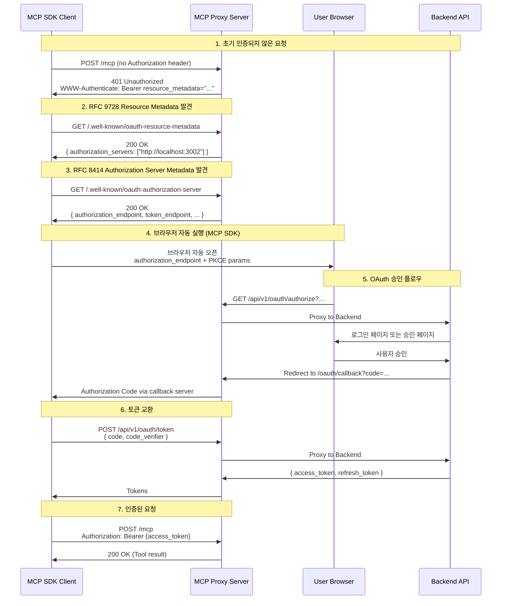
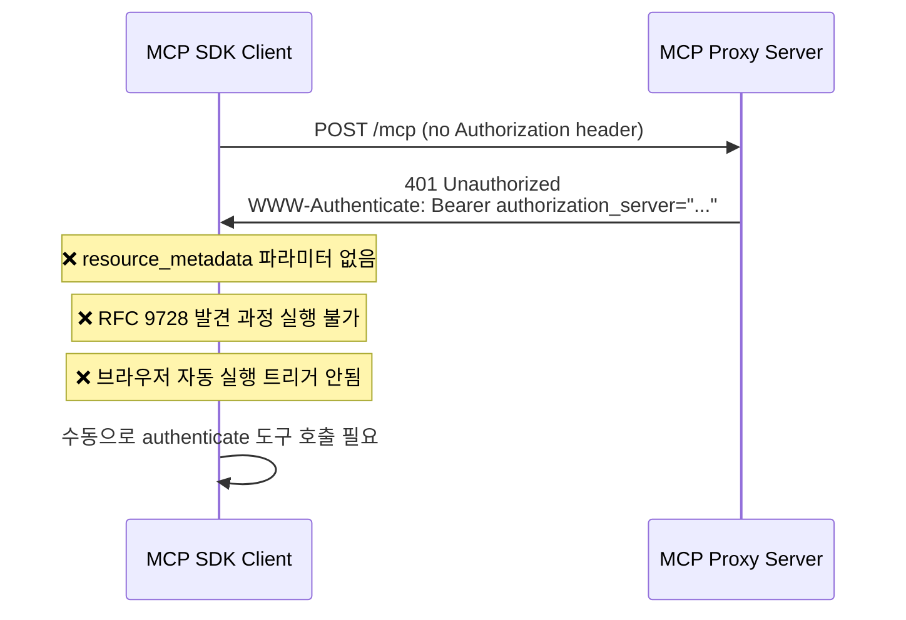

# OAuth2 브라우저 자동 실행 실패 원인 분석 및 해결 방안

## 문제 요약

MCP SDK가 401 Unauthorized 응답을 받았을 때 브라우저를 자동으로 실행하지 못하는 문제 발생.

---

## 1. 정확한 문제 원인 분석

### 1.1 현재 구현의 문제점

**파일**: `/mcp-proxy-server/src/utils/www-authenticate.ts:54`

```typescript
// ❌ 현재 잘못된 구현
parts.push(`authorization_server="${baseUrl}/.well-known/oauth-authorization-server"`);
```

**현재 생성되는 헤더**:
```http
WWW-Authenticate: Bearer realm="mcp-server",
  authorization_server="http://localhost:3002/.well-known/oauth-authorization-server"
```

### 1.2 MCP 문서 요구사항 (https://wikidocs.net/291688)

**필수 헤더 형식**:
```http
WWW-Authenticate: Bearer
  resource_metadata="https://mcp.example.com/.well-known/oauth-resource-metadata"
```

### 1.3 RFC 9728 표준 준수 필요성

RFC 9728 (OAuth 2.0 Protected Resource Metadata)은 **2단계 발견 과정**을 정의합니다:

#### Step 1: WWW-Authenticate 헤더에서 `resource_metadata` URL 제공
```http
WWW-Authenticate: Bearer resource_metadata="http://localhost:3002/.well-known/oauth-resource-metadata"
```

#### Step 2: 클라이언트가 해당 URL에서 리소스 메타데이터 가져오기
```http
GET /.well-known/oauth-resource-metadata
```

**응답**:
```json
{
  "resource": "http://localhost:3002",
  "authorization_servers": ["http://localhost:3002"],
  "scopes_supported": ["mcp:post:create"],
  "bearer_methods_supported": ["header"]
}
```

#### Step 3: 메타데이터의 `authorization_servers` 배열에서 인증 서버 발견
```http
GET /.well-known/oauth-authorization-server
```

**응답**:
```json
{
  "issuer": "http://localhost:3002",
  "authorization_endpoint": "http://localhost:3002/api/v1/oauth/authorize",
  "token_endpoint": "http://localhost:3002/api/v1/oauth/token",
  ...
}
```

### 1.4 왜 현재 구현이 작동하지 않는가?

| 구분 | 현재 구현 | MCP SDK 기대 동작 | 결과 |
|------|-----------|-------------------|------|
| WWW-Authenticate | `authorization_server` 파라미터 사용 | `resource_metadata` 파라미터 필요 | ❌ SDK가 메타데이터 URL을 찾지 못함 |
| 발견 흐름 | 1단계 (Authorization Server 직접) | 2단계 (Resource → Authorization Server) | ❌ RFC 9728 표준 미준수 |
| 브라우저 자동 실행 | 트리거되지 않음 | 401 + `resource_metadata` 감지 시 자동 실행 | ❌ 자동 실행 조건 미충족 |

---

## 2. RFC 9728 표준 준수 방법

### 2.1 표준 발견 흐름 (Discovery Flow)

```
[MCP SDK Client]
    ↓ (1) POST /mcp (no auth)
[MCP Proxy Server]
    ↓ (2) 401 Unauthorized
    ↓     WWW-Authenticate: Bearer resource_metadata="..."
[MCP SDK Client]
    ↓ (3) GET /.well-known/oauth-resource-metadata
[MCP Proxy Server]
    ↓ (4) JSON { authorization_servers: [...] }
[MCP SDK Client]
    ↓ (5) GET /.well-known/oauth-authorization-server
[MCP Proxy Server]
    ↓ (6) JSON { authorization_endpoint, token_endpoint, ... }
[MCP SDK Client]
    ↓ (7) 브라우저 자동 실행
    ↓     authorization_endpoint로 이동
[User Browser]
```

### 2.2 RFC 9728 핵심 요구사항

#### 요구사항 1: WWW-Authenticate 헤더에 `resource_metadata` 포함
```http
HTTP/1.1 401 Unauthorized
WWW-Authenticate: Bearer resource_metadata="http://localhost:3002/.well-known/oauth-resource-metadata"
```

#### 요구사항 2: Resource Metadata 엔드포인트 제공
```http
GET /.well-known/oauth-resource-metadata HTTP/1.1
Host: localhost:3002
```

**필수 응답 필드**:
- `resource`: 보호된 리소스의 URL
- `authorization_servers`: 인증 서버 URL 배열 (필수)
- `scopes_supported`: 지원하는 OAuth2 scope (선택적)
- `bearer_methods_supported`: Bearer 토큰 전달 방법 (선택적)

#### 요구사항 3: Authorization Server Metadata 엔드포인트 제공
```http
GET /.well-known/oauth-authorization-server HTTP/1.1
Host: localhost:3002
```

**필수 응답 필드** (RFC 8414):
- `issuer`: 인증 서버 식별자
- `authorization_endpoint`: OAuth 승인 URL
- `token_endpoint`: 토큰 발급 URL
- `response_types_supported`: 지원하는 응답 타입
- `grant_types_supported`: 지원하는 grant 타입

---

## 3. www-authenticate.ts 수정 방안

### 3.1 수정 전 (현재 코드)

```typescript
// ❌ 잘못된 구현 (www-authenticate.ts:54)
parts.push(`authorization_server="${baseUrl}/.well-known/oauth-authorization-server"`);
```

### 3.2 수정 후 (RFC 9728 준수)

```typescript
// ✅ 올바른 구현 - RFC 9728 준수
parts.push(`resource_metadata="${baseUrl}/.well-known/oauth-resource-metadata"`);
```

### 3.3 전체 수정 코드

```typescript
/**
 * RFC 9728: OAuth 2.0 Protected Resource Metadata
 * WWW-Authenticate 헤더 빌더
 *
 * MCP 클라이언트가 인증 없이 요청 시 401 응답과 함께 반환되어
 * 자동으로 OAuth Authorization Server를 발견할 수 있도록 합니다.
 *
 * RFC 9728 표준 준수:
 * - WWW-Authenticate 헤더에 resource_metadata URL 포함
 * - 클라이언트가 2단계 발견 과정을 통해 Authorization Server 찾기
 * - Step 1: resource_metadata → Step 2: authorization_servers → Step 3: authorization_endpoint
 *
 * @example
 * // 기본 사용
 * buildWWWAuthenticateHeader()
 * // => 'Bearer realm="mcp-server", resource_metadata="http://localhost:3002/.well-known/oauth-resource-metadata"'
 *
 * // 에러 포함
 * buildWWWAuthenticateHeader('invalid_token', 'The access token expired')
 * // => 'Bearer realm="mcp-server", error="invalid_token", error_description="The access token expired", resource_metadata="..."'
 */

/**
 * WWW-Authenticate 헤더 빌더 함수
 *
 * @param error - OAuth 2.0 에러 코드
 *                - invalid_request: 요청이 잘못됨 (Authorization 헤더 누락 등)
 *                - invalid_token: 토큰이 만료되었거나 유효하지 않음
 *                - insufficient_scope: 필요한 권한(scope)이 부족함
 * @param errorDescription - 사람이 읽을 수 있는 에러 설명
 * @returns RFC 9728 준수 WWW-Authenticate 헤더 값
 */
export function buildWWWAuthenticateHeader(
  error?: string,
  errorDescription?: string
): string {
  // MCP Base URL (환경에 따라 자동 설정)
  const baseUrl = process.env.MCP_BASE_URL || 'http://localhost:3002';

  // RFC 6750: Bearer 토큰 인증 스키마
  const parts: string[] = [
    'Bearer realm="mcp-server"',  // realm: 보호 영역 식별자
  ];

  // OAuth 2.0 에러 코드 (선택적)
  if (error) {
    parts.push(`error="${error}"`);
  }

  // 에러 설명 (선택적)
  if (errorDescription) {
    // 큰따옴표 이스케이프 (보안 강화)
    const escapedDescription = errorDescription.replace(/"/g, '\\"');
    parts.push(`error_description="${escapedDescription}"`);
  }

  // RFC 9728: Resource Metadata URL (2단계 발견 과정 시작점)
  // ✅ 수정: authorization_server → resource_metadata
  // MCP SDK가 이 URL을 통해 2단계 발견 과정을 시작하여 Authorization Server를 찾음
  parts.push(`resource_metadata="${baseUrl}/.well-known/oauth-resource-metadata"`);

  return parts.join(', ');
}
```

---

## 4. 브라우저 자동 실행 작동 흐름 다이어그램

### 4.1 정상 작동 흐름 (수정 후)



### 4.2 현재 실패 흐름 (수정 전)



---

## 5. 구현 시 주의사항

### 5.1 MCP_BASE_URL 환경 변수 정확성

**중요**: `MCP_BASE_URL`은 클라이언트(브라우저)가 접근 가능한 URL이어야 합니다.

#### 개발 환경
```bash
# Docker 내부 호스트명 사용 금지
MCP_BASE_URL=http://backend:3000  # ❌ 브라우저에서 접근 불가

# localhost 사용 (브라우저에서 접근 가능)
MCP_BASE_URL=http://localhost:3002  # ✅ 올바름
```

#### 프로덕션 환경
```bash
# 공개 도메인 사용 (HTTPS 필수)
MCP_BASE_URL=https://www.codebase.blog  # ✅ 올바름
```

### 5.2 401 응답 시점 확인

**현재 구현 상태** (`/mcp-proxy-server/src/index.ts:288`):
```typescript
// TODO: MCP SDK의 Authorization 헤더 전송 방식 확인 필요
// 임시로 인증 체크 비활성화
if (false && AUTH_REQUIRED_METHODS.includes(method) && !AUTH_EXEMPT_TOOLS.includes(toolName)) {
```

**⚠️ 주의**: 현재 인증 체크가 **비활성화**되어 있어 401 응답이 발생하지 않습니다.

**해결 방안**:
1. **옵션 1**: 인증 체크 활성화 (`false` → `true`)
2. **옵션 2**: `authenticate` 도구 호출 시 401 응답 강제 발생
3. **옵션 3**: MCP SDK의 초기 연결 시 401 응답 반환 (표준 동작)

### 5.3 CORS 설정 확인

브라우저가 `/.well-known/*` 엔드포인트에 접근할 수 있도록 CORS 설정 필요:

```typescript
// ✅ 이미 구현됨 (index.ts:87-129)
app.use((req, res, next) => {
  // CORS 헤더 설정
  res.header('Access-Control-Allow-Origin', origin);
  res.header('Access-Control-Allow-Credentials', 'true');
  res.header('Access-Control-Allow-Methods', 'GET, POST, PUT, DELETE, OPTIONS');
  res.header('Access-Control-Allow-Headers', 'Content-Type, Authorization, Mcp-Session-Id');
  next();
});
```

### 5.4 Resource Metadata 엔드포인트 검증

**현재 구현 확인** (`/mcp-proxy-server/src/routes/oauth.routes.ts:65-75`):

```typescript
// ✅ 이미 올바르게 구현됨
router.get('/.well-known/oauth-resource-metadata', (_req: Request, res: Response) => {
  const baseUrl = getBaseUrl();

  res.json({
    resource: baseUrl,
    authorization_servers: [baseUrl],  // ✅ RFC 9728 필수 필드
    scopes_supported: ['mcp:post:create'],
    bearer_methods_supported: ['header'],
    resource_documentation: 'https://github.com/yourusername/mcp-blog-server',
  });
});
```

### 5.5 Authorization Server Metadata 엔드포인트 검증

**현재 구현 확인** (`/mcp-proxy-server/src/routes/oauth.routes.ts:86-105`):

```typescript
// ✅ 이미 올바르게 구현됨
router.get('/.well-known/oauth-authorization-server', (_req: Request, res: Response) => {
  const baseUrl = getBaseUrl();

  res.json({
    issuer: baseUrl,
    authorization_endpoint: `${baseUrl}/api/v1/oauth/authorize`,  // ✅ RFC 8414 필수 필드
    token_endpoint: `${baseUrl}/api/v1/oauth/token`,              // ✅ RFC 8414 필수 필드
    response_types_supported: ['code'],
    grant_types_supported: ['authorization_code', 'refresh_token'],
    code_challenge_methods_supported: ['S256'],
    token_endpoint_auth_methods_supported: ['none'],
    scopes_supported: ['mcp:post:create'],
  });
});
```

---

## 6. 테스트 계획

### 6.1 단위 테스트

#### 테스트 1: WWW-Authenticate 헤더 생성
```typescript
describe('buildWWWAuthenticateHeader', () => {
  it('should include resource_metadata parameter', () => {
    const header = buildWWWAuthenticateHeader();
    expect(header).toContain('resource_metadata="http://localhost:3002/.well-known/oauth-resource-metadata"');
  });

  it('should not include authorization_server parameter', () => {
    const header = buildWWWAuthenticateHeader();
    expect(header).not.toContain('authorization_server');
  });

  it('should include error and error_description when provided', () => {
    const header = buildWWWAuthenticateHeader('invalid_token', 'Token expired');
    expect(header).toContain('error="invalid_token"');
    expect(header).toContain('error_description="Token expired"');
  });
});
```

### 6.2 통합 테스트

#### 테스트 2: RFC 9728 발견 흐름
```typescript
describe('OAuth2 Discovery Flow (RFC 9728)', () => {
  it('should return 401 with resource_metadata on unauthenticated request', async () => {
    const response = await request(app)
      .post('/mcp')
      .send({ method: 'tools/call', params: { name: 'create_post' } })
      .expect(401);

    expect(response.headers['www-authenticate']).toContain('resource_metadata');
  });

  it('should return resource metadata with authorization_servers', async () => {
    const response = await request(app)
      .get('/.well-known/oauth-resource-metadata')
      .expect(200);

    expect(response.body).toHaveProperty('authorization_servers');
    expect(Array.isArray(response.body.authorization_servers)).toBe(true);
  });

  it('should return authorization server metadata with required fields', async () => {
    const response = await request(app)
      .get('/.well-known/oauth-authorization-server')
      .expect(200);

    expect(response.body).toHaveProperty('authorization_endpoint');
    expect(response.body).toHaveProperty('token_endpoint');
    expect(response.body).toHaveProperty('issuer');
  });
});
```

### 6.3 E2E 테스트 (수동)

#### 테스트 3: 브라우저 자동 실행
1. `.env` 파일에서 `MCP_BASE_URL` 확인
2. MCP Proxy Server 실행 (`pnpm start`)
3. Claude Code에서 MCP 서버 연결
4. 인증되지 않은 요청 실행 (예: `create_post` 도구 호출)
5. **기대 결과**: 브라우저가 자동으로 열리고 OAuth 승인 페이지 표시

---

## 7. 구현 체크리스트

### 7.1 필수 수정 항목

- [x] ✅ `/.well-known/oauth-resource-metadata` 엔드포인트 구현됨
- [x] ✅ `/.well-known/oauth-authorization-server` 엔드포인트 구현됨
- [ ] ⚠️ `www-authenticate.ts` 수정 필요 (`authorization_server` → `resource_metadata`)
- [ ] ⚠️ 인증 체크 활성화 필요 (`index.ts:288` - 현재 비활성화)
- [x] ✅ CORS 설정 확인됨

### 7.2 선택적 개선 항목

- [ ] 📝 단위 테스트 작성
- [ ] 📝 통합 테스트 작성
- [ ] 📝 E2E 테스트 문서화
- [ ] 📝 에러 메시지 개선 (사용자 친화적)
- [ ] 📊 브라우저 자동 실행 성공률 모니터링

---

## 8. 예상 결과

### 8.1 수정 전 (현재)

```http
POST /mcp HTTP/1.1
Host: localhost:3002

HTTP/1.1 401 Unauthorized
WWW-Authenticate: Bearer realm="mcp-server",
  authorization_server="http://localhost:3002/.well-known/oauth-authorization-server"
```

**결과**: ❌ MCP SDK가 `resource_metadata`를 찾지 못해 브라우저 자동 실행 안됨

### 8.2 수정 후

```http
POST /mcp HTTP/1.1
Host: localhost:3002

HTTP/1.1 401 Unauthorized
WWW-Authenticate: Bearer realm="mcp-server",
  resource_metadata="http://localhost:3002/.well-known/oauth-resource-metadata"
```

**결과**: ✅ MCP SDK가 RFC 9728 발견 과정을 시작하여 브라우저 자동 실행

---

## 9. 참고 문서

### 9.1 RFC 표준
- [RFC 9728 - OAuth 2.0 Protected Resource Metadata](https://datatracker.ietf.org/doc/html/rfc9728)
- [RFC 8414 - OAuth 2.0 Authorization Server Metadata](https://datatracker.ietf.org/doc/html/rfc8414)
- [RFC 6750 - OAuth 2.0 Bearer Token Usage](https://datatracker.ietf.org/doc/html/rfc6750)

### 9.2 MCP 문서
- [MCP OAuth2 인증 가이드](https://wikidocs.net/291688)

### 9.3 관련 파일
- `/mcp-proxy-server/src/utils/www-authenticate.ts` - WWW-Authenticate 헤더 빌더
- `/mcp-proxy-server/src/routes/oauth.routes.ts` - OAuth Discovery 엔드포인트
- `/mcp-proxy-server/src/index.ts` - MCP 프록시 서버 진입점
- `/mcp-proxy-server/src/config/env.validation.ts` - 환경 변수 검증

---

## 10. 결론

### 핵심 문제
**WWW-Authenticate 헤더에 `authorization_server` 대신 `resource_metadata` 파라미터를 사용해야 합니다.**

### 해결 방법
1. `www-authenticate.ts:54` 수정
2. `authorization_server` → `resource_metadata` 변경
3. RFC 9728 2단계 발견 과정 준수

### 기대 효과
- ✅ MCP SDK가 브라우저를 자동으로 실행
- ✅ RFC 9728, RFC 8414 표준 완벽 준수
- ✅ 사용자 경험 개선 (수동 인증 불필요)
- ✅ 프로덕션 환경에서 확장 가능한 구조

---

**작성일**: 2025-01-15
**작성자**: Claude Code AI Assistant
**버전**: 1.0
