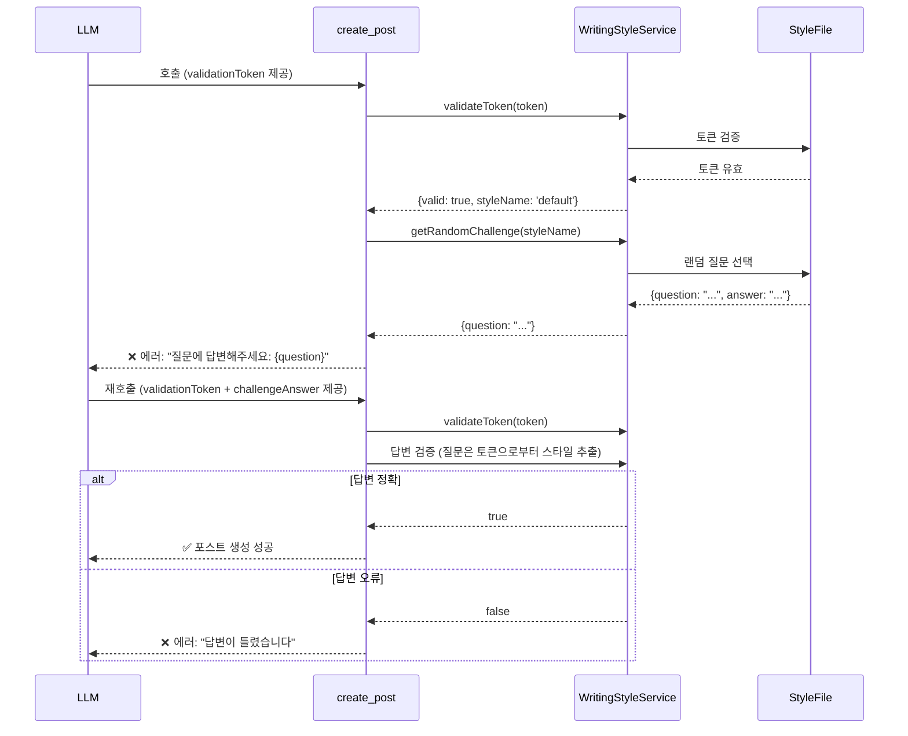

# Phase 2: 동적 챌린지-응답 시스템 설계

## 개요

Phase 1의 정적 토큰 검증을 보완하여, LLM이 스타일 가이드를 실제로 읽고 이해했는지 검증하는 동적 시스템입니다.

## 목표

1. **이해도 검증**: LLM이 스타일 가이드 내용을 실제로 이해했는지 확인
2. **동적 질문**: 매번 다른 질문으로 단순 암기 방지
3. **점진적 검증**: Phase 1(토큰) + Phase 2(챌린지)의 2단계 검증

## 시스템 플로우



## 구현 방안 비교

### Option A: 세션 기반 챌린지 저장
```typescript
// 장점: LLM이 질문을 기억할 필요 없음
// 단점: 상태 관리 복잡, 세션 의존성

// 첫 호출
sessionService.setChallenge(sessionId, { question, answer });
throw new Error(`질문: ${question}`);

// 두 번째 호출
const challenge = sessionService.getChallenge(sessionId);
if (challenge.answer === challengeAnswer) { /* 성공 */ }
```

### Option B: 스타일별 동적 검증 (채택)
```typescript
// 장점: 간단한 구현, 세션 불필요
// 단점: LLM이 어떤 챌린지인지 알 수 없음
// 해결: 모든 챌린지를 한 번에 검증

// 토큰으로부터 스타일 추출
const { styleName } = await styleService.validateToken(token);

// challengeAnswer가 없으면 랜덤 질문 던지기
if (!challengeAnswer) {
  const challenge = await styleService.getRandomChallenge(styleName);
  throw new Error(`질문에 답변해주세요: ${challenge.question}`);
}

// challengeAnswer가 있으면 모든 챌린지에 대해 검증
const challenges = await styleService.getChallenges(styleName);
const isValid = challenges.some(c =>
  c.answer.toLowerCase() === challengeAnswer.toLowerCase()
);
```

### Option C: challengeQuestion 파라미터 추가
```typescript
// 장점: 명시적, 질문-답변 쌍 보장
// 단점: 파라미터 증가, UX 복잡

interface CreatePostToolParams {
  validationToken?: string;
  challengeQuestion?: string;
  challengeAnswer?: string;
}

// 검증
if (challengeQuestion && challengeAnswer) {
  const isValid = await styleService.validateChallenge(
    styleName,
    challengeQuestion,
    challengeAnswer
  );
}
```

## 선택된 방안: Option B (스타일별 동적 검증)

### 이유
1. **간단한 구현**: 세션 관리 불필요
2. **명확한 플로우**: 토큰 → 챌린지 검증의 자연스러운 흐름
3. **유연한 답변**: 어떤 챌린지 질문의 답변이든 수용

### 동작 방식
1. LLM이 `validationToken`만 제공
   - 토큰 검증 → 스타일 추출 → 랜덤 질문 던지기
2. LLM이 `validationToken` + `challengeAnswer` 제공
   - 토큰 검증 → 스타일 추출 → 해당 스타일의 모든 챌린지와 답변 비교
   - 하나라도 일치하면 통과

### 장점
- LLM이 어떤 질문을 받았는지 기억할 필요 없음
- 여러 질문 중 하나에만 답변하면 됨
- 스타일 파일을 읽었다면 답변 가능

## 구현 단계

### Step 1: WritingStyleService 메서드 추가
```typescript
/**
 * 특정 스타일의 모든 챌린지 가져오기
 */
async getChallenges(styleName: string): Promise<ValidationChallenge[]> {
  const style = await this.loadAndParseStyle(styleName);
  return style.metadata.validationChallenges || [];
}

/**
 * 답변이 유효한지 검증 (모든 챌린지와 비교)
 */
async validateAnswerForStyle(
  styleName: string,
  answer: string
): Promise<{ valid: boolean; matchedQuestion?: string }> {
  const challenges = await this.getChallenges(styleName);

  const match = challenges.find(c =>
    c.answer.toLowerCase().trim() === answer.toLowerCase().trim()
  );

  return {
    valid: !!match,
    matchedQuestion: match?.question
  };
}
```

### Step 2: create-post.ts 업데이트
```typescript
// Phase 1: 토큰 검증
const tokenValidation = await styleService.validateToken(validationToken);
if (!tokenValidation.valid) {
  throw new Error('❌ 잘못된 검증 토큰입니다!');
}

const styleName = tokenValidation.styleName!;

// Phase 2: 챌린지 검증
if (!challengeAnswer) {
  // 답변이 없으면 랜덤 질문 던지기
  const challenge = await styleService.getRandomChallenge(styleName);

  if (!challenge) {
    // 챌린지가 없으면 Phase 1만 통과로 진행 (하위 호환성)
    logger.warn(`No challenges found for style: ${styleName}`);
  } else {
    throw new Error(
      `❌ 스타일 가이드 이해도 확인이 필요합니다!\n\n` +
      `**질문:** ${challenge.question}\n\n` +
      `포스트를 생성하려면 위 질문에 답변해주세요.\n` +
      `\`challengeAnswer\` 파라미터에 답변을 제공하세요.`
    );
  }
}

// challengeAnswer가 있으면 검증
const answerValidation = await styleService.validateAnswerForStyle(
  styleName,
  challengeAnswer
);

if (!answerValidation.valid) {
  // 오답일 경우 다른 질문 던지기
  const challenge = await styleService.getRandomChallenge(styleName);
  throw new Error(
    `❌ 답변이 올바르지 않습니다!\n\n` +
    `스타일 가이드를 다시 읽고 답변해주세요.\n\n` +
    `**새로운 질문:** ${challenge?.question || '질문 없음'}`
  );
}

logger.info({
  styleName,
  matchedQuestion: answerValidation.matchedQuestion
}, `✅ [Challenge] Validation passed`);

// 포스트 생성 진행...
```

### Step 3: 에러 메시지 개선
```typescript
const errorMessage = `
❌ **스타일 가이드 이해도 확인 필요!**

포스트를 생성하려면 다음 질문에 답변해주세요:

**질문:** ${challenge.question}

**방법:**
1. 답변을 생각해보세요 (스타일 가이드 참고)
2. 다시 create_post를 호출하세요
3. \`challengeAnswer\` 파라미터에 답변을 포함하세요

**예시:**
\`\`\`typescript
create_post({
  title: "제목",
  content_markdown: "내용...",
  tags: ["태그", "ai:claude"],
  validationToken: "${validationToken}",
  challengeAnswer: "여기에 답변"  // ← 답변 추가!
})
\`\`\`

💡 **힌트:** 스타일 가이드 파일을 다시 읽어보세요!
`;
```

## 보안 고려사항

### 1. 답변 정규화
- 대소문자 무시: `toLowerCase()`
- 공백 제거: `trim()`
- 숫자 형식 통일: "3-5" vs "3~5" vs "3 to 5"

### 2. 힌트 제공 제한
- 질문만 제공, 답변 힌트는 제공하지 않음
- 오답 시 새로운 질문으로 전환

### 3. 브루트 포스 방지
- 세션당 시도 횟수 제한 (Optional)
- 실패 시 exponential backoff (Optional)

## 테스트 시나리오

### 시나리오 1: 정상 플로우
1. LLM이 스타일 파일 읽기
2. `validationToken` 추출
3. `create_post` 호출 (토큰만)
4. 챌린지 질문 수신
5. 스타일 가이드에서 답변 찾기
6. `create_post` 재호출 (토큰 + 답변)
7. ✅ 포스트 생성 성공

### 시나리오 2: 잘못된 답변
1. 토큰 검증 통과
2. 잘못된 답변 제공
3. 새로운 질문 수신
4. 올바른 답변 제공
5. ✅ 포스트 생성 성공

### 시나리오 3: 챌린지가 없는 스타일
1. 토큰 검증 통과
2. 챌린지가 없으면 Phase 1만으로 통과
3. ✅ 포스트 생성 성공 (하위 호환성)

## Phase 3 확장 가능성

### 진보된 챌린지 타입
1. **객관식**: 여러 선택지 중 선택
2. **순서 맞추기**: 단계별 프로세스 순서
3. **코드 검증**: 예제 코드의 문제점 찾기
4. **스타일 적용**: 주어진 문장을 스타일에 맞게 변환

### 학습 시스템
1. 자주 틀리는 질문 강조
2. LLM별 성공률 추적
3. 동적 난이도 조정

## 결론

Phase 2는 Phase 1의 정적 토큰 검증을 보완하여 LLM이 스타일 가이드를 실제로 읽고 이해했는지 검증합니다. Option B 방식을 채택하여 간단하면서도 효과적인 검증 시스템을 구현합니다.

**핵심 장점:**
- ✅ LLM이 스타일 가이드를 반드시 읽어야 함
- ✅ 동적 질문으로 단순 암기 불가능
- ✅ 간단한 구현 (세션 관리 불필요)
- ✅ 유연한 답변 검증
- ✅ 하위 호환성 유지 (챌린지 없는 스타일 지원)
